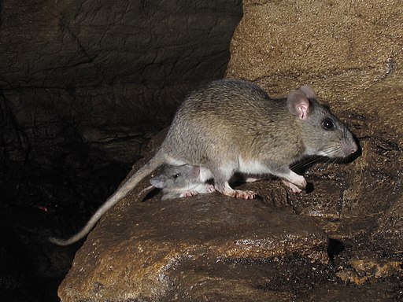
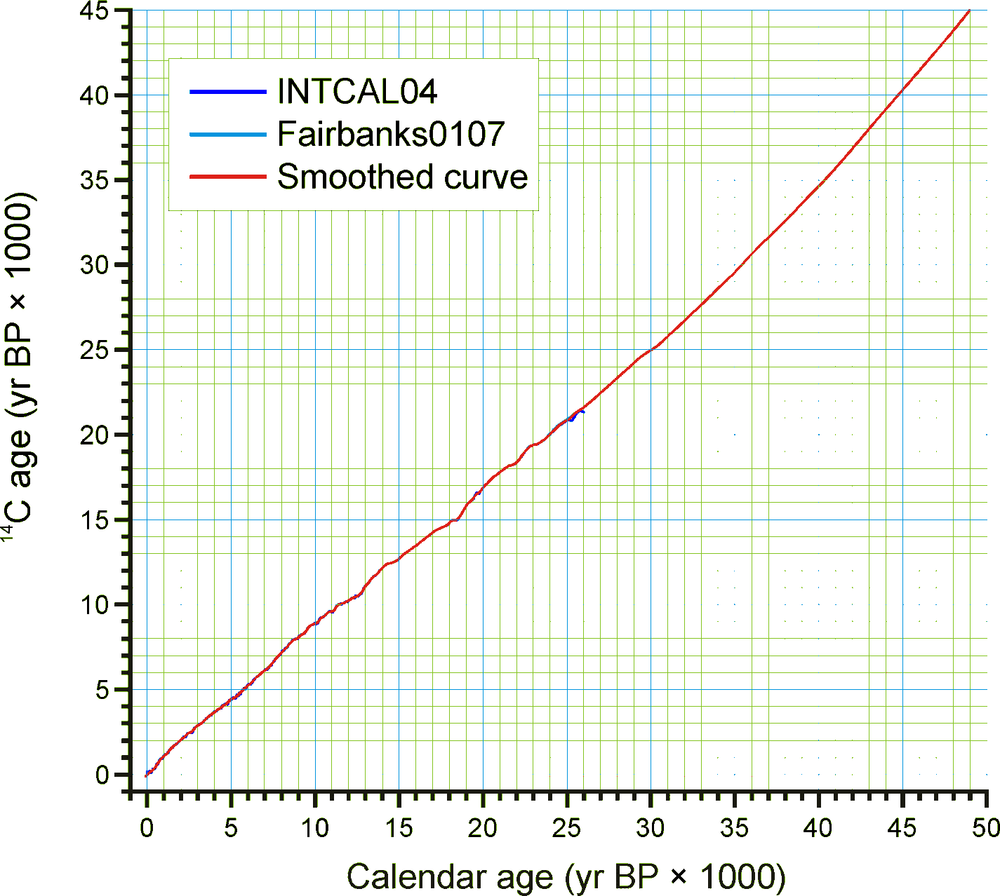
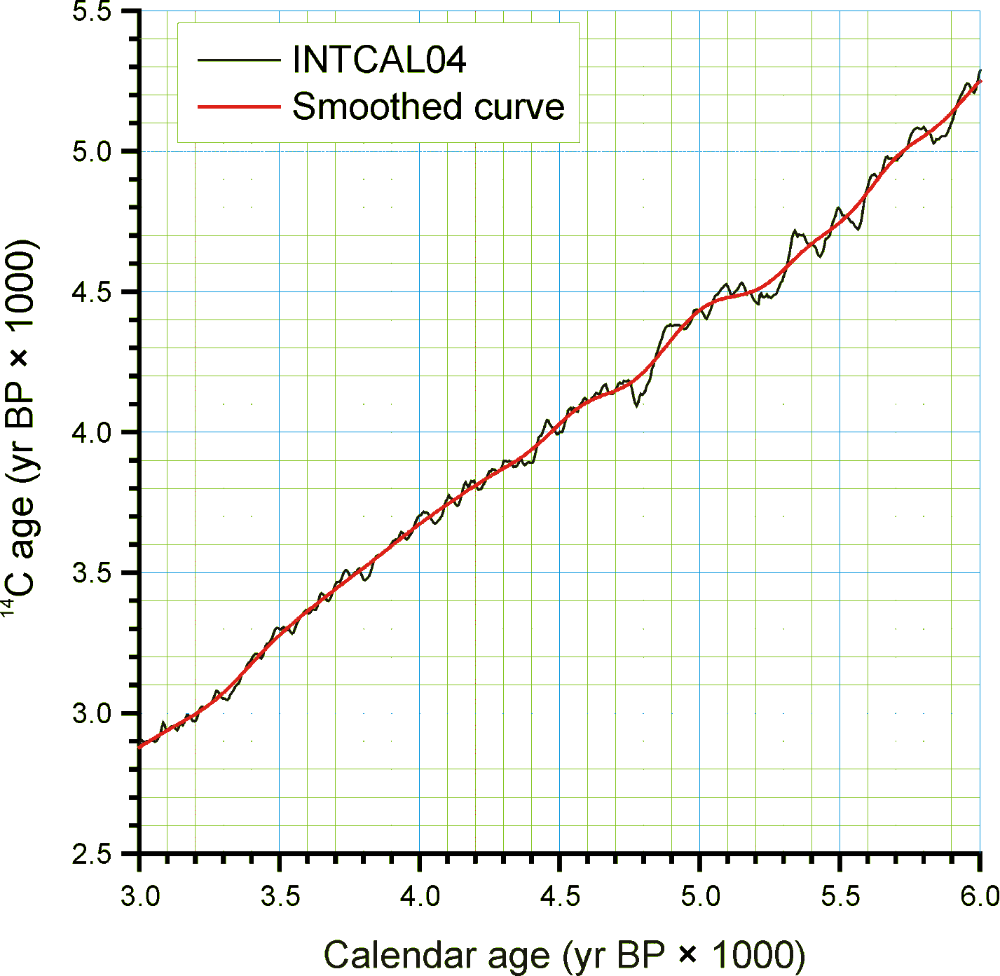

--- 
title: "Neotoma Paleoecology Manual v2.0"
description: "The manual for the Neotoma Paleoecology Database, including SQL and R code examples."
author: "Simon Goring"
date: "`r Sys.Date()`"
site: bookdown::bookdown_site
documentclass: book
bibliography: [assets/references.bib]
biblio-style: apalike
link-citations: yes
delete_merged_file: true
always_allow_html: true
graphics: yes
url: https://neotomadb.org
output:
  bookdown::gitbook:
    css: style.css
    config:
      toc:
        max-depth: 4
      edit: null
      download: null
  bookdown::pdf_book:
    latex_engine: xelatex
    citation_package: natbib
    keep_tex: yes
  bookdown::epub_book: default
---

# Acknowledgements

This documentation would not be possible without the extrordinary work of Dr. Eric C. Grimm [@Jacobson2021] who has spent countless hours developing this manual. In addition, Neotoma rests on the work of a number of researchers who contributed to the original North American Pollen Database, and subsequent data contributors, including FAUNMAP contributors and the data contributions of Allan Ashworth. The Neotoma Database would not exist were it not for the ongoing contributions of authors, data analysts and funding agencies, in particular the National Sciences Foundation. This manual draws heavily from Eric Grimm's original Neotoma manual (v2), published as [@grimm2008neotoma].

The Postgres snapshot of the database is accessible from [the Neotoma Snapshots page](http://www.neotomadb.org/snapshots).

```{r, packageload, echo=FALSE, messages=FALSE, warnings='false', results='hide'}
if (!require("pacman")) install.packages("pacman")
suppressPackageStartupMessages(library(pacman))
packages <- read.delim('requirements.txt')
p_load(char = unlist(packages))

dbLogin <- fromJSON('connect_remote.json')
db <- DBI::dbConnect(RPostgres::Postgres(),
                 dbname = dbLogin$database, 
                 host = dbLogin$host, 
                 port = dbLogin$port, 
                 user= dbLogin$user, 
                 password= dbLogin$password)

showTable <- function(db, tablename) {
  query <- "SELECT
                atr.attname AS column,
                pg_catalog.format_type(atr.atttypid, atr.atttypmod) AS data_type,
                array_to_string(array_remove(array_agg(DISTINCT con.conname), NULL), ', ') AS constraint
            FROM
                pg_catalog.pg_attribute AS atr
            INNER JOIN
                pg_catalog.pg_class AS cl ON cl.oid = atr.attrelid
            INNER JOIN
                pg_catalog.pg_namespace AS nsp ON nsp.oid = cl.relnamespace
            LEFT JOIN pg_catalog.pg_constraint AS con ON con.conrelid = atr.attrelid AND atr.attnum = ANY(con.conkey)
            WHERE
                atr.attnum > 0
                AND NOT atr.attisdropped
                AND nsp.nspname = 'ndb'
                AND cl.relname = $1
            GROUP BY atr.attname, atr.atttypid, atr.atttypmod, atr.attnum
            ORDER BY atr.attnum;"
  output <- dbGetQuery(db, query, tablename)
  DT::datatable(output, filter = 'none', rownames = FALSE, options = list(dom='ltip'))
}

```

<!--chapter:end:index.Rmd-->

# Introduction

Neotoma is a public database containing fossil data from the Holocene, Pleistocene, and Pliocene, or approximately the last 5.3 million years. The database stores associated physical data from fossil bearing deposits, for example sediment loss-on-ignition and geochemical data. The database also stores data from modern samples that are used to interpret fossil data.

The initial development of Neotoma was funded by a grant from the U.S. National Science Foundation Geoinformatics program. The inital grant was a collaborative proposal between Penn State University [@nsf0622349] and the Illinois State Museum [@nsf0622289]. It had five Principle Investigators, Russell W. Graham, Eric C. Grimm, Stephen T. Jackson, Allan C. Ashworth, and John W. (Jack) Williams.

Initially, data within Neotoma were merged from four existing databases: the Global Pollen Database, [FAUNMAP](\@ref(FAUNMAP)), a database of mammalian fauna [@Group1994], the North American Plant Macrofossil Database, and a [fossil beetle database](\@ref(BEETLE)) assembled by Allan Ashworth. Although structurally different, these databases contain similar kinds of data, and merging them was quite practical. The rationale for this merging was twofold:

1. To facilitate analyses of past biotic communities at the ecosystem level
2. To reduce the overhead in maintaining and distributing several independent databases.

Because the proxy types that Neotoma integrated were sufficiently diverse, the data model had to focus on the commonalities as the core of the database structure, specifically elements of stratigraphy and chronology. This design facilitated the gradual inclusion of other database types including the addition of ostracode, diatom, chironmid, and freshwater mussel datasets.

The Neotoma database was initially designed by Eric C. Grimm and implemented in Microsoft® Access®. Neotoma was ported to SQL Server, where it was served from the [Center for Environmental Informatics](https://sites.psu.edu/environmentalinformatics/) at Penn State University. Subsequently the database was ported to PostgreSQL, to support a fully open data ecosystem with an Application-Program Interface (API) that could be integrated into R packages [e.g., @goring2015neotoma] or other programming languages.

## Whence Neotoma

|  |
|:--:|
| A packrat of the genus *Neotoma*. Credit: Alan Cressler, CC BY-SA 2.0 <https://creativecommons.org/licenses/by-sa/2.0>, via Wikimedia Commons |

Neotoma was called a "Late Neogene Terrestrial Ecosystem Database" in the [original NSF proposal](https://nsf.gov/awardsearch/showAward?AWD_ID=0622289). At the time this proposal was written, the Neogene Period included the Miocene, Pliocene, Pleistocene, and Holocene epochs. However, a proposal before the International Commission on Stratigraphy elevated the Quaternary to a System or Period following the Neogene [@gibbard2010formal], terminating the Neogene at the end of Pliocene. To account for the change in nomenclature, numerous names and companion acronyms were considered, but none engendered enthusiastic support. B. Brandon Curry proposed the name **Neotoma**, and this name struck a fancy. *Neotoma* is the [genus for the packrat](https://en.wikipedia.org/wiki/Pack_rat). Packrats are prodigious collectors of anything in their territory, and moreover they are collectors of fossil data. **Neotoma** packrats collect plant macrofossils and bones, and pollen is preserved in their amberat -- hardened, dried urine, which impregnates their middens and preserves them for millennia.

## Rationale

Paleobiological data from the recent geological past have been invaluable for understanding ecological dynamics at timescales inaccessible to direct observation, including ecosystem evolution, contemporary patterns of biodiversity, principles of ecosystem organization, particularly the individualistic response of species to environmental gradients, and the biotic response to climatic change, both gradual and abrupt. Understanding the dynamics of ecological systems requires ecological time series, but many ecological processes operate too slowly to be amenable to experimentation or direct observation. In addition to having ecological significance, fossil data have tremendous importance for climatology and global change research. Fossil floral and faunal data are crucial for climate-model verification and are essential for elucidating climate-vegetation interactions that may partly control climate.

Basic paleobiological research is site based, and paleobiologists have devoted innumerable hours to identifying, counting, and cataloging fossils from cores, sections, and excavations. These data are typically published in papers describing single sites or small numbers of sites. Often, the data are published graphically, as in a pollen diagram, and the actual data reside on the investigator's computer or in a file cabinet. These basic data are similar to museum collections, costly to replace, sometimes irreplaceable, and their value does not diminish with time. Also similar to museum collections, the data require cataloging and curation. Whereas physical specimens of large fossils, such as animal bones, are typically accessioned into museums, microfossils, such as pollen, are not accessioned, and the digital data are the primary objects, and their loss is equivalent to losing valuable museum specimens. The integrated database that we propose ensures safe, long-term archiving of these data.

Large independent databases exist for fossil pollen, plant macrofossils, and mammals: the Global Pollen Database (GPD), the North American Plant Macrofossil Database (NAPMD), and FAUNMAP. In addition, a database of fossil beetles (BEETLE) has been assembled and integrated into Neotoma. These databases, as with others in the Earth and ecosystem sciences, have become essential cyberinfrastructure. Nevertheless, these resources were originally developed as standalone databases in the early 1990's. GPD and NAPMD were stored in [Paradox®](https://en.wikipedia.org/wiki/Paradox_(database)) file formats; FAUNMAP in [Microsoft Access](https://en.wikipedia.org/wiki/Microsoft_Access). Since initial database development, emphasis has been placed on ingest of new and legacy data. However, database and Internet technology have advanced greatly since 1995, and the current relational database software, ingest programs, data retrieval algorithms, output formats, and analysis tools are outdated and minimal. Moreover, the databases are not linked, so that integrated analyses are difficult.

Although GPD, NAPMD, and FAUNMAP were developed independently, they have much in common. The basic data of all three databases as well as BEETLE are essentially lists of taxa from cores, excavations, or sections, often with quantitative measures of abundance. The three databases include similar metadata. The objective of Neotoma is to build a unified data structure that will incorporate all of these databases. The database will initially incorporate pollen, plant macrofossil, mammal, and beetle data. However, the database designed facilitates the incorporation of all kinds of fossil data.

Various teams of investigators have developed databases for paleobiological data that have been project or discipline based,
including the four databases to be integrated in this project. However, long-term maintenance and sustainability have been problematic because of the need to secure continuous funding. Nevertheless, these databases have become the established archives for their disciplines and, new data are continuously contributed. However, because of funding hiatuses, long spells may intervene between times of data contribution and their public availability. For example, the plant macrofossil database has not incorporated any new data since 1999. The number of different databases and disciplines exacerbates the problem, because each database requires a database manager. Consolidation of informatics technology helps address this overhead issue. However, specialists are still essential for management and supervision of data collection and quality control for their disciplines or organismal groups.

The purposes of Neotoma are:

* to facilitate studies of ecosystem development and response to climate change
* to provide the historical context for understanding biodiversity dynamics, including genetic diversity
* to provide the data for climate-model validation
* to provide a safe, long-term, low-cost archive for a wide variety of paleobiological data.

Site-based studies are invaluable in their own right, and they are the generators of new data. However, much is gained by marshalling data from geographic arrays of sites for synoptic, broad-scale ecosystem studies. In order to carry out such studies efficiently, a queryable database is required. Thus, it is much morethan an archive; it is essential cyberinfrastructure for paleoenvironmental research. The database facilitates integration, synthesis, and understanding, and it promotes information sharing and collaboration. The individual databases have been extensively used for scientific research, with several hundred scientific publications directly based upon data drawn from these databases. This project will enhance those databases and will continue their public access. By integrating these databases and by simplifying the contributor interface, we can reduce the number of people necessary for community-wide database maintenance, and thereby help ensure their long-term sustainability and existence.

## History of the Constituent Databases

### Global Pollen Database

In an early effort, the Cooperative Holocene Mapping Project [@Members1988;@Wright1993c] assembled pollen data in the 1970s and 1980s to test climate models. Although data-model comparison was the principal objective of the COHMAP project, the  synoptic analyses of the pollen data, particularly maps showing the constantly shifting ranges of species in response to climate change, were revelatory and led to much ecological insight [e.g. @Webb1981;@Webb1987a;@Webb1988b].

The COHMAP pollen "database" was a set of flat files with a fixed file format for data and for chronologies. FORTRAN programs were written to read these files and to assemble data for particular analyses. Thompson Webb III managed the COHMAP pollen database at Brown University, but as the quantity of data increased, data management became increasingly cumbersome; the data needed to be migrated to a relational database management system. Discussions with E. C. Grimm led to the initiation of the North American Pollen Database (NAPD) in 1990.

At the same time in , the International Geological Correlation Project IGCP 158 [@Church1989IGCPP1] was conducting a major collaborative synthesis of paleoecological data, primarily of pollen, making the need for a pollen database painfully obvious. In the forward to the book resulting from this project [@berglund1996palaeoecological], J.L. de Beaulieu describes the role that the IGCP 158 project had in launching the European Pollen Database [@Huntley1993b]. A workshop to develop a European Pollen Database (EPD) was held in in 1. North American representatives also attended, and the organizers of NAPD and EPD commenced a long-standing collaboration to develop compatible databases. NAPD and EPD held several joint workshops and developed the same data structure. Nevertheless, the two databases were independently established, partly because Internet capabilities were not yet sufficient to easily manage a merged database. The pollen databases were developed in Paradox, which at the time was the most powerful RDBMS readily available for the PC platform. NAPD and EPD established two important protocols:

* the databases were relational and queryable
* they were publicly available.

As the success the NAPD-EPD partnership escalated, working groups initiated pollen databases for other regions, including the Latin American Pollen Database (LAPD) in 1994, the Pollen Database for and the Russian Far East (PDSRFE) in 1995, and the African Pollen Database (APD) in 1996. At its initial organizational workshop, LAPD opted to merge with NAPD, rather than develop a standalone database, and the Global Pollen Database was born. PDSRFE also followed this model. APD developed independently, but uses the table structure of GPD and EPD. Pollen database projects have also been initiated in other regions, and the GPD contains some of these data, including the Indo-Pacific Pollen Database and the Japanese Pollen Database.

```{sql, ageSamples, connection=db, output.var="sampleroundcount", echo=FALSE}
SELECT ROUND(age::bigint, -2) AS age, COUNT(*) AS n
FROM ndb.sampleages
WHERE age IS NOT NULL
GROUP BY ROUND(age::bigint, -2);
```

```{r, agedistributions, echo=FALSE, fig.alt="Histogram of sample age distributions in Neotoma for the first 200000 years of samples showing that data is heavily skewed the the present.", fig.cap="Sample age distributions in Neotoma for a subset of Neotoma data.  Ages are heavily skewed to samples in the last 10,000 years, and moreso to the near-present.", warnings=FALSE}
ggplot(sampleroundcount, aes(x = age, y = n)) +
    geom_histogram(stat="identity", width=500) +
    scale_x_continuous() +
    theme_bw() +
    xlab('Years Before Present') +
    ylab('Age Count')
```

The pollen databases contain data from the Holocene, Pleistocene, and Pliocene, although most data are from the last 20,000 years (Fig. \@ref(fig:agedistributions)). Included are fossil data, mainly from cores and sections, and modern surface samples, which are essential for calibrating fossil data. NAPD data are not separate from the GPD, but rather the NAPD is the North American subset of GPD. EPD has both public and restricted data --- a concession that had to be made early on to assuage some contributors.

### North American Plant Macrofossil Database

Plant macrofossils include plant organs generally visible to the naked eye, including seeds, fruits, leaves, needles, wood, bud scales, and megaspores. Synoptic-scale mapping of plant macrofossils from modern assemblages [@Jackson1997] and fossil assemblages [@Jackson1997;@Jackson2000c;@Jackson2002] have shown the utility of plant macrofossils in providing spatially and taxonomically precise reconstructions of past species ranges. Although plant macrofossil records are spatially precise, synoptic networks of high-quality sites can scale up to yield aggregate views of past distributions [@Jackson1997]. In addition, macrofossils, with their greater taxonomic resolution, augment the pollen data by providing information on which species might have been present, and can resolve issues of long-distance transport [@Birks2003].

The North American Plant Macrofossil Database (NAPMD) has been directed by S.T. Jackson at the . Highest priority has been placed on data from the last 30,000 years, although some earlier Pleistocene and late Pliocene data are included. The database originated as a research database for selected taxa from Late Quaternary sediments of eastern North America [@Jackson1997]. In 1994, an effort was initiated with NOAA funding to build on this foundation to develop a cooperative, relational database comprising all of , a longer time span, and all plant taxa.

The structure of NAPMD was adapted from the pollen database and was also stored in a Paradox file format. Although the plant macrofossil database was well served by the data model structure, modifications were made to accommodate different organs from the same species and to deal with the various quantitative measures of abundance. The Plant Macrofossil database also included surface samples, which were not part of the pollen databases at the time, but are useful for the interpretation of fossil data.

### FAUNMAP {#FAUNMAP}

R.W. Graham, E.L. Lundelius, Jr., and a group of Regional Collaborators organized a project to develop a database for late Quaternary faunal data from the , which the U.S. NSF funded in 1990. This project had a research agenda, and its seminal paper focused on the individualistic behavior displayed by animal species [@Group1994].

Two FAUNMAP databases exist, FAUNMAP I and FAUNMAP II. Both databases were coordinated by R. W. Graham and E. L. Lundelius, Jr. and funded by NSF. Both are relational databases for fossil mammal sites. The data were extracted from peer-reviewed literature, selected theses and dissertations, and selected contract reports for both paleontology and archaeology (all data is currently contained within the Neotoma publications tables). Unpublished collections were not included. Data were originally captured in Paradox but were later migrated to Microsoft Access.

FAUNMAP I contains data from sites in the continental United States (the lower 48 States) that date between 500 BP and \~40,000 BP. Funding for FAUNMAP I ended in 1994, with the production of two major publications by the FAUNMAP Working Group [@Group1994;@Group1996], along with publications from individual members and many others who accessed the database on-line. Graham and Lundelius continued the FAUNMAP project, developing FAUNMAP II with funding from NSF beginning in 1998. FAUNMAP II [@faunmapTwo] shares the same structure as FAUNMAP I but expands the spatial coverage to include and and extends the temporal coverage to the Pliocene (5 Ma). In addition, sites published since 1994, when FAUNMAP I was completed, have been added for the contiguous 48 States. In all, FAUNMAP I and II contain more than 5000 fossil-mammal sites with more than 600 mammal species for all of North America north of Mexico that range in age from 0.5 ka to 5 Ma­.

The detailed structure of the FAUNMAP database is described in FAUNMAP Working Group [@Group1994]. Sites identified by name and location were subdivided into Analysis Units (AU's), which varied from site to site depending upon the definitions used in the original publications (e.g., stratigraphic horizons, cultural horizons, excavation levels, biostratigraphic zones). All data (*i.e.*, taxa identified, and counts of individual specimens) and metadata (sediment types, depositional environments, facies, radiometric and other geochronological dates, modifications of bone) were associated with the individual AUs. This structure -- analysis units within sites -- allows for information to be extracts at the site level, or at the smallest sample subdivision. The analysis unit permits fine-scale temporal resolution and analysis. Similar to the GPD and NAPMD, FAUNMAP contains archival and research tables. Similar to the plant macrofossil database, FAUNMAP contains a variety of quantitative measures of abundance (*e.g.*, MNI, NISP), and presence data are more commonly used for analysis.

### BEETLE {#BEETLE}

Many beetles have highly specific ecological and climatic requirements and are valuable indicators of past environments [@morgan1983late;@ashworth2001aapg;@ashworth2004coleoptera]. Coleoptera is one of the most diverse groups of organisms on Earth, and of the insects, perhaps the most commonly preserved as fossils. Allan Ashworth has assembled a database of fossil beetles from . The data, which were recorded in Excel, contain 5523 individual records of 2567 taxa from 199 sites and 165 publications. Metadata include site name, latitude and longitude, lithology of sediment, absolute age, and geological age. The basic data are similar to plant and mammal databases -- lists of taxa from sites. The metadata have not been recorded to the extent of the other databases, especially chronological data, but Ashworth has resolved the taxonomic issues and has assembled the publications, so that the additional metadata can be easily pulled together.

## Who Will Use Neotoma?

The existing databases have been used widely for a variety of studies. Because the databases have been available on-line, precise determination of how many publications have made use of them is difficult. In addition, the databases are widely used for instructional purposes. Below are examples of the kinds of people who have used these databases and who we expect will find the new, integrated database even more useful.

* **Paleoecologists** seeking to place a new record into a regional/continental/global context (e.g., Bell and Mead 1998, Czaplewski et al. 1999, Bell and Barnosky 2000, Newby et al. 2000, Futyma and Miller 2001, Gavin et al. 2001, Czaplewski et al. 2002, Schauffler and Jacobson 2002, Camill et al. 2003, Rosenberg et al. 2003, Willard et al. 2003, Pasenko and Schubert 2004, and many others).
* **Synoptic paleoecologists** interested in mapping regional to sub-continental to global patterns of vegetation change (e.g., Jackson et al. 1997, Williams et al. 1998, Jackson et al. 2000, Prentice et al. 2000, Thompson and Anderson 2000, Williams et al. 2000, Williams et al. 2001, Williams 2003, Webb et al. 2004, Williams et al. 2004, Asselin and Payette 2005).
* **Synoptic paleoclimatologists** building benchmark paleoclimatic reconstructions for GCM evaluation (e.g., Bartlein et al. 1998, Farrera et al. 1999, Guiot et al. 1999, Kohfeld and Harrison 2000, CAPE Project Members 2001, Kageyama et al. 2001, Kaplan et al. 2003).
* **Paleontologists** trying to understand the timing, patterns, and causes of extinction events (e.g., Jackson and Weng 1999, Graham 2001, Barnosky et al. 2004, Martínez-Meyer et al. 2004, Wroe et al. 2004).
* **Evolutionary biologists** mapping the genetic legacies of Quaternary climatic variations (e.g., Petit et al. 1997, Fedorov 1999, Tremblay and Schoen 1999, Hewitt 2000, Comps et al. 2001, Good and Sullivan 2001, Petit et al. 2002, Kropf et al. 2003, Lessa et al. 2003, Petit et al. 2003, Hewitt 2004, Lascoux et al. 2004, Petit et al. 2004, Whorley et al. 2004, Runck and Cook 2005).

* **Macroecologists** interested in temporal records of species turnover and biodiversity and historical controls on modern patterns of floristic diversity (e.g., Silvertown 1985, Qian and Ricklefs 2000, Brown et al. 2001, Haskell 2001).
* **Archeologists** who are studying human subsistence patterns and interactions with their environment (e.g., Grayson 2001, Grayson and Meltzer 2002, Cannon and Meltzer 2004, Grayson in press).
*  **Natural resource managers** who need to know historical ranges and abundances of plants and animals for designing conservation and management plans (e.g., Graham and Graham 1994, Cole et al. 1998, Noss et al. 2000, Owen et al. 2000, Committee on Ungulate Management in Yellowstone National Park 2002, Burns et al. 2003)
* **Scientists** trying to understand the potential response of plants, animals, biomes, ecosystems, and biodiversity to global warming (e.g., Bartlein et al. 1997, Davis et al. 2000, Barnosky et al. 2003, Burns et al. 2003, Kaplan et al. 2003, Schmitz et al. 2003, Jackson and Williams 2004, Martínez-Meyer et al. 2004)
* **Teachers** who use the databases for teaching purposes and class exercises.

<!--chapter:end:chapters/01-neotoma_introduction.Rmd-->

# SQL Quickly

SQL (Sturctured Query Language) is a standard language for querying and modifying relational databases. There is an official standard for SQL, statements such as `SELECT` and `WHERE` are common across most SQL implementations, however, individual vendors do maintain proprietary formatting.  Neotoma is implemented using PostgreSQL, which has [extensive documentation online](https://www.postgresql.org/docs/14/index.html). It is beyond the scope of this document to teach SQL, however, we have included a large number of SQL queries along with the documentation to provide templates for queries, and to help the user understand how to directly work with the database. These queries can by typed or copied and pasted into database tools such as [pgAdmin](https://www.pgadmin.org/).

Throughout the document we will refer to tables using the format `ndb.tablename`.  Here `ndb` is the schema for most of the data tables within the Neotoma database. There are other schema, including `apps`, `doi` and `public`, but the data tables themselves are kept in the `ndb` schema.  You can see all available data tables in the `ndb` schema using the [Neotoma database schema website](https://open.neotomadb.org/dbschema).

## SQL Example

The following SQL example lists the number of sites by the geopolitical unit, where the geopolitical unit is a country.  It uses three tables, `ndb.sites`, which contains **site** information, `ndb.geopoliticalunits`, which lists all geopolitical units (countries, provinces, towns, etc.), and a `JOIN` table, which helps to link the `ndb.sites` table to the `ndb.geopoliticalunits` table.

By convention, SQL first defines the output, using the `SELECT` statement.  The `FROM` block is used to explain how the information is brought together, and the `WHERE` (and subsequent blocks) are meant to help filter and aggregate data as generated within the `FROM` block.

Throughput this document we will use `AS` statemements to help us write our SQL queries neatly.  Using `AS` helps us create an alias so that we don't have to write so much in our query.  As much as possible we will use the same aliases for tables throughout this guide.  For example, `FROM ndb.sites AS st` is commonly used, where `st` becomes the alias for the `ndb.sites` table, and stands in for it elsewhere in the query. Often you will see `gpu` used for `ndb.geopoliticalunits`, or `tx` for `ndb.taxa`.  In Postgres SQL it is not neccessary to use the term `AS` (we use it here to make the queries clearer for folks just learning how to use SQL), so it's possible to see things like `ndb.sites st` in place of `ndb.sites AS st`.  Below is an example where both forms are used:

### Query {.tabset}

#### SQL Query

```{sql, sampleCall, echo=TRUE, connection=db, output.var="geopoliticalsort"}
SELECT
  COUNT(*) AS sites,
  gpu.geopoliticalname, 
  gpu.geopoliticalunit
FROM
  ndb.geopoliticalunits AS gpu
  INNER JOIN ndb.sitegeopolitical AS sgp ON sgp.geopoliticalid = gpu.geopoliticalid
  INNER JOIN ndb.sites st ON st.siteid = sgp.siteid
WHERE 
  gpu.geopoliticalunit = 'country'
GROUP BY
  gpu.geopoliticalid
HAVING COUNT(*) > 0
ORDER BY sites DESC;
```

#### Output {.active}

```{r}
DT::datatable(geopoliticalsort)
```

## Table Keys

Within tables there are often Keys. A Key may be a **Primary Key** (PK), which acts as a unique identifier for individual records within a table, or they may be a **Foreign Key** (FK) which refers to a unique identifier in another table. Primary Keys and Foreign Keys are critical to join tables in a SQL query. 

In relational databases such as Neotoma you will often have "entity" tables, that represent explicit things (e.g., people, sites), and then tables that express the relationship between entities using foreign keys.  So, for example the table `ndb.sitegeopoliticalunits` expresses the relationship between `ndb.sites` and `ndb.geopoliticalunits`.  Both `ndb.sites` and `ndb.geopoliticalunits` represent entities; a country is a thing, with properties, as is a site.  The `ndb.sitegeopoliticalunits` defines the relationship betwen these things.  It is a table with two columns, one is an FK that refers back to the PK, `siteid`s, in `ndb.sites`, and one is an FK for the primary key of the `ndb.geopoliticalunits`.

Switching to the *SQL Query* tab in the above example will show you that we are using the PK for the `geopoliticalunits`, `geopoliticalid`. It links the complete information in the `ndb.geopoliticalunits` table to the `ndb.sites` table, through a `JOIN` table, that has two columns, the `siteid` that is the PK for `ndb.sites` and the `geopoliticalid` column, that is the PK for `ndb.geopoliticalunits`.  In this way, `siteid` is the PK in `ndb.sites` and an FK in `ndb.sitegeopoliticalunits`.

## Data Types

Neotoma uses several standard SQL data types.  You can find out more about these individual data types in the Postgres [data type documentation](https://www.postgresql.org/docs/current/datatype.html).

### Query {.tabset}

#### SQL Query

```{sql, dataTypeCall, echo=FALSE, connection = db, fig.cap="Common data types within the Neotoma database.", output.var="datatypes"}
SELECT LOWER(data_type) AS DataType, count(*) AS columns 
FROM information_schema.columns
WHERE table_schema = 'ndb' 
GROUP BY data_type
HAVING COUNT(*) > 1;
```

#### Data {.active}

```{r}
DT::datatable(datatypes)
```

<!--chapter:end:chapters/sql_quickly.Rmd-->

# Database Design Concepts

## Sites, Collection Units, Analysis Units, Samples, and Datasets

Fossil data are site based. A `Site <Sites>`{.interpreted-text role="ref"} has a name, latitude-longitude coordinates, altitude, and areal extent. In Neotoma, Sites are designated geographically as boxes with north and south latitude coordinates and east and west longitude coordinates. If the areal extent is not known, the box collapses to a point, with the north and south latitudes equal and the east and west longitudes equal. Most of the legacy sites in Neotoma currently have point coordinates. The lat-long box can circumscribe the site, for example a lake, or it may circumscribe a larger area in which the site lies either because the exact location of the site is not known or because the exact location is purposely kept vague. In the case of many legacy sites, the exact location is not know precisely; for example, it may have been described as «on a gravel bar 5 miles east of town». The exact locations of some sites have purposely been kept vague to prevent looting and vandalism.

A `Collection Unit <CollectionUnits>`{.interpreted-text role="ref"} is a unit from a site from which a collection of fossils or other data have been made. Typical Collection Units are cores, sections, and excavation units. A site may have several Collection Units. A Collection Unit is located spatially within a site and may have precise GPS latitude-longitude coordinates. Its definition is quite flexible. For pollen data, a Collection Unit is typically a core, a section, or surface sample. A Collection Unit can also be a composite core comprised of two or more adjacent cores pieced together to form a continuous stratigraphic sequence. A Collection Unit can also be an excavation unit. For faunal data, a Collection Unit could be as precise as an excavation square, or it could be a group of squares from a particular feature within a site. For example, consider a pit cave with three sediment cones, each with several excavation squares. Collection Units could be defined as the individual squares, or as three composite Collection Units, one from each sediment cone. Another example is an archaeological site, from which the reported Collection Units are different structures, although each structure may have had several excavation squares. The precision in the database depends on how data were entered or reported.

For many published sites, the data are reported from composite Collection Units. If faunal data are reported from a site or locality without explicit Collection Units, then data are assigned to a single Collection Unit with the name «Locality». This is a «quote».

Different kinds of data may have been collected from a single Collection Unit, for example fauna and macrobotanicals from an excavation, or pollen and plant macrofossils from a lake-sediment core. A composite Collection Unit may include data from different milieus, which, nevertheless, are associated with each other, for example a diatom sample from surficial lake sediments and an associated lake-water sample for water-chemistry measurements.

The Collection Unit is equivalent to the Entity in the Global Pollen Database but was not defined in FAUNMAP. When the FAUNMAP data were imported into Neotoma, most localities were assigned a single «Locality» Collection Unit. However, for some localities, the data were assigned to different Collection Units that were clearly identifiable in FAUNMAP (see **Figure 1**).

An `Analysis Unit <AnalysisUnits>`{.interpreted-text role="ref"} is a stratigraphic unit within a Collection Unit and is typically defined in the vertical dimension. An Analysis Unit may be a natural stratigraphic unit with perhaps irregular depth and thickness or it may be an arbitrary unit defined by absolute depth and thickness. An excavation may have been dug in arbitrary units, for example 10 cm levels, or it may have followed natural stratagraphic boundaries, for example the «red zone» or a feature in an archaeological site. Although Analysis Units could be designated by an upper depth and lower depth, in Neotoma they are designated by their midpoint depth and thickness, which is more convenient for developing age models. Pollen and other microfossils are typically sampled at arbitrary depths, and although these samples have thicknesses corresponding to the thickness of the sampling device (usually 1 cm or less), these thicknesses are often not reported, just the depths. Different kinds of samples may have been taken from a single analysis unit, for example pollen, diatoms, and ostracodes. The Analysis Unit links these various samples together.

In larger excavations, natural stratigraphic Analysis Units may cut across excavation squares or Collection Units, and the data are reported by Analysis Unit rather than by Collection Unit. In this case, the fossil data are assigned to a generic composite Collection Unit named «Locality», which has the explicitly defined Analysis Units. If the Analysis Units are not described or reported, then the data are assigned to a single Analysis Unit with the name «Assemblage». Thus, for a locality published with only faunal list, the fauna are assigned to a Collection Unit named «Locality» and to an Analysis Unit named «Assemblage».

In FAUNMAP, Analysis Units are the primary sample units, and fauna are recorded by Analysis Unit. In the GPD, Analysis Units correspond to samples.

`Samples <Samples>`{.interpreted-text role="ref"} are of a single data type from an Analysis Unit. For example, there may be a vertebrate faunal sample and a macrobotanical sample from the same Analysis Unit; or there may be a pollen sample and an ostracode sample from the same Analysis Unit. There can be multiple samples of the same data type from an Analysis Unit, for example two pollen samples counted by different analysts. Normally, vertebrate fossils from an Analysis Unit comprise a single sample; however, if the fossils are of mixed age, individually dated bones may be treated as separate samples, each with a precise age. In addition to fossils, samples may also be used for physical measurements, such as loss-on-ignition. Geochronologic measurements, such as radiocarbon dates, are made on geochronologic samples.

A `Dataset <Datasets>`{.interpreted-text role="ref"} is a set of Samples of a single data type from a Collection Unit. For example the pollen data from a core comprise a pollen Dataset. The geochronologic samples from a Collection Unit form a geochronologic Dataset. Every Sample is assigned to a Dataset, and every Dataset is assigned to a Collection Unit. Samples from different Collection Units cannot be assigned to the same Dataset (although they may be assigned to Aggregate Datasets).


**Figure 1**. Diagram showing the relationships between tables in Neotoma, the Pollen Database, and FAUNMAP. Because the pollen database has only pollen, no need exists for Analysis Units, which may have multiple data types. FAUNMAP does not make a hierarchical distinction between Collection Units and Analysis Units, and the data for both Analysis Units and fauna are contained in the Faunal table, although within the Faunal table, implicit one-to-many relationships exist between Localities and Analysis Units and between Analysis Units and faunal data.

## Taxa and Variables

In general, a sample in Neotoma has a list of taxa with some measure of abundances. The `Data <Data>`{.interpreted-text role="ref"} table in Neotoma has fields for SampleID, VariableID, and Value. **Variables**, which are listed in the `Variables <Variables>`{.interpreted-text role="ref"} table, consist of a **Taxon**, referenced in the `Taxa <Taxa>`{.interpreted-text role="ref"} table, as well as the identified **Element,** measurement **Units**, **Context**, and **Modification**. A Taxon is generally a biological Taxon, but a Taxon may also be a physical attribute such as loss-on-ignition.

* For biological taxa, the **Element** is the organ or skeletal element. Typical faunal Elements are bones, teeth, scales, and other hard body parts. Bone and tooth Elements may be specifically identified (e.g. «tibia» or even more precisely «tibia, distal, left», «M2, lower, left»). Some soft Elements also occur in the database (e.g. «hair» and «dung»). For mammals, an unspecified element is «bone/tooth». Elements for plant macrofossils are the organs identified (e.g. «seed», «needle», «cone bract»). Pollen and spores are treated simply as taxon Elements. Thus, *Picea* seeds, *Picea* needles, and *Picea* pollen are three different Variables. All three refer to a single entry in the [Taxa](#_Table:_Taxa) table for *Picea*.
* Variable **Units** are the measurement units. For faunal data, the most common are «present/absent», «number of individual specimens» (NISP), and «minimum  number of individuals» (MNI). Plant macrofossils have many different quantitative and semi-quantitative measurement Units, including concentrations and relative abundance scales. Measurement Units for pollen are NISP (counts) and «percent». For pollen the preferred measurement Unit is NISP, but for some sites only percentage data are available. *Picea* pollen NISP and *Picea* pollen percent are two different Variables.
* Variable **Contexts** for fauna include «articulated», «intrusive», and «redeposited». A context for pollen is «anachronic», which refers to a pollen type known to be too old for the contemporary sedimentary deposit. Most Variables do not have a specified context.
* Variable **Modifications** include various modifications to fossils or modifiers to Variables, including human modifications to bones (e.g. «bone tool», «human butchering», «burned») and preservational and taphonomic modifications (e.g. «carnivore gnawed», «fragment»). Modifications for pollen include preservational classifications such as «corroded» and «degraded».

## Taxonomy and Synonymy

Neotoma does not change or question identifications from original sources, although taxonomic names may be synonymized to currently accepted names. Thus, for example, the old (although still valid) non-standard plant family names such as Gramineae and Compositae are synonimized to their standard family names terminated with «-aceae», viz. Poaceae and Asteraceae. Neotoma has not attempted to establish complete or comprehensive synonymies. However, the `Synonyms <Synonyms>`{.interpreted-text role="ref"} table lists commonly encountered synonyms. The descriptions of the `SynonymTypes <SynonymTypes>`{.interpreted-text role="ref"} and `Taxa <Taxa>`{.interpreted-text role="ref"} tables contain fuller discussions of synonymiztions made in Neotoma.

An important feature of Neotoma is that the `Taxa <Taxa>`{.interpreted-text role="ref"} table is hierarchical. Each Taxon has a HigherTaxonID, which is the TaxonID of the next higher taxonomic rank. Thus, data are stored at the highest taxonomic resolution reported by the original investigators, but can be extracted
at a higher taxonomic level.

Synonymy presents a challenge for any organismal database, particularly for one such as Neotoma, which archives data collected for over a century and which archives extinct taxa, often for which few and fragmentary specimens exist. Many changes are due to increased understanding of the diversity within taxonomic groups and of the phylogenetic relationships within and among groups. Other changes are due purely to taxonomic rules or conventions set by the International Code of Botanical Nomenclature (McNeill et al. 2006) and the International Code of Zoological Nomenclature (International Commission on Zoological Nomenclature 1999). Working groups representing the different taxonomic groups included in Neotoma have established appropriate taxonomic authorities:

* Plants -- There is no worldwide authority. The International Plant Names Index[^1] lists validly published names, but a listed name is not necessarily the accepted name for a given taxon. For families, Neotoma follows the Angiosperm Phylogeny Group II (2003) and Stevens (2007+), which follows and updates APG II. The APG is an international consortium of plant taxonomists, and the APG classification utilizes the great quantity of phylogenetic data generated in recent years. For lower taxonomic ranks, the various pollen database cooperatives follow appropriate regional floras:
* North American Pollen Database/North American Plant Macrofossil Database: Insofar as possible, follows the *Flora of North America* (Flora of North America Editorial Committee 1993+); about half of the planned FNA volumes have been published. Otherwise, appropriate regional floras are followed.
* European Pollen Database: The EPD has a Taxonomy Support Group. In general, nomenclature follows *Flora Europaea* (Tutin 1964-1993).
* African Pollen Database: The APD has a Committee for Nomenclature, which has produced a list of pollen types with misspellings, synonymy, and nomenclature corrected[^2]. APD nomenclature follows *Enumération des plantes à fleurs d\'Afrique Tropicale* (Lebrun and Stork 1991-1997).
* Latin American Pollen Database: has a tremendously rich and diverse flora and no comprensive flora is available. Various regional floras are followed.
* Indo-Pacific Pollen Database: For Australia and adjacent areas follows the *Australian Plant Name Index* (Chapman 1991). For other regions, appropriate regional floras are followed.
* Pollen Database for Siberia and the Russian Far East Follows *Vascular Plants of Russia and Adjacent States* (Czerepanov 1995).
* Mammals -- For extant taxa, the authority is Wilson and Reeder's (2005) *Mammal Species of the World* . Original sources are followed for extinct species, and the database is considered authoritative.
* Birds -- For North America, the authority is the American Ornithologists' Union *Check-list of North American Birds* (American Ornithologists\' Union 1983).
* Fish -- Follows the *Catalog of Fishes* (Eschmeyer 1998).
* Mollusks -- For North America, follows *Common and Scientific Names of Aquatic Invertebrates from the United States and Canada: Mollusks* (Turgeon et al. 1998).
* Beetles -- Comprehensive manuals do not exist. Original taxonomic authorities are cited, and the database is considered authoritative.

## Taxa and Ecological Groups

In the `Taxa <Taxa>`{.interpreted-text role="ref"} table, each taxon is assigned a TaxaGroupID, which refers to the `TaxaGroupTypes <TaxaGroupTypes>`{.interpreted-text role="ref"} table. These are major taxonomic groups, such as «Vascular plants», «Diatoms», «Testate amoebae», «Mammals», «Reptiles and amphibians», «Fish», and «Molluscs». Also included are «Charcoal» and «Physical variables». 

**Ecological Groups** are groupings of taxa within Taxa Groups, which may be ecological or taxonomic. Ecological Groups are assigned in the `EcolGroups <EcolGroups>`{.interpreted-text role="ref"} table, in which taxa are assigned an `ecolgroupid`, which links to the `EcolGroupTypes <EcolGroupTypes>`{.interpreted-text role="ref"} table, and an EcolSetID, which links to the `EcolSetTypes <EcolSetTypes>`{.interpreted-text role="ref"} table.

Ecological Groups are commonly used to organize taxa lists and stratigraphic diagrams. For any taxonomic group, more than one Ecological Set may be assigned. For example, beetles may be assigned to a set of ecological groups, such as dung and bark beetles, and to second set based on taxonomy. Vascular plants are assigned to a «Default plant» set comprised of groups such as «Trees and Shrubs», «Upland Herbs», and «Terrestrial Vascular Cryptogams». Default pollen diagrams can then be generated based on a pollen sum of these three groups. Mammals are assigned to a «Vertebrate orders» set.

## Chronology

Neotoma stores both the archival data used to reconstruct chronologies as well as interpreted chronologies derived from the archival data. The basic data used to reconstruct chronologies occurs in three tables:

* `Geochronology <Geochronology>`{.interpreted-text role="ref"},
* `Tephrachronology <Tephrachronology>`{.interpreted-text role="ref"}, and
* `RelativeChronology <RelativeChronology>`{.interpreted-text role="ref"}.

The `Geochronology <Geochronology>`{.interpreted-text role="ref"} table includes geophysical measurements such as radiocarbon, thermoluminescence, uranium series, and potassium-argon dates. This table also includes dendrochronological dates derived from tree-ring chronologies, for example logs in archaeological structures. The `Tephrachronology <Tephrachronology>`{.interpreted-text role="ref"} table records tephras in Analysis Units. This table refers to the `Tephras <Tephras>`{.interpreted-text role="ref"} lookup table, which stores the ages for known tephras. The `RelativeChronology <RelativeChronology>`{.interpreted-text role="ref"} table stores relative age information for Analysis Units. Relative age scales include the archaeological time scale, geologic time scale, geomagnetic polarity time scale, marine isotope stages, North American land mammal ages, and Quaternary event classification. For example, diagnostic artifacts from an archaeological site may have cultural associations with a known age ranges, which can be assigned to Analysis Units. The faunal assemblage from an Analysis Unit may be assignable to particular land mammal age, which places it within a broad time range. Sedimentary units may be assigned to particular geomagnetic chrons, marine isotope stages, or Quaternary events, such as a particular interglacial. Many of these relative ages have rather broad time spans, but do provide some chronologic control.

Actual Chronologies are constructed from the basic chronologic data in the `Geochronology <Geochronology>`{.interpreted-text role="ref"}, `Tephrachronology <Tephrachronology>`{.interpreted-text role="ref"}, and `RelativeChronology <RelativeChronology>`{.interpreted-text role="ref"} tables. These chronologies are stored in the `Chronologies <Chronologies>`{.interpreted-text role="ref"} table. A Chronology applies to a Collection Unit and consists of a number of Chron Controls, which are ages assigned to Analysis Units. A Chron Control may be an actual geochronologic measurement, such as a radiocarbon date, or it may be derived from the actual measurement, such as a radiocarbon date adjusted for an old carbon reservoir or calibrated to calendar years. A Chron Control may by an average of several radiocarbon dates from the same Analyis Unit. Different kinds of basic chronologic data may be used to assign an age to an Analysis Unit, for example radiocarbon dates and diagnostic archaeological artifacts. Some relative Chron Controls are not from one of the established relative time scales. Examples of these are local biostratigraphic controls, which may be based on dated horizons from nearby sites. A familiar example in is the *Ambrosia*-rise, which marks European settlement. The exact date varies regionally, depending on when settlement occurred locally. For a given site, the date assigned to the *Ambrosia*-rise may be based on historical information about when settlement occurred or possibly on geophysical dating (e.g. ^210^Pb) of a nearby site.

For continuous stratigraphic sequences, such as cores, not every Analysis Unit may have a direct date. Therefore, ages are commonly interpolated between dated Analysis Units. In this case, the ChronControls are the age-depth control points for an age model, which may be linear interpolation between Chron Controls or a fitted curve or spline.

**Figure 2. Smoothed quick radiocarbon calibration curve. At the scale of this figure the difference is mostly less than the line thickness.**

Age is measured in different time scales, the two most commn being radiocarbon years before present (^14^C yr BP) or presumed calendar years before present (cal yr BP). For a calibrated radiocarbon date, «cal yr BP» technically stands for «calibrated years before present», i.e. calibrated to calendar years. In Neotoma, «cal yr BP» is used for both calibrated radiocarbon years and for other ages scales presumed to be in calendar years, viz. dendrochronologic years and other geochronlogic ages believed to be in calendar years. The zero datum for any «BP» age is ad 1950, regardless of its derivation. Thus, BP ages younger than ad 1950 are negative---ad 2000 = ‑50 BP.

Ages may be reported in ad/bc age units, in which case bc years are stored as negative values. If ages are reported with a datum other than ad 1950 for BP years, the ages must be converted to an ad 1950 datum or to the ad/bc age scale before entry into Neotoma. For example, ^210^Pb dates are often reported relative to the year of analysis; these must be converted to either ad/bc or «cal yr BP» with an ad 1950 datum.

**Figure 3. An enlarged portion of Figure 2 showing the monontonic smoothed curve**

Radiocarbon years can be calibrated to calendar years with a calibration curve. The current calibration curve for ≤26,000 cal yr BP (=21,341^14^C yr BP) is the  NTCAL04 calibration curve (Reimer et al. 2004). Various programs, both online and standalone, are available for calibrating individual radiocarbon dates, two of the more popular are CALIB[^3] (Stuiver and Reimer 1993) and OxCal[^4] (Bronk Ramsey 1995, 2001), both available online for download. Calibration of radiocarbon years beyond the INTCAL04 curve is more controversial. However, the Fairbanks0107 curve is available for calibration of radiocarbon dates to 50,000 cal yr BP, the practial limit of radiocarabon dating (Fairbanks et al. 2005, Chiu et al. 2007), with an online application[^5].

Figure 4. Sample ages calculated from the Neotoma quick calibraton curve vs. ages calculated from traditional age models.

Calibrated radiocarbon dates better represent the true time scale and the true errors and probability distributions of the age estimates. In addition, other important paleo records, notably the ice cores and tree-ring records, have calendar-year time-scales. Therefore, for comparison among proxies and records, it is clearly desirable to place all records on the same time-scale, viz. a calendar-year time-scale. Although this goal is laudable, most of the data ingested into Neotoma from other databases is on a radiocarbon time scale. The majority of assigned ages and almost all the ages from the pollen database are interpolated ages derived from age models. The proper method for deriving calibrated ages is to calibrate the radiocarbon dates and then reinterpolate new ages between these calibrated dates. 

Virtually all age models are problematic. A key problem is that most age models linearly interpolate between age-depth points or fit functions or splines to points. However, radiocarbon ages are not points, but probability distributions. Moreover, the probability distributions of calibrated ages are non-Gaussian. Each calibrated age has a unique probability distribution, and many are bimodal or multimodal. Various investigators have used different points, including the intercepts of the radiocarbon age with the calibration curve and the midpoint of the 1σ or 2σ probability distributon. The former is particularly inappropriate (Telford et al. 2004b). The 50% median probability is probably the best single point; however, because of multimodality, this particular point may, in fact, be very unlikely. Nevertheless, if it falls between more-or-less equally probable modes, it may still be the best single point. Most age models for cores are based on relataively few radiocarbon dates, and the uncertainties of the interpolated ages are unknown and large (Telford et al. 2004a). Indeed, chronology is perhaps the greatest challenge for future research with this database.


**Figure 5. Anomalies (Sample ages from Neotoma default calendar-year age models minus ages calculated with the Neotoma quick calibration curve) vs. time.**

Given the need for a common age scale and the enormity of the task to properly develop new age models, a `RadiocarbonCalibration <RadiocarbonCalibration>`{.interpreted-text role="ref"} conversion table was developed to quickly convert sample ages in radiocarbon years to calendar years. These calibrated ages are for perusal and data exploration; however, the differences between these ages and those calculated with traditional age models are relatively small. The table contains radiocarbon ages from -100 to 45,000 in 1-year increments with corresponding calibrated values. The table was generated by smoothing the INTCAL04 calibration curve with an FFT filter so that the curve is monotonically increasing, i.e. so that there are no age reversals in calibrated age. The INTCAL04 curve is in 5-yr increments from -5 to 12,500 ^14^C yr BP, 10-yr increments from 12,500 to 15,000 ^14^C yr BP, and 20-yr increments from 15,000 to 26,000 ^14^C yr BP. The FFT filter was 50 points (250 yr) for the first interval, 25 points (250 yr) for the second interval, and 10 points (200 yr) for the third interval. For the calibration beyond 26,000 ^14^C yr BP, a calibrated age was determined with the Fairbanks0107 calibration curve every 100 years with a standard deviation of ±100 years from 20,000±100 ^14^C yr BP to 46,700±100 ^14^C yr BP. These were then smoothed with a 5-sample (500-yr) FFT filter. The curve kinks sharply after 45,000 ^14^C yr BP, so the quick calibration curve was terminated at this date. The Fairbanks0107 curve diverges somewhat from the INTCAL04 curve for the portion they overlap in age. From 20,000 to 26,000 ^14^C yr BP, the difference was prorated linearly from zero divergence from the INTCAL04 curve at 20,000 ^14^C yr BP to zero divergence from the Fairbanks0107 curve at 26,000 ^14^C yr BP. **Figure 2** shows the smoothed curve, and Error! Reference source not found. shows an enlargement of part of the curve.

An analysis was made to assess the deviation between ages derived from traditionally calibrated age models and ages derived from the quick calibration curve. From the database, 57 default Chronologies in calibrated radiocarbon years were selected. The Chron Controls were all calibrated radiocarbon dates, except for top dates, European settlement dates, and ^210^Pb dates in the uppermost portions of the cores. A few Chronologies used the Zdanowicz et al. (1999) calendar-year age from the GISP2 ice core. Ages beyond the reliable age limit (`Chronologies.AgeBoundOlder <Chronologies>`{.interpreted-text role="ref"}) were not used. These 57 Chronologies had a total of 1945 Sample Ages in calibrated radiocarbon years. **Figure 4** shows graph of ages from the Neotoma age models vs. the ages calculated with the quick calibration curve. Error! Reference source not found. shows the anomalies vs. time and **Figure 6** shows a histogram of the distribution of anomalies. Nearly half (47%) of the anomalies are \<25 years, 86% are \<100 years, 97% are \<200 years, and 99.4% are \<300 years. The average absolute anomaly is 49.2 years, and the median is 29 years. Thus, the quick calibration curve provides remarkably good results. The ages have no confidence limits, but neither do the interpolated ages of most age models.


Figure 6. Binned distribution of anomalies between Neotoma default calendar-year age models and ages calculated with the Neotoma quick calibration curve.

## Sediment and Depositional Environments

Several tables deal with depositional environments, depositional agents, and sediment descriptions. In Neotoma, the **Depositional Environment**
refers to the Depositional Environment of the site today, for example, «», «Fen», «Cave», «Colluvial Fan». Depositional Environments may vary within a Site. For example, a lake with a marginal fen has lake and fen Depositional Environments. Thus, Depositional Environments are an attribute of Collection Units and are assigned in the `CollectionUnits <CollectionUnits>`{.interpreted-text role="ref"} table. Depositional Environments are listed in the in the `DepEnvtTypes <DepEnvtTypes>`{.interpreted-text role="ref"} lookup table, and they are hierarchical, for example:

> Glacial Lacustrine

Any of these Depositional Environments may be assigned to a Collection Unit, but because they are hierarchical, Collection Units may be grouped at higher levels, for example, all Collection Units from natural lakes. The top level Depositional Environments, with some examples, are:

```{sql, topleveldepenv, connection=db}
SELECT depenvt AS "Depositional Environment" 
FROM ndb.depenvttypes 
WHERE depenvtid = depenvthigherid 
LIMIT 10;
```

The Depositional Environment may change through time. For example, as a basin fills with sediment, it may convert from a lake to a fen and perhaps later to a bog. A colluvial slope may have alluvial sediments at depth. A modern playa lake may have a buried paleosol. Thus, a sediment section may have units with different facies and depositional agents. The **Facies** is the sum total of the characteristics that distinguish a sedimentary unit. Facies are listed in the
`FaciesTypes <FaciesTypes>`{.interpreted-text role="ref"} lookup table and are assigned to Analysis Units in the `AnalysisUnits.FaciesID <AnalysisUnits>`{.interpreted-text role="ref"} field. A sedimentary unit may have one or more agents of deposition. For example, a cave deposit may be partly owing to human habitation and partly to carnivore activity. Depositional Agents are listed in the `DepAgentTypes <DepAgentTypes>`{.interpreted-text role="ref"} lookup
table and are assigned to Analysis Units in the `DepAgents <DepAgents>`{.interpreted-text role="ref"} table.

Whereas Facies and Depositional Agents are both keyed to Analysis Units, the `Lithology <Lithology>`{.interpreted-text role="ref"} table is keyed to Collection Units. Analysis Units, especially from cores, may not be contiguous but be placed at discrete intervals down section. Lithologic units are defined by depth in the Collection Unit. Whereas Facies have short descriptions and are keyed to the `FaciesTypes <FaciesTypes>`{.interpreted-text role="ref"} lookup table, the `Lithology.Description <Lithology>`{.interpreted-text role="ref"} field is a memo, and lithologic descriptions much more detailed than Facies descriptions. FAUNMAP, which was built around Analysis Units, stores Facies and Depositional Agent data; whereas the pollen database, which was centered on Collection Units, stores lithologic data.

## Date Fields

Neotoma uses date fields in several tables. Dates are stored internally as a double precision floating point number, which facilitates calculations and functions involving dates. The disadvantage is that complete dates must be stored, i.e. year, month, and day; whereas in many cases only the year or month are known, for example the month a core was collected. Neotoma had adapted the convention that if only the month is known, the day is set to the first of the month; if only the year is known, the month and day are set to January 1. Thus, «June 1984» is set to «June 1, 1984»; and «1984» is set to «January 1, 1984». The drawback, of course, is that these imprecise dates cannot be distinguished from precise dates on the first of the month. However, it was determined that the advantages of the date fields outweighed this disadvantage.

[^1]: <http://www.ipni.org>

[^2]: <http://medias.obs-mip.fr/apd/>

[^3]: <http://calib.qub.ac.uk/calib/>

[^4]: <http://c14.arch.ox.ac.uk/embed.php?File=oxcal.html>

[^5]: <http://radiocarbon.ldeo.columbia.edu/research/radcarbcal.htm>

<!--chapter:end:chapters/db_design_concepts.Rmd-->

# Neotoma Tables

The Neotoma Database contains more than 100 tables and as new proxy
types get added, or new metadata is stored, the number of tables may
increase or decrease. As a result, this manual should not be considered
the final authority, but it should provide nearly complete coverage of
the database and its structure. In particular, do our best to divide
tables into logical groupings: Chronology & Age related tables, Dataset
related tables, Site related tables, Contact tables, Sample tables and
so on.

## Site Related Tables

Tables for key geographic information relating to the dataset. Specifically geographic coordinates, geo-political units and any situational information such as images of the site itself.

* [`siteimages`](#SiteImages)
* [`sites`](#Sites)
* [`sitegeopolitical`](#SiteGeoPolitical)
* [`geopoliticalunits`](GeoPoliticalUnits)

## Dataset & Collection Related Tables

Tables related to complete datasets, or collections of samples. These include Collection information, but only refer to sites, since, as described in the Design Concepts, datasets are conceptually nested within sites, even if a site contains only a single dataset.

* `AggregateDatasets`{.interpreted-text role="ref"},
* `AggregateOrderTypes`{.interpreted-text role="ref"},
* `CollectionTypes`{.interpreted-text role="ref"},
* `CollectionUnits`{.interpreted-text role="ref"},
* `DatasetPublications`{.interpreted-text role="ref"},
* `Datasets`{.interpreted-text role="ref"},
* `DatasetSubmissions`{.interpreted-text role="ref"},
* `DatasetSubmissionTypes`{.interpreted-text role="ref"},
* `DatasetTypes`{.interpreted-text role="ref"},
* `DatasetPIs`{.interpreted-text role="ref"},
* `DepEnvtTypes`{.interpreted-text role="ref"},
* `Lithology`{.interpreted-text role="ref"},
* `Projects`{.interpreted-text role="ref"}.

## Chronology & Age Related Tables

Information about the age models and chronological controls used to
assess sample ages. Includes secondary information on tephras, and
geochronological data types.

* `AgeTypes`{.interpreted-text role="ref"},
* `AggregateChronologies`{.interpreted-text role="ref"},
* `ChronControls`{.interpreted-text role="ref"},
* `ChronControlTypes`{.interpreted-text role="ref"},
* `Chronologies`{.interpreted-text role="ref"},
* `AggregateSampleAges`{.interpreted-text role="ref"},
* `Geochronology`{.interpreted-text role="ref"},
* `GeochronPublications`{.interpreted-text role="ref"},
* `GeochronTypes`{.interpreted-text role="ref"},
* `RelativeAgePublications`{.interpreted-text role="ref"},
* `RelativeAges`{.interpreted-text role="ref"},
* `RadiocarbonCalibration`{.interpreted-text role="ref"},
* `RelativeAgeScales`{.interpreted-text role="ref"},
* `RelativeAgeUnits`{.interpreted-text role="ref"},
* `RelativeChronology`{.interpreted-text role="ref"},
* `Tephrachronology`{.interpreted-text role="ref"},
* `Tephras`{.interpreted-text role="ref"}.

## Sample Related Tables

Information relating to individual samples or analysis units. This
includes the age of the sample, the data content of the sample, and
information relating to the physical condition or situation of the
samples themselves.

* `AnalysisUnits`{.interpreted-text role="ref"},
* `Data`{.interpreted-text role="ref"}, `DepAgents`{.interpreted-text
* role="ref"}, `DepAgentTypes`{.interpreted-text role="ref"},
* `SampleAges`{.interpreted-text role="ref"},
* `SampleAnalysts`{.interpreted-text role="ref"},
* `SampleKeywords`{.interpreted-text role="ref"},
* `Samples`{.interpreted-text role="ref"},
* `AggregateSamples`{.interpreted-text role="ref"},
* `FaciesTypes`{.interpreted-text role="ref"},
* `Keywords`{.interpreted-text role="ref"}.

## Taxonomy Related Tables

Tables related to taxonomic information, phylogenetic information and
ecological classifications. These tables also include hierarchy based on
morphological or phylogenetic relationships.

* [`ecolgroups`](#EcolGroups)
* [`ecolgrouptypes`](#EcolGroupTypes)
* [`ecolsettypes`](#EcolSetTypes)
* [`synonyms`](#Synonyms)
* [`synonymtypes`](#SynonymTypes)
* [`taxa`](#Taxa)
* [`taxagrouptypes`](#TaxaGroupTypes)
* [`variables`](#Variables)
* [`variablecontexts`](#VariableContexts)
* [`variableelements`](#VariableElements)
* [`variablemodifications`](#VariableModifications)
* [`variableunits`](#VariableUnits)

## Individual Related Tables

Tables associated with individuals, institutions and organizations.

* `Collectors`{.interpreted-text role="ref"},
* `Contacts`{.interpreted-text role="ref"},
* `ContactStatuses`{.interpreted-text role="ref"}

## Publication Related Tables

Information relating to the publication of primary or derived data
within the Neotoma Paleoecological Database.

* `PublicationAuthors`{.interpreted-text role="ref"},
* `PublicationEditors`{.interpreted-text role="ref"},
* `Publications`{.interpreted-text role="ref"},
* `PublicationTypes`{.interpreted-text role="ref"}

<!--chapter:end:chapters/tables/neotoma_tables.Rmd-->

# Taxonomy Related Tables

## ecolgroups {#ecolgroups}

Ecological groups represent a method for organizing or representing taxa.  The ecological group to which a taxon belongs depends both on the taxon and the dataset type.  Taxa are assigned to sets of Ecological Groups. A taxon may be assigned to more than one Ecological Group, representing different schemes for organizing taxa.

```{r, ecolgroupstable, echo=FALSE}
showTable(db, 'ecolgroups')
```

* **TaxonID (Primary Key, Foreign Key)**: Taxon identification number. The field links to the [`taxa`](#Taxa) table.

* **EcolSetID (Primary Key, Foreign Key)**: Ecological Set identification number. Field links to the [`ecolsettypes`](#EcolSetTypes) table.

* **EcolGroupID (Foreign Key)**: A four-letter Ecological Group identification code. Field links to the [`ecolgrouptypes`](#EcolGroupTypes) table.

### SQL Example

The following query produces a list of the Ecological Groups for all vascular plants (VPL) within the database.

```{sql, ecolgroupSQL, connection=db}
SELECT DISTINCT
   tx.taxagroupid,
   eg.ecolgroupid,
   est.ecolsetname,
   egt.ecolgroup
FROM ndb.ecolgroups AS eg
INNER JOIN ndb.ecolsettypes AS est ON est.ecolsetid = eg.ecolsetid
INNER JOIN ndb.ecolgrouptypes AS egt ON egt.ecolgroupid = eg.ecolgroupid
INNER JOIN ndb.taxa AS tx ON tx.taxonid = eg.taxonid
WHERE
   tx.taxagroupid = 'VPL'
GROUP BY
   tx.taxagroupid,
   eg.ecolgroupid,
   est.ecolsetname,
   egt.ecolgroup;
```

### SQL Example

This query lists all the taxa in the Ecological Group «Sirenia».

```{sql, SireniaGroups, connection=db}
SELECT
   egt.ecolgroup,
   tx.taxonname
FROM
   ndb.taxa AS tx
   INNER JOIN ndb.ecolgroups AS eg ON tx.taxonid = eg.taxonid
   INNER JOIN ndb.ecolgrouptypes AS egt ON egt.ecolgroupid = eg.ecolgroupid
WHERE egt.ecolgroup = 'Sirenia';
```

## ecolgrouptypes {#EcolGroupTypes}

Lookup table of Ecological Group Types. The table is referenced by the
[`ecolgroups`](#EcolGroups) table.

```{r, ecolgrouptypestable, echo=FALSE}
showTable(db, 'ecolgrouptypes')
```

* **EcolGroupID (Primary Key)**: An arbitrary Ecological Group identification number.
* **EcolGroup**: Ecological Group.

## ecolsettypes {#EcolSetTypes}

Lookup table of Ecological Set Types. The table is referenced by the [`ecolgroups`](#EcolGroups) table.

```{r, ecolsettypestable, echo=FALSE}
showTable(db, 'ecolsettypes')
```

* **EcolSetID (Primary Key)**: An arbitrary Ecological Set identification number.
* **EcolSetName**: The Ecological Set name.

## synonyms {#Synonyms}

This table lists common synonyms for taxa in the [`taxa`](#Taxa) table. No effort has been made to provide a complete taxonomic synonymy, but rather to list synonyms commonly used in recent literature.

```{r, synonymstable, echo=FALSE}
showTable(db, 'synonyms')
```

* **SynonymID (Primary Key)**: An arbitrary synonym identification number.
* **SynonymName**:   Name of the synonym.
* **TaxonID (Foreign Key)**: The accepted taxon name in Neotoma. This field links to the [`taxa`](#Taxa) table.
* **PublicationID (Foreign Key)**: Published authority for synonymy. Field links to [`publications`](#Publications) table.
* **SynonymTypeID (Foreign Key)**: Type of synonym. Field links to the [`synonymtypes`](#SynonymTypes) lookup table.
* **Notes**: Free form notes or comments about the synonymy.

## synonymtypes {#SynonymTypes}

Lookup table of Synonym Types. Table is referenced by the
[`synonyms`](#Synonyms) table.

```{r, synonymtypestable, echo=FALSE}
showTable(db, 'synonymtypes')
```

* **SynonymTypeID (Primary Key)**: An arbitrary Synonym Type identification number.
* **SynonymType**: Synonym type. Below are some examples:
  * **nomenclatural, homotypic, or objective synonym**:   a synonym that unambiguously refers to the same taxon, particularly one with the same description or type specimen. These synonyms are particularly common above the species level. For example, Gramineae = Poaceae, *Clethrionomys gapperi* = *Myodes gapperi*. The term «objective» is used in zoology, whereas «nomenclatural» or «homotypic» is used in botany.
  * **taxonomic, heterotypic, or subjective synonym**: a synonym typically based on a different type specimen, but which is now regarded as the same taxon as the senior synonym. For example, *Iva ciliata* = *Iva annua*. The term «subjective» is used in zoology, whereas «taxonomic» or «heterotypic» is used in botany.
  * **genus merged into another genus**: heterotypic or subjective synonym; a genus has been merged into another genus and has not been retained at a subgeneric rank. This synonymy may apply to either the generic or specific level, for example: *Petalostemon* = *Dalea*, *Petalostemon purpureus* = *Dalea purpurea*.
  * **family merged into another family**:   Heterotypic or subjective synonym; a family has been merged into another family and has not been retained at a subfamilial rank. For example, the Taxodiaceae has been merged with the Cupressaceae. This synonymy creates issues for data entry, because palynologically the Taxodiaceae *sensu stricto* is sometimes distinguishable from the Cupressaceae sensu stricto. If a pollen type was identified as «Cupressaceae/Taxodiaceae», then synonymizing to «Cupressaceae» results in no loss of information. However, synonymizing «Taxodiaceae» to «Cupressaceae» potentially does. In this case, consultation with the original literature or knowledge of the local biogeography may point to a logical name change that will retain the precision of the original identification. For example, in the southeastern , «Taxodiaceae» can be changed to «*Taxodium*» or «*Taxodium*-type» in most situations. If «Cupressaceae» was also identified, then it should be changed to «Cupressaceae undiff.» or possibly «Juniperus-type» if other Cupressaceae such as Chamaecyperus are unlikely.
  * **rank change: species reduced to subspecific rank**: heterotypic or subjective synonym; a species has been reduced to a subspecies or variety of another species. These synonyms may be treated in two different ways, depending on the situation or protocols of the contributing data cooperative: (1) The taxon is reduced to the subspecific rank (e.g. *Alnus* *fruticosa* = *Alnus viridis* subsp. *fruticosa*, *Canis familiaris* = *Canis lupus familiaris*), either because the fossils can be assigned to the subspecies based on morphology, as is likely the case with the domestic dog, *Canis lupus familiaris*, or because the subspecies can be assigned confidently based on biogeography. (2) The taxon is changed to the new taxon and the subspecific rank is dropped because the fossil is not distinguishable at the subspecific level. For example, *Alnus rugosa* = *Alnus incana* subsp. *rugosa*, but may simply be changed to *Alnus incana* because the pollen of *A. incana* subsp. *rugosa* and *A. incana* subsp. *incana* are indistinguishable morphologically.
  * **rank change: genus reduced to subgenus**: heterotypic or subjective synonym; a genus has been reduced to subgeneric rank in another family. At the generic level, this synonymy is clear from the naming conventions, e.g. *Mictomys* = *Synaptomys (Mictomys)*; however, at the species level it is not, e.g. *Mictomys borealis* = *Synaptomys borealis*.
  * **rank change: family reduced to subfamily**: heterotypic or subjective synonym; a family has been reduced to subfamily rank in another family. By botanical convention the family name is retained, e.g. Pyrolaceae = Ericaceae subf. Monotropoideae; whereas by zoological convention it is not, e.g. Desmodontidae = Desmodontinae.
  * **rank change: subspecific rank elevated to species**: heterotypic or subjective synonym; a subspecies or variety has been raised to the species rank, e.g. *Ephedra fragilis* subsp. *campylopoda* = *Ephedra foeminea*.
  * **rank change: subgeneric rank elevated to genus**:   heterotypic or subjective synonym; a subgenus or other subgeneric rank has been raised to the generic rank. At the subgeneric level, this synonymy is clear from the naming conventions, e.g. *Potamogeton* subg. *Coleogeton* = *Stuckenia*; however, at the species level it is not, e.g. *Potamogeton pectinatus* = *Stuckenia pectinata*.
  * **rank change: subfamily elevated to family**: heterotypic or subjective synonym; a subfamily has been raised to the family rank, e.g. Liliaceae subf. Amaryllidoideae = Amaryllidaceae, Pampatheriinae = Pampatheriidae.
  * **rank elevated because of taxonomic uncertainty**: because the precise taxonomic identification is uncertain, the rank has been raised to a level that includes the universe of possible taxa. A common cause of such uncertainty is taxonomic splitting subsequent to the original identification, in which case the originally identified taxon is now a much smaller group. For example, the genus *Psoralea* has been divided into several genera; the genus *Psoralea* still exists, but now includes a much smaller number of species. Consequently, in the database *Psoralea* has been synonymized with Fabaceae tribe Psoraleeae, which includes the former *Psoralea* sensu lato. A zoological example is *Mustela* sp. The genus *Mustela* formerly included the minks, which have now been separated into the genus *Neovison*. Consequently, *Mustela* sp. = *Mustela/Neovison* sp.
  * **globally monospecific genus**: Although identified at the genus level, specimens assigned to this genus can be further assigned to the species level because the genus is monospecific.
  * **globally monogeneric family**: although identified at the family level, specimens assigned to this family can be further assigned to the genus level because the family is monogeneric.

### SQL Example

This query provides the preferred synonym in the database for *Bison alleni* along with the published authority for the synonymy and the notes in the database on the rationale for the synonymy. The notes indicate some potential problems with this synonymy.

```{sql, BisonTaxonExample, connection=db}
SELECT 
    syntx.taxonname AS preferred,
    tx.taxonname AS original,
    pub.citation AS publication,
    syn.notes AS synonymnotes
FROM ndb.taxa AS tx
  INNER JOIN ndb.synonymy AS syn ON syn.taxonid = tx.taxonid
  INNER JOIN ndb.taxa AS syntx ON syn.reftaxonid = syntx.taxonid
  INNER JOIN ndb.publications AS pub ON syn.publicationid = pub.publicationid
WHERE syntx.taxonname = 'Bison alleni';
```

## taxa {#Taxa}

This table lists all taxa in the database. Most taxa are biological taxa; however, some are biometric measures and some are physical parameters.

```{r, taxatable, echo=FALSE}
showTable(db, 'taxa')
```

* **TaxonID (Primary Key)**: An arbitrary Taxon identification number.
* **TaxonCode**: A code for the Taxon. These codes are useful for other software or output for which the complete name is too long. Because of the very large number of taxa, codes can be duplicated for different Taxa Groups. In general, these various Taxa Groups are analyzed separately, and no duplication will occur within a dataset. However, if Taxa Groups are combined, unique codes can be generated by prefixing with the TaxaGroupID, For example, VPL:Cle (*Clethra*) and    MAM:Cle (*Clethrionomys*). A set of conventions has been established for codes. In some cases conventions differ depending on whether the organism is covered by rules of botanical nomenclature (BN) or zoological nomenclature (ZN).
  * **Genus**:   Three-letter code, first letter capitalized, generally the first three unless already used: **Ace** (*Acer*) or **Cle** (*Clethrionomys*).
  * **Subgenus**:   The genus code plus a two-letter subgenus code, first letter capitalized, separated by a period: **Pin.Pi** (*Pinus* subg. *Pinus*) or **Syn.Mi** (*Synaptomys (Mictomys)*).
  * **Species**:   The genus code plus a two-letter, lower-case species code, separated by a period: **Ace.sa** (*Acer saccharum*), **Ace.sc** (*Acer saccharinum*), or **Cle.ga** (*Clethrionomys gapperi*)
  * **Subspecies or variety**: The species code a two-letter, lower-case subspecies code, separated by a period: **Aln.vi.si** (*Alnus viridis* subsp. *sinuata*), or **Bis.bi.an** (*Bison bison antiquus*)
  * **Family**: Six-letter code, first letter capitalized, consisting of three letters followed by «eae» (BN) or «dae» (ZN): **Roseae** (Rosaceae), or **Bovdae** (Bovidae)
  * **Subfamily or tribe**: (BN) Family code plus two-letter subfamily code, first letter capitalized, separated by a period. (ZN) Six-letter code, first letter capitalized, consisting of three letters followed by «nae»: **Asteae.As** (Asteraceae subf. Asteroideae), **Asteae.Cy** (Asteraceae tribe Cynarea), or **Arvnae** Arvicolinae.
  * **Order**: (BN) Six-letter code, first letter capitalized, consisting of three letters followed by «les». (ZN) Six-letter code, first letter capitalized, consisting of three letters, followed by the last three letters of the order name, unless the order name is ≤6 letters long, in which case the code = the order name. Zoological orders do not have a common ending: **Ercles** (Ericales), **Artyla** (Artiodactyla), or **Rodtia** (Rodentia).
  * **Taxonomic levels higher than order**: Six-letter code, first letter capitalized, consisting of three letters, followed by the last three letters of the order name, unless the order name is ≤6 letters long, in which case the code = the order name: **Magida** (Magnoliopsida), **Magyta** (Magnoliophyta), or **Mamlia** (Mammalia).

    **Types**

    :   The conventional taxon code followed by «-type»: **Aln.in-t**
        (*Alnus incana*-type), **Amb-t** (*Ambrosia*-type)

    **cf.**

    :   «cf. » is placed in the proper position: **Odc.cf.he**
        (*Odocoileus* cf. *O. hemionus*), **cf.Odc.he** (cf. *Odocoileus
        hemionus*), or **cf.Odc** (cf. *Odocoileus*).

    **aff.**

    :   «aff. » is abbreviated to «af. »: **af.Can.di** (aff. *Canis
        dirus*)

    **?**

    :   «?» is placed in the proper position. **?Pro.lo** (?\*Procyon
        lotor\*)

    **Alternative names**

    :   A slash is placed between the conventional abbreviations for the
        alternative taxa: **Ost/Cpn** (*Ostrya/Carpinus*), or
        **Mstdae/Mepdae** (Mustelidae/Mephitidae)

    **Undifferentiated taxa**

    :   (BN) «.ud» is added to the code. (ZN) «.sp » is added to the
        code: **Aln.ud** (*Alnus* undiff.), **Roseae.ud** (Rosaceae
        undiff.), **Mms.sp** (*Mammuthus* sp.), or **Taydae.sp**
        (*Tayassuidae* sp.).

    **Parenthetic modifiers**

    :   The conventional taxon code with an appropriate abbreviation for
        the modifier separated by periods. Multiple modifiers also
        separated by periods. Abbreviations for pollen morphological
        modifiers follow Iversen and Troels-Smith (1950): **Raneae.C3**
        (Ranunculaceae (tricolpate)), **Raneae.Cperi** (Ranunculaceae
        (pericolpate)), **Pineae.ves.ud** (Pinaceae (vesiculate)
        undiff.), **Myteae.Csyn.psi** (Myrtaceae (syncolpate, psilate)),
        **Bet.\>20µ** (*Betula* (\>20 µm))

    **Non-biological taxa**

    :   Use appropriate abbreviations: **bulk.dens** (Bulk density),
        **LOI** Loss-on-ignition, **Bet.pol.diam** (*Betula* mean
        pollen-grain diameter).

**TaxonName**

:   Name of the taxon. Most TaxonNames are biological taxa; however,
    some are biometric measures and some are physical parameters. In
    addition, some biological taxa may have parenthetic non-Latin
    modifers, e.g. «*Betula* (\>20 µm)» for *Betula* pollen grains \>20
    µm in diameter. In general, the names used in Neotoma are those used
    by the original investigator. In particular, identifications are not
    changed, although Dataset notes can be added to the database
    regarding particular identifications. However, some corrections and
    synonymizations are made.

    These include:

    -   Misspellings are corrected.
    -   Nomenclatural, homotypic, or objective synonyms may be applied.
        Because these synonyms unambiguously refer to the same taxon, no
        change in identification is implied. For example, the old family
        name for the grasses «Gramineae» is changed to «Poaceae».
    -   Taxonomic, heterotypic, or subjective synonyms may be applied if
        the change does not effectively assign the specimen to a
        different taxon. Although two names may have been based on
        different type specimens, if further research has shown that
        these are in fact the same taxon, the name is changed to the
        accepted name. These synonymizations should not cause confusion.
        However, uncritical synonymization, although taxonomically
        correct, can result in loss of information, and should be
        avoided. For example, although a number of recent studies have
        shown that the Taxodiaceae should be merged with the
        Cupressaceae, simply synonymizing Taxodiaceae with Cupressaceae
        may expand the universe of taxa beyond that implied by the
        original investigator. For example, a palynologist in the
        southeastern United States may have used «Taxodiaceae» to imply
        «*Taxodium*», which is the only genus of the family that has
        occurred in the region since the Pliocene, but used the the
        family name because, palynologically, *Taxodiuim* cannot be
        differentiated from other Taxodiaceae. However, well preserved
        *Taxodium* pollen grains can be differentiated from the other
        Cupressaceous genera in the regin, *Juniperus* and
        *Chamaecyperus*. Thus, the appropriate synonymization for
        «Taxodiaceae» in this region would be «*Taxodium*» or
        «*Taxodium*-type», which would retain the original taxonomic
        precision. On the other hand, the old «TCT» shorthand for
        «Taxodiaceae/Cupressaceae/Taxaceae» now becomes
        «Cupressaceae/Taxaceae» with no loss of information.
    -   For alternative taxonomic desginations, the order may be
        changed. For example, «*Ostrya/Carpinus*» would be substituted
        for «*Carpinus/Ostrya*».

    The database has a number of conventions for uncertainty in
    identification. The uncertainty is included in the taxon name. Thus,
    «*Acer* *pensylvanicum*» and «*Acer* cf. *A. pensylvanicum*» are two
    different taxa.

    **cf.**

    :   Latin *confer*, which means compare. In taxonomy «cf. »
        generally means that the specimen compares well to or is similar
        to the type referred, but the identification is uncertain.
        Uncertainty may arise for a number of reasons. The specimen may
        not be well preserved. It may be nondescript. There may be other
        similar taxa that can not be ruled out. The analyst may not have
        access to a complete reference or comparative collection for the
        group, so other related taxa cannot be excluded with certainty.

    For uncertainty at the species level, the convention in Neotoma is, for example, «*Odocoileus* cf. *O. hemionus*», not

    :   «*Odocoileus* cf. *hemionus*». Placement of «cf. » is important,
        because it indicates the taxonomic level of uncertaintly. For
        example, «*Odocoileus* cf. *O. hemionus*» implies that the
        identification of *Odocoileus* is secure, but that the species
        identification is not; whereas «cf. *Odocoileus hemionus*»
        implies that not even the genus identification is certain. A
        further implication in the latter example is that if the genus
        identification is correct, then the the specimen must also be
        that species, perhaps because of biogeographic considerations.
        Although commonly overlooked, it is also important to indicate
        the proper level of uncertainly in family-genus identifications.
        For example, «Brassicaceae cf. *Brassica*» implies that
        assignment to the Brassicaceae is secure; whereas simply «cf.
        *Brassica*» does not indicate that even the family
        identification is certain.

        In FAUNMAP, the uncertainty is recorded in a separate field from
        the taxon name, and for species it is not discernable whether
        the uncertainty is at the genus or species level. When data were
        imported from FAUNMAP, the «cf. » uncertainty was conservatively
        assigned to the genus level. Thus, if «*Bison bison*» was
        indicated to have «cf. » uncertainty, this record was imported
        as «cf. *Bison bison*» rather than «*Bison* cf. *B. bison*».
        However, in many cases, the uncertainty in the original data was
        probably at the species level.

    **aff.**

    :   «aff. » Latin *affinis*, which means having affinity with, but
        distinct from, the referred taxon. This desgination is often
        applied to a taxon thought to be undescribed. Thus, «aff. *Canis
        dirus*» implies an affinity to *Canus dirus*, but the specimen
        is likely from another species.

    **?**

    :   «?» is used to designate a questionable identification. It may
        indicate even less certainty than «cf. ». An example is
        «?Procyon lotor».

    **Types**

    :   Many pollen taxa are designated as types, e.g.
        «*Ambrosia*-type». A type denotes a morphological type that is
        consistent with the referred taxon, but also includes other taxa
        that are palynologically indistinguishable. For example,
        «*Ambrosia*-type» includes *Ambrosia* and *Iva* *axillaris*. The
        referred name commonly indicates the sporophyte taxon thought to
        be the most probable source of the pollen. An analyst may choose
        a «-type» designation referring to a lower taxonomic rank rather
        than an inclusive higher taxonomic rank because the referred
        taxon is thought to be the source taxon with very high
        probability. For example, in eastern , *Pinus strobus* is the
        only species of *Pinus* subg. *Strobus*, although several other
        species of this subgenus occur in western . Consequently, some
        analysts refer to «*Pinus strobus*-type» rather than «*Pinus*
        subg. *Strobus*». Ideally, a type would comprise a well defined
        universe of taxa, but in practice types are often vaguely
        defined. For example, in eastern «*Populus balsamifera*-type»
        includes a large proportion of *P. balsamifera* and probably
        smaller proportions of *P. tremuloides, P. grandidentata,* and
        *P. deltoides*; whereas «*Populus tremuloides*-type» includes
        larger proportions of these latter three species and a smaller
        proportion of *P. balsamifera*. However, these proportions are
        ill-defined.

    **Alternative taxonomic designations**

    :   In some cases, fossil specimens of two taxa are
        indistinguishable and are more-or-less equally likely. The names
        can then be separated by a slash, e.g. «*Ostrya/Carpinus*»,
        «Mustelidae/Mephitidae». If one taxon is more likely, the
        analyst may choose to use a «-type» designation instead, e.g.
        «*Ostrya*-type». Although the order of alternative names may be
        changed by the database, a «-type» designation is not
        substituted for alternatives. However, the use of more two
        alternatives is discouraged. In cases in which taxonomic
        revisions have reduced the number of speices within a taxon, the
        original universe of species may be retained with the slash
        designation. An example is «Mustelidae», which in older
        literature included the skunks, which have now been placed in
        their own family the Mephitidae; thus «Mustelidae/Mephitidae»
        retains the original set of possible taxa.

    **Undifferentiated taxa**

    :   Lower taxonomic ranks may not be differentiated. The convention
        among palynologists is to specify these by the suffix «undiff.
        ». Thus, «Rosaceae undiff.» designates undifferentiated
        Rosaceae. However, palynologists have inconsistently applied the
        «undiff.» appellation, and the pollen databases established a
        convention that taxa must be mutually exclusive within a
        dataset. Thus, if a higher-rank taxon is present in a dataset,
        the «undiff.» suffix is applied only if lower-rank taxa are also
        present. For example, if «*Spiraea*» occurs in a dataset,
        «Rosaceae» would be changed to «Rosaceae undiff.», because
        *Spiraea* is a genus in the family Rosaceae. On the other hand,
        if «Rosaceae undiff.» occurs with no other Rosaceae, then
        «Rosaceae undiff.» is changed to simply «Rosaceae»; it is
        implicit that the family is not differentiated.

    Faunal analysts customarily use the appellation «sp.» to designate
    undifferentiated taxa. Thus, «*Microtus* sp.» indicates
    undifferentiated *Microtus*. In addition, faunal analysts regularly
    use the «sp.» designation even when no lower-rank taxa are
    identified. The «sp.» appellation is most frequently used with
    genera. The principle of taxonomic mutual exclusivity has not been
    applied to fauanl datasets, although it should probably be
    considered.

**Author**

:   Author(s) of the name. Neither the pollen database nor FAUNMAP
    stored author names, so these do not currently exist in Neotoma for
    plant and mammal names. These databases follow standard taxonomic
    references (e.g. *Flora of North America*, *Flora Europaea*, Wilson
    and Reeder\'s *Mammal Species of the World*), which, of course, do
    cite the original authors. However, for beetles, the standard
    practice is to cite original author names; therefore, this field was
    added to Neotoma.

**HigherTaxonID**

:   The TaxonID of the next higher taxonomic rank, for example, the
    HigherTaxonID for «*Bison*» is the TaxonID for «Bovidae». For
    «cf.\'s» and «-types», the next higher rank may be much higher owing
    to the uncertainty of the identification; the HigherTaxonID for «cf.
    *Bison bison*» is the TaxonId for «Mammalia». The HigherTaxonID
    implements the taxonomic hierarchy in Neotoma.

**Extinct**

:   Boolean (True/False) variable. The value is True if the taxon is
    extinct, False if extant.

**TaxaGroupID (Foreign Key)**

:   The TaxaGroupID facilitates rapid extraction of taxa groups that are
    typically grouped together for analysis. Some of these groups
    contain taxa in different classes or phyla. For example, vascular
    plants include the Spermatophyta and Pteridophyta; the herps include
    Reptilia and Amphibia; the testate amoebae include taxa from
    different phyla. Field links to the
    `TaxaGroupTypes`{.interpreted-text role="ref"} table.

**PublicationID (Foreign Key)**

:   Publication identification number. Field links to the
    `Publications`{.interpreted-text role="ref"} table.

**Notes**

:   Free form notes or comments about the Taxon.

## taxagrouptypes {#TaxaGroupTypes}

Lookup table for Taxa Group Types. This table is referenced by the [`taxa`](#Taxa) table.

```{r, taxagrouptypeptable, echo=FALSE}
showTable(db, 'taxagrouptypes')
```

**TaxaGroupID (Primary Key)**

:   A three-letter Taxa Group code.

**TaxaGroup**

:   The taxa group. Below are some examples:

```{sql, taxonGroups, connection=db}
SELECT * FROM ndb.taxagrouptypes
LIMIT 5;
```

## Variables {#Variables}

This table lists **variables**, which always consist of a *taxon* (linked by a **taxonid**) and units of measurement. Variables can also have [variable elements](#VariableElements), [variable contexts](#VariableContexts), and [variable modifications](#VariableModifications). Thus, the same taxon with different measurement units (e.g. present/absent, NISP, MNI) are different Variables.

```{r, variabletable, echo=FALSE}
showTable(db, 'variables')
```

**VariableID (Primary Key)**

:   An arbitrary Variable identification number.

**TaxonID (Foreign Key)**

:   Taxon identification number. Field links to the
    `Taxa`{.interpreted-text role="ref"} table.

**VariableElementID (Foreign Key)**

:   Variable Element identification number. Field links to the
    `VariableElements`{.interpreted-text role="ref"} lookup table.

**VariableUnitsID (Foreign Key)**

:   Variable Units identification number. Field links to the
    `VariableUnits`{.interpreted-text role="ref"} lookup table.

**VariableContextID (Foreign Key)**

:   Variable Context identification number. Field links to the
    `VariableContexts`{.interpreted-text role="ref"} lookup table.

**VarialbeModificationID (Foreign Key)**

:   Variable Modification identification number. Field links to the
    `VariableModifications`{.interpreted-text role="ref"} lookup table.

### SQL Example

This query lists the different variables expressions for *Zea mays* with elements and measurement units:

``` {sql, getMeasurements, connection=db}
SELECT 
    tx.taxonname,
    ve.variableelement,
    vu.variableunits
FROM 
               ndb.taxa             AS tx
    INNER JOIN ndb.variables        AS var ON          var.taxonid = tx.taxonid
    INNER JOIN ndb.variableunits    AS vu  ON   vu.variableunitsid = var.variableunitsid
    INNER JOIN ndb.variableelements AS ve  ON ve.variableelementid = var.variableelementid
WHERE tx.taxonname = 'Zea mays'
GROUP BY tx.taxonname, 
         ve.variableelement,
         vu.variableunits;
```

### SQL Example

This query lists all sites with *Zea mays* pollen by designating the
VariableElement as «pollen».

``` {sql, zeaPollenSites, connection=db}
SELECT DISTINCT tx.taxonname, 
       ve.variableelement, 
       st.sitename
FROM 
    ndb.taxa AS tx
    INNER JOIN ndb.variables        AS var ON          var.taxonid = tx.taxonid
    INNER JOIN ndb.variableelements AS ve  ON ve.variableelementid = var.variableelementid
    INNER JOIN ndb.data             AS dt  ON var.variableid = dt.variableid
    INNER JOIN ndb.samples          AS smp ON smp.sampleid = dt.sampleid
    INNER JOIN ndb.datasets         AS ds  ON ds.datasetid = smp.datasetid
    INNER JOIN ndb.collectionunits  AS cu  ON cu.collectionunitid = ds.collectionunitid
    INNER JOIN ndb.sites            AS st  ON st.siteid = cu.siteid
WHERE tx.taxonname = 'Zea mays'
  AND ve.variableelement = 'pollen'
LIMIT 10;
```

We can obtain a similar result if we search instead for all records from pollen datasets, as below.  However, it may be the case that pollen is observed and recorded in datasets that are not, strictly speaking, pollen datasets.

``` {sql, ZeapollenByDataset, connection=db}
SELECT DISTINCT tx.taxonname, 
       dst.datasettype, 
       st.sitename
FROM 
    ndb.taxa AS tx
    INNER JOIN ndb.variables        AS var ON          var.taxonid = tx.taxonid
    INNER JOIN ndb.data             AS dt  ON var.variableid = dt.variableid
    INNER JOIN ndb.samples          AS smp ON smp.sampleid = dt.sampleid
    INNER JOIN ndb.datasets         AS ds  ON ds.datasetid = smp.datasetid
    INNER JOIN ndb.datasettypes     AS dst ON dst.datasettypeid = ds.datasettypeid
    INNER JOIN ndb.collectionunits  AS cu  ON cu.collectionunitid = ds.collectionunitid
    INNER JOIN ndb.sites            AS st  ON st.siteid = cu.siteid
WHERE tx.taxonname = 'Zea mays'
  AND dst.datasettype = 'pollen'
LIMIT 10;
```

### SQL Example

This example gives a list of all sites with *Bison bison antiquus* bones
with human butchering.

``` {.sourceCode .sql}
SELECT Taxa.TaxonName, VariableModifications.VariableModification,
Sites.SiteName

FROM Sites INNER JOIN (CollectionUnits INNER JOIN (Datasets INNER JOIN
(Samples INNER JOIN ((VariableModifications INNER JOIN (Taxa INNER JOIN
Variables ON Taxa.TaxonID = Variables.TaxonID) ON
VariableModifications.VariableModificationID =
Variables.VariableModificationID) INNER JOIN Data ON
Variables.VariableID = Data.VariableID) ON Samples.SampleID =
Data.SampleID) ON Datasets.DatasetID = Samples.DatasetID) ON
CollectionUnits.CollectionUnitID = Datasets.CollectionUnitID) ON
Sites.SiteID = CollectionUnits.SiteID

GROUP BY Taxa.TaxonName, VariableModifications.VariableModification,
Sites.SiteName

HAVING (((Taxa.TaxonName)="Bison bison antiquus") AND
((VariableModifications.VariableModification)="human butchering"));
```

Result:

  --------------------- -------------------------- ------------------------
  **TaxonName**         **VariableModification**   **SiteName**

  Bison bison antiquus  human butchering           Folsom

  Bison bison antiquus  human butchering           \[41LU1\]

  Bison bison antiquus  human butchering           Murray Springs
                                                   \[EE:8:25\]

  Bison bison antiquus  human butchering           San Jon
  --------------------- -------------------------- ------------------------

## VariableContexts {#VariableContexts}

Variable Contexts lookup table. Table is referenced by the [variables](#Variables) table.

```{r, variablecontexttable, echo=FALSE}
showTable(db, 'variablecontexts')
```

* **VariableContextID (Primary Key)**
  * An arbitrary Variable Context identification number.
* **VariableContext**
  * Depositional context. Examples are:
    * **anachronic**: A specimen older than the primary deposit, e.g. a Paleozoic spore in a Holocene deposit. The specimen may be redeposited from the  catchment, or may be derived from long distance, e.g. Tertiary pollen grains in Quaternary sediments with no local Tertiary source. A Pleistocene specimen in a Holocene archaeological deposit, possibly resulting from aboriginal fossil collecting, would also be anachronic.
    * **intrusive**: A specimen, generally younger than the primary deposit, *e.g*. a domestic pig in an otherwise Pleistocene deposit.
    * **redeposited**: A specimen older than the primary deposit and assumed to have been redeposited from a local source by natural causes.
    * **articulated**: An articulated skeleton
    * **clump**: A clump, esp. of pollen grains

## VariableElements {#VariableElements}

Lookup table of Variable Elements. Table is referenced by the
[variables](#Variables) table.

```{r, variableelementstable, echo=FALSE}
showTable(db, 'variableelements')
```

**VariableElementID (Primary Key)** An arbitrary Variable Element
identification number.

**VariableElement**

:   The element, part, or organ of the taxon identified. For plants,
    these include pollen, spores, and various macrofossil organs, such
    as «seed», «twig», «cone», and «cone bract». Thus, *Betula* pollen
    and *Betula* seeds are two different Variables. For mammals,
    Elements include the bone or tooth identified, e.g. «tibia». «tibia,
    distal, left», «M2, lower, left». Some more unusual elements are
    *Neotoma* fecal pellets and *Erethizon dorsata* quills. If no
    element is indicated for mammalian fauna, then the genric element
    «bone/tooth» is assigned. Elements were not assigned in FAUNMAP, so
    all Variables ingested from FAUNMAP were assigned the «bone/tooth»
    element. Physical Variables may also have elements. For example, the
    Loss-on-ignition Variables have «Loss-on-ignition» as a Taxon, and
    temperature of analysis as an element, e.g. «500°C», «900°C».
    Charcoal Variables have the size fragments as elements, e.g. «75-100
    µm», «100-125 µm».

## VariableModifications {#VariableModifications}

Lookup table of Variable Modifications. Table is referenced by the
[variables](#Variables) table.

```{r, variablemodificationstable, echo=FALSE}
showTable(db, 'variablemodifications')
```

**VariableModificationID (Primary Key)**

:   An arbitrary Variable Modification identification number.

**VariableModification**

:   Modification to a specimen. Examples of modifications to bones
    include «carnivore gnawed», «rodent gnawed», «burned», «human
    butchering». Modifications to pollen grains include various
    preservation states, e.g. «1/2 grains», «degraded», «corroded»,
    «broken». Most Variables do not have a modification assigned.

## VariableUnits {#VariableUnits}

Lookup table of Variable Units. Table is referenced by the
[variables](#Variables) table.

```{r, variableunitstable, echo=FALSE}
showTable(db, 'variableunits')
```

**VariableUnitsID (Primary Key)**

:   An arbitrary Variable Units identification number.

**VariableUnit**

:   The units of measurement. For fauna, these are «present/absent»,
    «NISP» (Number of Individual Specimens), and «MNI» (Minimum Number
    of Individals). For pollen, these are «NISP» (pollen counts) and
    «percent». Units for plant macrofossils include «present/abesnt» and
    «NISP», as well as a number of quantitative concentration
    measurements and semi-quantitative abundance measurements such as
    «1-5 scale». Examples of charcoal measurement units are
    «fragments/ml» and «µm\^2/ml».

## RepositoryInstitutions {#RepositoryInstitutions}

A lookup table of institutions that are repositories for fossil specimens. Table is referenced by the [`repositoryspecimens`](#RepositorySpecimens) table.

```{r, repositoryinstitutionstable, echo=FALSE}
showTable(db, 'repositoryinstitutions')
```

**RepositoryID (PrimaryKey)**

:   An arbitrary Repository identification number. Repositories include
    museums, university departments, and various governmental agencies.

**Acronym**

:   A unique acronym for the repository. Many repositories have
    well-established acronyms (e.g. AMNH = of Natural History); however,
    there is no official list. Various acronyms have been used for some
    institutions, and in some cases the same acronym has been used for
    different institutions. Consequently, the database acronym may
    differ from the acronym used in some publications. For example,
    «CMNH» has been used for the Carnegie Museum of Natural History, the
    Cleveland Museum of Natural History, and the Cincinnati Museum of
    Natural History. In Neotoma, two of these institutions were assigned
    different acronyms, ones that have been used for them in other
    publications: CM -- Carnegie Museum of Natural History, CLM --
    Cleveland Museum of Natural History.

**Repository**

:   The full name of the repository.

**Notes**

:   Free form notes or comments about the repository, especially notes
    about name changes, closures, and specimen transfers. In some cases,
    it is known that the specimens were transferred, but their current
    disposition may be uncertain.

## RepositorySpecimens {#RepositorySpecimens}

This table lists the repositories in which fossil specimens have been
accessioned or reposited. The inventory in Neotoma is by Dataset, which
is the collection of specimens from a Collection Unit. Occasionally,
specimens from a single Collection Unit have been reposited at different
institutions, in which case multiple records for that Dataset occur in
the table.

```{r, repositoryspecimentstable, echo=FALSE}
showTable(db, 'repositoryspecimens')
```

**DatasetID (Primary Key, Foreign Key)**

:   Dataset identification number. Field links to the
    `Datasets`{.interpreted-text role="ref"} table.

**RepositoryID (Primary Key, Foreign Key)**

:   Repository identification number. Field links to the
    `RepositoryInstitutions`{.interpreted-text role="ref"} lookup table.

**Notes**

:   Free form notes or comments about the disposition of the specimens.

### SQL Example

This query lists the repositories for specimens from the Kimmswick site.

``` {.sourceCode .sql}
SELECT Sites.SiteName, CollectionUnits.CollUnitName,
RepositoryInstitutions.Repository

FROM RepositoryInstitutions INNER JOIN (((Sites INNER JOIN
CollectionUnits ON Sites.SiteID = CollectionUnits.SiteID) INNER JOIN
Datasets ON CollectionUnits.CollectionUnitID =
Datasets.CollectionUnitID) INNER JOIN RepositorySpecimens ON
Datasets.DatasetID = RepositorySpecimens.DatasetID) ON
RepositoryInstitutions.RepositoryID = RepositorySpecimens.RepositoryID

WHERE (((Sites.SiteName)="Kimmswick"));
```

Result:

  ---------------- -------------------- --------------------
  **SiteName**     **CollUnitName**     **Repository**

  Kimmswick        Locality             

  Kimmswick        Locality             
  ---------------- -------------------- --------------------

## specimendates {#SpecimenDates}

This table enables queries for dated specimens of indivual taxa. Although the `materialdated` field in the [`geochronology`](#Geochronology) table may list the taxa dated, this protocol is not enforced, and the field is not linked to the [`taxa`](#Taxa) table.

```{r, specimendatestable, echo=FALSE}
showTable(db, 'specimendates')
```

* **`specimendateid` (Primary Key)**: An arbitrary specicimen date ID.
* **`geochronid` (Foreign Key)**: Geochronologic identification number. Field links to the [`geochronology`](#Geochronology) table.
* **TaxonID (Foreign Key)**: Accepted name in Neotoma. Field links to [`taxa`](#Taxa) table.
* **VariableElementID (Foreign Key)**: Variable Element identification number. Field links to the
    [`variableelements`](#VariableElements) lookup table.
* **SampleID (Primary Key, Foreign Key)**: Sample ID number. Field links to the [`samples`](#Samples) table.
* **Notes**:   Free form notes or comments about dated specimen.

<!--chapter:end:chapters/tables/tables_taxa.Rmd-->

# Chronology & Age Related Tables

## AgeTypes {#AgeTypes}

Lookup table of Age Types or units. This table is referenced by the [`chronologies`](#Chronologies) and [`geochronology`](#Geochronology) tables.

```{r, agetypestable, echo=FALSE}
showTable(db, 'agetypes')
```

**AgeTypeID (Primary Key)**

:   An arbitrary Age Type identification number.

**AgeType**

:   Age type or units. Includes the following:

    -   Calendar years AD/BC
    -   Calendar years BP
    -   Calibrated radiocarbon years BP
    -   Radiocarbon years BP
    -   Varve years BP

## AggregateChronologies {#AggregateChronologies}

This table stores metadata for Aggregate Chronologies. An Aggregate Chronology refers to an explicit chronology assigned to a sample Aggregate. The individual Aggregate Samples have ages assigned in the [`aggregatesampleages`](#AggregateSampleAges) table. An Aggregate Chronology would be used, for example, for a set of packrat middens assigned to an [`aggregatedatasets`](#AggregateDatasets). The Aggregate Chronology is analagous to the Chronology assigned to samples from a single Collection Unit.

An Aggregate may have more than one Aggregate Chronology, for example one in radiocarbon years and another in calibrated radiocarbon years. One Aggreagate Chronology per Age Type may be designated the default, which is the Aggregate Chronology currently preferred by the database stewards.

```{r, AggregateChronologiestable, echo=FALSE}
showTable(db, 'aggregatechronologies')
```

**AggregateChronID (Primary Key)**

:   An arbitrary Aggregate Chronology identification number.

**AggregateDatasetID (Foreign Key)**

:   Dataset to which the Aggregate Chronology applies. Field links to
    the `AggregateDatasets`{.interpreted-text role="ref"} table.

**AgeTypeID (Foreign Key)**

:   Age type or units. Field links to the `AgeTypes`{.interpreted-text
    role="ref"} table.

**IsDefault**

:   Indicates whether the Aggregate Chronology is a default or not.
    Default status is determined by a Neotoma data steward. Aggregate
    Datasets may have more than one default Aggregate Chronology, but
    may have only one default Aggregate Chronology per Age Type.

**ChronologyName**

:   Optional name for the Chronology.

**AgeBoundYounger**

:   The younger reliable age bound for the Aggregate Chronology. Younger
    ages may be assigned to samples, but are not regarded as reliable.
    If the entire Chronology is considered reliable, AgeBoundYounger is
    assigned the youngest sample age rounded down to the nearest 10.
    Thus, for 72 BP, AgeBoundYounger = 70 BP; for -45 BP,
    AgeBoundYounger = -50 BP.

**AgeBoundOlder**

:   The older reliable age bound for the Aggregate Chronology. Ages
    older than AgeOlderBound may be assigned to samples, but are not
    regarded as reliable. This situation is particularly true for ages
    extrapolated beyond the oldest Chron Control. . If the entire
    Chronology is considered reliable, AgeBoundOlder is assigned the
    oldest sample age rounded up to the nearest 10. Thus, for 12564 BP,
    AgeBoundOlder is 12570.

**Notes**

:   Free form notes or comments about the Aggregate Chronology.

## ChronControls {#ChronControls}

This table stores data for Chronology Controls, which are the age-depth control points used for age models. These controls may be geophysical controls, such as radiocarbon dates, but include many other kinds of age controls, such as biostratigraphic controls, archaeological cultural associations, and volcanic tephras. In the case of radiocarbon dates, a Chronology Control may not simply be the raw radiocarbon date reported by the laboratory, but perhaps a radiocarbon date corrected for an old carbon reservoir, a calibrated radiocarbon date, or an average of several radiocarbon dates from the same level. A common control for
lake-sediment cores is the age of the top of the core, which may be the year the core was taken or perhaps an estimate of 0 BP if a few cm of surficial sediment were lost.

```{r, ChronControlstable, echo=FALSE}
showTable(db, 'chroncontrols')
```

**ChronControlID (Primary Key)**

:   An arbitrary Chronology Control identification number.

**ChronologyID (Foreign Key)**

:   Chronology to which the ChronControl belongs. Field links to the
    Chronolgies table.

**ChronControlTypeID (Foreign Key)**

:   The type of Chronology Control. Field links to the
    `ChronControlTypes`{.interpreted-text role="ref"} table.

**Depth**

:   Depth of the Chronology Control in cm.

**Thickness**

:   Thickness of the Chronology Control in cm.

**Age**

:   Age of the Chronology Control.

**AgeLimitYounger**

:   The younger age limit of a Chronology Control. This limit may be
    explicitly defined, for example the younger of the 2-sigma range
    limits of a calibrated radiocarbon date, or it may be more loosely
    defined, for example the younger limit on the range of dates for a
    biostratigraphic horizon.

**AgeLimitOlder**

:   The older age limit of a Chronology Control.

**Notes**

:   Free form notes or comments about the Chronology Control.

## ChronControlTypes {#ChronControlTypes}

Lookup table of Chronology Control Types. This table is referenced by
the [`chroncontrols`](#ChronControls) table.

```{r, ChronControlTypestable, echo=FALSE}
showTable(db, 'chroncontroltypes')
```

**ChronControlTypeID (Primary Key)**

:   An arbitrary Chronology Control Type identification number.

**ChronControlType**

:   The type of Chronology Control object. Chronology Controls include
    such geophysical controls as radiocarbon dates, calibrated
    radiocarbon dates, averages of several radiocarbon dates,
    potassium-argon dates, and thermoluminescence dates, as well as
    biostratigraphic controls, sediment stratigraphic contols, volcanic
    tephras, archaeological cultural associations, and any other types
    of age controls. In general these are calibrated or calendar year
    dates Before Present. Some ChronControlTypes are in Radiocarbon
    Years, so caution must be exercised.

## Chronologies {#Chronologies}

This table stores Chronology data. A Chronology refers to an explicit
chronology assigned to a Collection Unit. A Chronology has Chronology
Controls, the actual age-depth control points, which are stored in the
[`chroncontrols`](#ChronControls) table. A Chronology is also based on an Age
Model, which may be a numerical method that fits a curve to a set of
age-depth control points or may simply be individually dated Analysis
Units.

A Collection Unit may have more than one Chronology, for example one in
radiocarbon years and another in calibrated radiocarbon years. There may
be a Chronology developed by the original author and another developed
by a later research project. Chronologies may be stored for archival
reasons, even though they are now believed to have problems, if they
were used for an important research project. One Chronology per Age Type
may be designated the default Chronology, which is the Chronology
currently preferred by the database stewards.

Based upon the Chronology, which includes the Age Model and the Chron
Controls, ages are assigned to individual samples, which are stored in
the [`SampleAges`](#SampleAges) table.

A younger and older age bounds are assigned to the Chronology. Within
these bounds the Chronology is regarded as reliable. Ages may be
assigned to samples beyond the reliable age bounds, but these are not
considered reliable.

```{r, Chronologiestable, echo=FALSE}
showTable(db, 'chronologies')
```

**ChronologyID (Primary Key)**

:   An arbitrary Chronology identification number.

**CollectionUnitID (Foreign Key)**

:   Collection Unit to which the Chronology applies. Field links to the
    `CollectionUnits`{.interpreted-text role="ref"} table.

**AgeTypeID (Foreign Key)**

:   Age type or units. Field links to the `AgeTypes`{.interpreted-text
    role="ref"} table.

**ContactID (Foreign Key)**

:   Person who developed the Age Model. Field links to the
    `Contacts`{.interpreted-text role="ref"} table.

**IsDefault**

:   Indicates whether the Chronology is a default chronology or not.
    Default status is determined by a Neotoma data steward. Collection
    Units may have more than one default Chronology, but may have only
    one default Chronology per Age Type. Thus, there may be a default
    radiocarbon year Chronology and a default calibrated radiocarbon
    year Chronology, but only one of each. Default Chronologies may be
    used by the Neotoma web site, or other web sites, for displaying
    default diagrams or time series of data. Default Chronologies may
    also be of considerable use for actual research purposes; however,
    users may of course choose to develop their own chronologies.

**ChronologyName**

:   Optional name for the Chronology. Some examples are:

    -   COHMAP chron 1 A Chronology assigned by the COHMAP project.
    -   COHMAP chron 2 An alternative Chronology assigned by the COHMAP
        project
    -   NAPD 1 A Chronology assigned by the North American Pollen
        Database.
    -   Gajewski 1995 A Chronology assigned by Gajewski (1995).

**DatePrepared**

:   Date that the Chronology was prepared.

**AgeModel**

:   The age model used for the Chronology. Some examples are: linear
    interpolation, 3^rd^ order polynomial, and individually dated
    analysis units.

**AgeBoundYounger**

:   The younger reliable age bound for the Chronology. Younger ages may
    be assigned to samples, but are not regarded as reliable. If the
    entire Chronology is considered reliable, AgeBoundYounger is
    assigned the youngest sample age rounded down to the nearest 10.
    Thus, for 72 BP, AgeBoundYounger = 70 BP; for -45 BP,
    AgeBoundYounger = -50 BP.

**AgeBoundOlder**

:   The older reliable age bound for the Chronology. Ages older than
    AgeOlderBound may be assigned to samples, but are not regarded as
    reliable. This situation is particularly true for ages extrapolated
    beyond the oldest Chron Control. . If the entire Chronology is
    considered reliable, AgeBoundOlder is assigned the oldest sample age
    rounded up to the nearest 10. Thus, for 12564 BP, AgeBoundOlder
    is 12570.

**Notes**

:   Free form notes or comments about the Chronology.

### SQL Example

The following SQL statement produces a list of Chronologies for :

``` {.sourceCode .sql}
SELECT Sites.SiteName, Chronologies.ChronologyName,
Chronologies.IsDefault, AgeTypes.AgeType

FROM AgeTypes INNER JOIN ((Sites INNER JOIN CollectionUnits ON
Sites.SiteID = CollectionUnits.SiteID) INNER JOIN Chronologies ON
CollectionUnits.CollectionUnitID = Chronologies.CollectionUnitID) ON
AgeTypes.AgeTypeId = Chronologies.AgeTypeID

WHERE (((Sites.SiteName)=""));
```

### SQL Example

The following statement produces a list of the ChronControls for the
Default Chronology from in Calibrated radiocarbon years BP. Here we show
only the first 5 rows:

```{sql, .sourceCode .sql}
SELECT ChronControls.Depth, ChronControls.Age,
ChronControls.AgeLimitYounger, ChronControls.AgeLimitOlder,
ChronControlTypes.ChronControlType

FROM ChronControlTypes INNER JOIN ((AgeTypes INNER JOIN ((Sites INNER
JOIN CollectionUnits ON Sites.SiteID = CollectionUnits.SiteID) INNER
JOIN Chronologies ON CollectionUnits.CollectionUnitID =
Chronologies.CollectionUnitID) ON AgeTypes.AgeTypeId =
Chronologies.AgeTypeID) INNER JOIN ChronControls ON
Chronologies.ChronologyID = ChronControls.ChronologyID) ON
ChronControlTypes.ChronControlTypeID = ChronControls.ChronControlTypeID

WHERE (((Sites.SiteName)="Wolsfeld Lake") AND
((Chronologies.IsDefault)=True) AND ((AgeTypes.AgeType)="Calibrated
radiocarbon years BP"));
```

Result:

  ----------- --------- --------------------- ------------------- --------------------------
  **Depth**   **Age**   **AgeLimitYounger**   **AgeLimitOlder**   **ChronControlType**

  650         -25       -25                   -25                 Core top

  662         -13       -8                    -18                 Interpolated, corrected
                                                                  for compaction

  670         0         -5                    5                   Interpolated, corrected
                                                                  for compaction

  680         22        17                    27                  Interpolated, corrected
                                                                  for compaction

  690         46        41                    51                  Interpolated, corrected
                                                                  for compaction

  . . .       . . .     . . .                 . . .               . . .
  ----------- --------- --------------------- ------------------- --------------------------

## AggregateSampleAges {#AggregateSampleAges}

This table stores the links to the ages of samples in an Aggregate
Dataset. The table is necessary because samples may be from Collection
Units with multiple chronologies, and this table stores the links to the
sample ages desired for the Aggregate Dataset.

```{r, aggregatesampleagestable, echo=FALSE}
showTable(db, 'aggregatesampleages')
```

**AggregateDatasetID (Primary Key, Foreign Key)**

:   Aggregate Dataset identification number. Field links to the
    `AggregateDatasets`{.interpreted-text role="ref"} table.

**AggregateChronID (Primary Key, Foreign Key)**

:   Aggregate Chronology identification number Field links to the
    `AggregateChronologies`{.interpreted-text role="ref"} table.

**SampleAgeID (Primary Key, Foreign Key)**

:   Sample Age ID number. Field links to the
    `SampleAges`{.interpreted-text role="ref"} table.

### SQL Example

The following SQL statement produces a list of Sample ID numbers and
ages for the Aggregate Dataset:

``` {.sourceCode .sql}
SELECT AggregateSamples.SampleID, SampleAges.Age

FROM SampleAges INNER JOIN ((AggregateDatasets INNER JOIN
AggregateSampleAges ON AggregateDatasets.AggregateDatasetID =
AggregateSampleAges.AggregateDatasetID) INNER JOIN AggregateSamples ON
AggregateDatasets.AggregateDatasetID =
AggregateSamples.AggregateDatasetID) ON (AggregateSamples.SampleID =
SampleAges.SampleID) AND (SampleAges.SampleAgeID =
AggregateSampleAges.SampleAgeID)

WHERE (((AggregateDatasets.AggregateDatasetName)=""));
```

### SQL Example

The AggregateSampleAges table may have multiple SampleAgeID\'s for
Aggregate Dataset samples, for example SampleAgeID\'s for radiocarbon
and calibrated radiocarbon chronologies. In this case, the Chronolgies
table must be linked into a query to obtain the ages of Aggregate
Samples, and either the AgeTypeID must be specified in the Chronolgies
table or the `AgeTypes`{.interpreted-text role="ref"} table must also be
linked with the AgeType specified. The following SQL statement produces
a list of Sample ID numbers and «Radiocarbon years BP» ages for the «»
Aggregate Dataset: `Samples`{.interpreted-text role="ref"}

``` {.sourceCode .sql}
SELECT AggregateSamples.SampleID, SampleAges.Age

FROM AgeTypes INNER JOIN (Chronologies INNER JOIN (SampleAges INNER JOIN
((AggregateDatasets INNER JOIN AggregateSampleAges ON
AggregateDatasets.AggregateDatasetID =
AggregateSampleAges.AggregateDatasetID) INNER JOIN AggregateSamples ON
AggregateDatasets.AggregateDatasetID =
AggregateSamples.AggregateDatasetID) ON (AggregateSamples.SampleID =
SampleAges.SampleID) AND (SampleAges.SampleAgeID =
AggregateSampleAges.SampleAgeID)) ON Chronologies.ChronologyID =
SampleAges.ChronologyID) ON AgeTypes.AgeTypeId = Chronologies.AgeTypeID

WHERE (((AggregateDatasets.AggregateDatasetName)="") AND
((AgeTypes.AgeType)="Radiocarbon years BP"));
```

## Geochronology {#Geochronology}

This table stores geochronologic data. Geochronologic measurements are
from geochronologic samples, which are from Analysis Units, which may
have a depth and thickness. Geochronologic measurments may be from the
same or different Analysis Units as fossils. In the case of faunal
excavations, geochronologic samples are typically from the same Analysis
Units as the fossils, and there may be multiple geochronologic samples
from a single Analysis Unit. In the case of cores used for microfossil
analyses, geochronologic samples are often from separate Analysis Units;
dated core sections are often thicker than microfossil Analysis Units.

```{r, geochronologytable, echo=FALSE}
showTable(db, 'geochronology')
```

**GeochronID (Primary Key)**

:   An arbitrary Geochronologic identificantion number.

**SampleID (Foreign Key)**

:   Sample identification number. Field links to
    `Samples`{.interpreted-text role="ref"} table.

**GeochronTypeID (Foreign Key)**

:   Identification number for the type of Geochronologic analysis, e.g.
    «Carbon-14», «Thermoluminescence». Field links to the
    `GeochronTypes`{.interpreted-text role="ref"} table.

**AgeTypeID (Foreign Key)**

:   Identification number for the age units, e.g. «Radiocarbon years
    BP», «Calibrated radiocarbon years BP».

**Age**

:   Reported age value of the geochronologic measurement.

**ErrorOlder**

:   The older error limit of the age value. For a date reported with ±1
    SD or σ, the ErrorOlder and ErrorYounger values are this value.

**ErrorYounger**

:   The younger error limit of the age value.

**Infinite**

:   Is «True» for and infinite or "greater than" geochronologic
    measurement, otherwise is «False».

**Delta13C**

:   The measured or assumed δ^13^C value for radiocarbon dates, if
    provided. Radiocarbon dates are assumed to be normalized to δ^13^C,
    and if uncorrected and normalized ages are reported, the normalized
    age should be entered in the database.

**LabNumber**

:   Lab number for the geochronologic measurement.

**Material Dated**

:   Material analyzed for a geochronologic measurement.

**Notes**

:   Free form notes or comments about the geochronologic measurement.

### SQL Example

This query lists the geochronologic data for Montezuma Well.

``` {.sourceCode .sql}
SELECT AnalysisUnits.Depth, AnalysisUnits.Thickness, 
GeochronTypes.GeochronType, Geochronology.Age, Geochronology.ErrorOlder,
Geochronology.ErrorYounger, Geochronology.Delta13C,
Geochronology.LabNumber, Geochronology.MaterialDated,
Geochronology.Notes

FROM GeochronTypes INNER JOIN ((((Sites INNER JOIN CollectionUnits ON
Sites.SiteID = CollectionUnits.SiteID) INNER JOIN AnalysisUnits ON
CollectionUnits.CollectionUnitID = AnalysisUnits.CollectionUnitID) INNER
JOIN Samples ON AnalysisUnits.AnalysisUnitID = Samples.AnalysisUnitID)
INNER JOIN Geochronology ON Samples.SampleID = Geochronology.SampleID)
ON GeochronTypes.GeochronTypeID = Geochronology.GeochronTypeID

WHERE (((Sites.SiteName)="Montezuma Well"));
```

Result:

  ----------- ------------- ------------------ --------- --------- ----------- -------------- ---------- ------------------- --------------
  **Depth**   **Thick..**   **GeochronType**   **Age**   **Error   **Error     **Delta13C**   **Lab      **MaterialDated**   **Notes**
                                                         Older**   Younger**                  Number**                       

  1015        1             Carbon-14:         10975     95        95                         AA-4694    Juniperus twig       
                            accelerator mass                                                                                 
                            spectrometry                                                                                     

  225         10            Carbon-14:         1526      50        50                         AA-2450    charcoal, wood       
                            accelerator mass                                                                                 
                            spectrometry                                                                                     

  330         10            Carbon-14:         2885      60        60                         AA-2451    charcoal, wood       
                            accelerator mass                                                                                 
                            spectrometry                                                                                     

  395         10            Carbon-14:         5540      60        60                         AA-4693    charcoal, wood       
                            accelerator mass                                                                                 
                            spectrometry                                                                                     

  465         10            Carbon-14:         8003      70        70                         AA-2452    Scirpus achenes      
                            accelerator mass                                                                                 
                            spectrometry                                                                                     

  535         10            Carbon-14:         14950     350       320         -26.7          A-4732     bark                Davis and
                            proportional gas                                                                                 Shafer (1992)
                            counting                                                                                         reject as too
                                                                                                                             old.

  887         1             Carbon-14:         9520      200       200         -25.3          A-4733     wood                 
                            proportional gas                                                                                 
                            counting                                                                                         

  887         1             Carbon-14:         24910     370       370                        AA-5053    wood                Davis and
                            accelerator mass                                                                                 Shafer (1992)
                            spectrometry                                                                                     reject as too
                                                                                                                             old.
  ----------- ------------- ------------------ --------- --------- ----------- -------------- ---------- ------------------- --------------

## GeochronPublications {#GeochronPublications}

Publications in which Geochronologic measurements are reported. Many
older radiocarbon dates are reported in the journal *Radiocarbon*. Dates
may be reported in multiple publications. The \"publication\" could be a
database such as the online Canadian Archaeological Radiocarbon
Database.

```{r, geochronpublicationstable, echo=FALSE}
showTable(db, 'geochronpublications')
```

**GeochronID (Primary Key, Foreign Key)**

:   Geochronologic identification number. Field links to the
    `Geochronology`{.interpreted-text role="ref"} table.

**PublicationID (Primary Key, Foreign Key)**

:   Publication identification number. Field links to the
    `Publications`{.interpreted-text role="ref"} table.

## GeochronTypes {#GeochronTypes}

Lookup table for Geochronology Types. Table is referenced by the
`Geochronology`{.interpreted-text role="ref"} table.

  ----------------------------------------------------
  Field Name                   Variable Type    Key
  ---------------------------- ---------------- ------
  GeochronTypeID               Long Integer     PK

  GeochronType                 Text             
  ----------------------------------------------------

**GeochronTypeID (Primary Key)**

:   Geochronology Type identification number.

**GeochronType**

:   Type of Geochronologic measurement.

## RelativeAgePublications {#RelativeAgePublications}

This table stores Publications in which Relative Ages are reported for
CollectionUnits.

  ----------------------------------------------------------------------------------------
  Field Name                   Variable Type  Key       Reference Table
  ---------------------------- -------------- --------- ----------------------------------
  RelativeAgeID                Long Integer   PK, FK    `RelativeAges`{.interpreted-text
                                                        role="ref"}

  PublicationID                Long Integer   PK, FK    `Publications`{.interpreted-text
                                                        role="ref"}
  ----------------------------------------------------------------------------------------

**RelativeAgeID (Primary Key, Foreign Key)**

:   Relative Ages identification number. Field links to the
    `RelativeAges`{.interpreted-text role="ref"} table.

**PublicationID (Primary Key, Foreign Key)**

:   Publication identification number. Field links to
    `Publications`{.interpreted-text role="ref"} table.

## RelativeAges {#RelativeAges}

Lookup table of RelativeAges. Table is referenced by the
`RelativeChronology`{.interpreted-text role="ref"} table.

  --------------------------------------------------------------------------------------
  Field Name               Variable Type  Key    Reference Table
  ------------------------ -------------- ------ ---------------------------------------
  RelativeAgeID            Long Integer   PK      

  RelativeAgeUnitID        Long Integer   FK     `RelativeAgeUnits`{.interpreted-text
                                                 role="ref"}

  RelativeAgeScaleID       Long Integer   FK     `RelativeAgeScales`{.interpreted-text
                                                 role="ref"}

  RelativeAge              Text                   

  C14AgeYounger            Double                 

  C14AgeOlder              Double                 

  CalAgeYounger            Double                 

  CalAgeOlder              Double                 

  Notes                    Memo                   
  --------------------------------------------------------------------------------------

**RelativeAgeID (Primary Key)**

:   An arbitrary Relative Age identification number.

**RelativeAgeUnitID (Foreign Key)**

:   Relative Age Unit (e.g. «Marine isotope stage», «Land mammal age»).
    Field links to the `RelativeAgeUnits`{.interpreted-text role="ref"}
    lookup table.

**RelativeAgeScaleID (Foreign Key)**

:   Relative Age Scale (e.g. «Geologic time scale», «Marine isotope
    stages»). Field links to the `RelativeAgeScales`{.interpreted-text
    role="ref"} lookup table.

**RelativeAge**

:   Relative Age (e.g. «Rancholabrean», a land mammal age; «MIS 11»,
    marine isotope stage 11).

**C14AgeYounger**

:   Younger age of the Relative Age unit in ^14^C yr B.P. Applies only
    to Relative Age units within the radiocarbon time scale.

**C14AgeOlder**

:   Older age of the Relative Age unit in ^14^C yr B.P. Applies only to
    Relative Age units within the radiocarbon time scale.

**CalAgeYounger**

:   Younger age of the Relative Age unit in calendar years.

**CalAgeOlder**

:   Older age of the Relative age unit in calendar years.

**Notes**

:   Free form notes or comments about Relative Age unit.

SQL Example
-----------

The following query gives the Relative Ages for the «North American land
mammal ages». The Relative Age Unit for each of these is «Land mammal
age». Commas were added to the ages in the query result to make them
more readable.

``` {.sourceCode .sql}
SELECT RelativeAges.RelativeAge, RelativeAges.CalAgeYounger,
RelativeAges.CalAgeOlder

FROM RelativeAgeScales INNER JOIN RelativeAges ON
RelativeAgeScales.RelativeAgeScaleID = RelativeAges.RelativeAgeScaleID

WHERE (((RelativeAgeScales.RelativeAgeScale)="North American land mammal ages"));
```

Result:

  CalAgeYounger   CalAgeOlder   RelativeAge
  --------------- ------------- -------------------
  14000.0         150000.0      Rancholabrean
  150000.0        1900000.0     Irvingtonian
  850000.0        1900000.0     Irvingtonian I
  400000.0        850000.0      Irvingtonian II
  150000.0        400000.0      Irvingtonian III
  1900000.0       4900000.0     Blancan
  4620000.0       4900000.0     Blancan I
  4100000.0       4620000.0     Blancan II
  3000000.0       4100000.0     Blancan III
  2500000.0       3000000.0     Blancan IV
  1900000.0       2500000.0     Blancan V
  4900000.0       9000000.0     Hemphillian
  10000.0         14000.0       Early Santarosean
  410.0           10000.0       Late Santarosean
  -100.0          410.0         Saintaugustinean
  410.0           14000.0       Santarosean
                                

RadiocarbonCalibration {#RadiocarbonCalibration}
======================

Radiocarbon calibraton table. This table is intended for quick
calibraton of age-model radiocarbon dates. These calibrated dates are
for perusal and data exploration only. Please see Section *2.5* for a
full discussion.

  -------------------------------------------------------------
  Field Name                            Variable Type    Key
  ------------------------------------- ---------------- ------
  C14yrBP                               Long Integer     PK

  CalyrBP                               Long Integer     
  -------------------------------------------------------------

**C14yrBP**

:   Age in radiocarbon years BP. The range is -100 to 45,000 by 1-year
    increments.

**CalyrBP**

:   Age in calibrated radiocarbon years BP.

RelativeAgeScales {#RelativeAgeScales}
=================

Lookup table of Relative Age Scales. Table is referenced by the
`RelativeAges`{.interpreted-text role="ref"} table.

  --------------------------------------------------------
  Field Name                       Variable Type    Key
  -------------------------------- ---------------- ------
  RelativeAgeScaleID               Long Integer     PK

  RelativeAgeScale                 Text             
  --------------------------------------------------------

**RelativeAgeScaleID (Primary Key)**

:   An arbitrary Relative Age Scale identification number.

**RelativeAgeScale**

:   Relative Age Scale. The table stores the following Relative Age
    Scales:

    -   Archaeological time scale
    -   Geologic time scale
    -   Geomagnetic polarity time scale
    -   Marine isotope stages
    -   North American land mammal ages
    -   Quaternary event classification

RelativeAgeUnits {#RelativeAgeUnits}
================

Lookup table of RelativeAgeUnits. Table is referenced by the
`RelativeAges`{.interpreted-text role="ref"} table.

  -------------------------------------------------------
  Field Name                      Variable Type    Key
  ------------------------------- ---------------- ------
  RelativeAgeUnitID               Long Integer     PK

  RelativeAgeUnit                 Text             
  -------------------------------------------------------

**RelativeAgeUnitID (Primary Key)**

:   An arbitrary Relative Age Unit identification number.

**RelativeAgeUnit**

:   Relative Age Unit. Below are the Relative Age Units for the
    «Geologic time scale» with an example Relative Age.

  --------------------------- ---------------------------
  **Geologic time scale**     

  **RelativeAgeUnit**         **RelativeAge Example**

  Period                      Quaternary

  Epoch                       Pleistocene

  Stage                       Middle Pleistocene

  Informal stage              Middle Holocene
  --------------------------- ---------------------------

«Period», «Epoch», and «Stage» are defined by the International
Commission on Statigraphy. An «Informal stage» is defined in Neotoma.

RelativeChronology {#RelativeChronology}
==================

This table stores relative chronologic data. Relative Ages are assigned
to Analysis Units, The Relative Age data along with any possible
`Geochronology`{.interpreted-text role="ref"} and
`Tephrachronology`{.interpreted-text role="ref"} data are used to create
a chronology.

  --------------------------------------------------------------------------------------
  Field Name                    Variable Type  Key   Reference Table
  ----------------------------- -------------- ----- -----------------------------------
  RelativeChronID               Long Integer   PK     

  AnalysisUnitID                Long Integer   FK    `AnalysisUnits`{.interpreted-text
                                                     role="ref"}

  RelativeAgeID                 Long Integer   FK    `RelativeAges`{.interpreted-text
                                                     role="ref"}

  Notes                         Memo                  
  --------------------------------------------------------------------------------------

**RelativeChronID (Primary Key)**

:   An arbitrary Relative Chronology identification number.

**AnalysisUnitID (Foreign Key)**

:   Analysis Unit identification number. Field links to the
    `AnalysisUnits`{.interpreted-text role="ref"} table.

**RelativeAgeID (Foreign Key)**

:   Relative Age identification number. Field links to the
    `RelativeAges`{.interpreted-text role="ref"} lookup table.

**Notes**

:   Free form notes or comments.

Tephrachronology {#Tephrachronology}
================

This table stores tephrachronologic data. The table relates Analysis
Units with dated tephras in the `Tephras`{.interpreted-text role="ref"}
table. These are tephras with established ages that are used form a
chronology. The tephras are typically not directly dated at the Site of
the Analysis Unit, but have been dated at other sites. A directly dated
tephra, e.g. an argon-argon date, belongs in the
`Geochronology`{.interpreted-text role="ref"} table.

  --------------------------------------------------------------------------------------
  Field Name                   Variable Type  Key    Reference Table
  ---------------------------- -------------- ------ -----------------------------------
  TephrachronID                Long Integer   PK      

  AnalysisUnitID               Long Integer   FK     `AnalysisUnits`{.interpreted-text
                                                     role="ref"}

  TephraID                     Long Integer   FK     `Tephras`{.interpreted-text
                                                     role="ref"}

  Notes                        Memo                   
  --------------------------------------------------------------------------------------

**TephrachronID (Primary Key)** An arbitrary Tephrachronology
identification number.

**AnalysisUnitID (Foreign Key)** Analysis Unit identification number.
Field links to the `AnalysisUnits`{.interpreted-text role="ref"} table.
The tephra may be contained within the AnalysisUnit, especially in
excavations, or the AnalysisUnit may be assigned specifically to the
tephra, particulary with cores.

**TephraID (Foreign Key)** Tephra identification number. Field links to
the `Tephras`{.interpreted-text role="ref"} table.

**Notes** Free form notes or comments about the tephra.

Tephras {#Tephras}
=======

Tephras lookup table. This table stores recognized tephras with
established ages. Referenced by the `Tephrachronology`{.interpreted-text
role="ref"} table.

  ----------------------------------------------
  Field Name             Variable Type    Key
  ---------------------- ---------------- ------
  TephraID               Long Integer     PK

  TephraName             Text             

  C14Age                 Double           

  C14AgeYounger          Double           

  C14AgeOlder            Double           

  CalAge                 Double           

  CalAgeYounger          Double           

  CalAgeOlder            Double           

  Notes                  Memo             
  ----------------------------------------------

**TephraID (Primary Key)**

:   An arbitrary Tephra identification number.

**TephraName**

:   Name of the tephra, e.g. «Mazama».

**C14Age**

:   Age of the tephra in ^14^C yr BP. For example, Hallett et al. (1997)
    provide an estimate of the age of the Mazama tephra based on
    radiocarbon dating of plant macrofossils in lake sediments encasing
    the tephra.

**C14AgeYounger**

:   Younger age estimate of the tephra in ^14^C yr BP.

**C14AgeOlder**

:   Older age estimate of the tephra in ^14^C yr BP.

**CalAge**

:   Age of the tephra in cal yr BP, either calibrated radiocarbon years
    or estimated calendar years derived from another dating method. For
    example, Zdanowicz et al. (1999) identified the Mazama tephra in the
    GISP2 ice core and estimated the age from layer counts.

**CalAgeYounger**

:   Younger age estimate of the tephra in cal yr BP.

**CalAgeOlder**

:   Older age estimate of the tephra in cal yr BP.

**Notes**

:   Free form notes or comments about the tephra.

<!--chapter:end:chapters/tables/tables_chron.Rmd-->

# References

American Ornithologists\' Union. 1983. Check-list of North American
birds, seventh edition. American Ornithologists\' Union, Washington,
D.C., USA. \[<http://www.aou.org/checklist/index.php3>\]

Angiosperm Phylogeny Group. 2003. An update of the Angiosperm Phylogeny
Group classification for the orders and families of flowering plants:
APG II. Botanical Journal of the Linnean Society 141:399-436.

Ashworth, A. C. 2001. Perspectives on Quaternary beetles and climate
change. *in* L. C. Gerhard, W. E. Harrison, and B. M. Hanson, editors.
Geological perspectives of global climate change. AAPG Studies in
Geology 47. American Association of Petroleum Geologists, Tulsa,
Oklahoma, USA.

Ashworth, A. C. 2004. Quaternary Coleoptera of the United States and
Canada. Pages 505-517 *in* A. R. Gillespie, S. C. Porter, and B. F.
Atwater, editors. The Quaternary Period in the United States.
Developments in Quaternary Science 1. Elsevier, Amsterdam, The
Netherlands.

Asselin, H., and S. Payette. 2005. Late Holocene opening of the forest
tundra landscape in northern Québec, Canada. Global Ecology and
Biogeography 14:307-313.

Barnosky, A. D., E. A. Hadly, and C. J. Bell. 2003. Mammalian response
to global warming on varied temporal scales. Journal of Mammalogy
84:354-368.

Barnosky, A. D., P. L. Koch, R. S. Feranec, S. L. Wing, and A. B.
Shabel. 2004. Assessing the causes of late Pleistocene extinctions on
the continents. Science 306:70-75.

Bartlein, P. J., K. H. Anderson, P. M. Anderson, M. E. Edwards, C. J.
Mock, R. S. Thompson, R. S. Webb, T. Webb, III, and C. Whitlock. 1998.
Paleoclimate simulations for North America over the past 21,000 years:
features of the simulated climate and comparisons with
paleoenvironmental data. Quaternary Science Reviews 17:549-585.

Bartlein, P. J., C. Whitlock, and S. L. Shafer. 1997. Future climate in
the Yellowstone National Park region and its potential impact on
vegetation. Conservation Biology 11:782-792.

Bell, C. J., and A. D. Barnosky. 2000. The microtine rodents from the
Pit locality in Porcupine Cave, Park County, Colorado. Annals of
Carnegie Museum 69:93-134.

Bell, C. J., and J. I. Mead. 1998. Late Pleistocene microtine rodents
from Snake Creek Burial Cave, White Pine County, Nevada. Great Basin
Naturalist 58:82-86.

Berglund, B. E., H. J. B. Birks, M. Ralska-Jasiewiczowa, and H. E.
Wright, editors. 1996. Palaeoecological events during the last 15 000
years: regional syntheses of palaeoecological studies of lakes and mires
in Europe, volumes. John Wiley & Sons, Chichester, England.

Birks, H. H. 2003. The importance of plant macrofossils in the
reconstruction of lateglacial vegetation and climate: examples from
Scotland, western Norway, and Minnesota, USA. Quaternary Science Reviews
22:453-473.

Bronk Ramsey, C. 1995. Radiocarbon calibration and analysis of
stratigraphy: The OxCal program. Radiocarbon 37:425-430.

Bronk Ramsey, C. 2001. Development of the radiocarbon calibration
program OxCal. Radiocarbon 43(2A):355-363.

Brown, J. H., S. K. M. Ernest, J. M. Parody, and J. P. Haskell. 2001.
Regulation of diversity: maintenance of species richness in changing
environments. Oecologia 126:321-332.

Burns, C. E., K. M. Johnson, and O. J. Schmitz. 2003. Global climate
change and mammalian species diversity in U.S. national parks.
Proceedings of the National Academy of Sciences of the United States of
America 100:11474-11477.

Camill, P., C. E. Umbanhowar, Jr., R. Teed, C. E. Geiss, J. Aldinger, L.
Dvorak, J. Kenning, J. Limmer, and K. Walkup. 2003. Late-glacial and
Holocene climatic effects on fire and vegetation dynamics at the
prairie--forest ecotone in south-central Minnesota. Journal of Ecology
91:822-836.

Cannon, M. D., and D. J. Meltzer. 2004. Early Paleoindian foraging:
examining the faunal evidence for large mammal specialization and
regional variability in prey choice. Quaternary Science Reviews
23:1955-1987.

CAPE Project Members. 2001. Holocene paleoclimate data from the Arctic:
testing models of global climate change. Quaternary Science Reviews
20:1275-1287.

Chapman, A. D. 1991. Australian plant name index, 4 volumes. Australian
flora and fauna series 12. Australian Government Publishing Service,
Canberra.

Chiu, T.-C., R. G. Fairbanks, L. Cao, and R. A. Mortlock. 2007. Analysis
of the atmospheric ^14^C record spanning the past 50,000 years derived
from high-precision ^230^Th/^234^U/^238^U, ^231^Pa/^235^U and ^14^C
dates on fossil corals. Quaternary Science Reviews 26:18-36.

COHMAP Members. 1988. Climatic changes of the last 18,000 years:
observations and model simulations. Science 241:1043-1052.

Cole, K. L., M. B. Davis, F. Stearns, K. Walker, and G. Guntenspergen.
1.    Historical landcover changes in the Great Lakes region. Pages
43-50 *in* T. D. Sisk, editor. Perspectives on the land use history of
North America: a context for understanding our changing environment.
Biological Science Report USGS/BRD/BSR 1998-0003. United States
Geological Survey, Biological Resources Division.

Committee on Ungulate Management in Yellowstone National Park, N. R. C.
1.    Ecological dynamics on Yellowstone\'s northern range. National
Academy Press, Washington, D.C., USA.

Comps, B., D. Gömöry, J. Letouzey, B. Thiébaut, and R. J. Petit. 2001.
Diverging trends between heterozygosity and allelic richness during
postglacial colonization in the European beech. Genetics 157:389-397.

Czaplewski, N. J., J. I. Mead, C. J. Bell, W. D. Peachey, and T.-L. Ku.
1.    Papago Springs Cave revisited, part II: vertebrate paleofauna.
Occasional Papers of the Oklahoma Museum of Natural History 5:1-41.

Czaplewski, N. J., W. L. Puckette, and C. Russell. 2002. A Pleistocene
tapir and associated mammals from the southwestern Ozark highland.
Journal of Cave and Karst Studies 64:97-107.

Czerepanov, S. K. 1995. Vascular plants of Russia and adjacent states
(the former USSR). Cambridge University Press, Cambridge, England.

Davis, M. B., C. Douglas, R. Calcote, K. Cole, M. Winkler, and R.
Flakne. 2000. Holocene climate in the western Great Lakes National Parks
and Lakeshores: implications for future climate change. Conservation
Biology 14:968-983.

Eschmeyer, W. N., editor. 1998. Catalog of fishes, 3 volumes. California
Academy of Sciences, San Francisco, California, USA.
\[<http://research.calacademy.org/research/ichthyology/catalog/>\]

Fairbanks, R. G., R. A. Mortlock, T.-C. Chiu, L. Cao, A. Kaplan, T. P.
Guilderson, T. W. Fairbanks, A. L. Bloom, P. M. Grootes, and M.-J.
Nadeau. 2005. Radiocarbon calibration curve spanning 0 to 50,000 years
BP based on paired ^230^Th/^234^U/^238^U and ^14^C dates on pristine
corals. Quaternary Science Reviews 24:1781-1796.

Farrera, I., S. P. Harrison, I. C. Prentice, G. Ramstein, J. Guiot, P.
J. Bartlein, R. Bonnefille, M. Bush, W. Cramer, U. von Grafenstein, K.
Holmgren, H. Hooghiemstra, G. Hope, D. Jolly, S.-E. Lauritzen, Y. Ono,
S. Pinot, M. Stute, and G. Yu. 1999. Tropical climates at the Last
Glacial Maximum: a new synthesis of terrestrial palaeoclimate data. I.
Vegetation, lake-levels and geochemistry. Climate Dynamics 15:823-856.

FAUNMAP Working Group. 1994. FAUNMAP: a database documenting late
Quaternary distributions of mammal species in the United States.
Illinois State Museum Scientific Papers 35(1-2):1-690.

FAUNMAP Working Group. 1996. Spatial response of mammals to late
Quaternary environmental fluctuations. Science 272:1601-1606.

Fedorov, V. B. 1999. Contrasting mitochondrial DNA diversity estimates
in two sympatric genera of Arctic lemmings (*Discrostonyx*: *Lemmus*)
indicate different responses to Quaternary environmental fluctuations.
Proceedings of the Royal Society of London B 266:621-626.

Flora of North America Editorial Committee. 1993+. Flora of North
America north of Mexico, 14+ volumes. Oxford University Press, New York,
New York, USA. \[<http://hua.huh.harvard.edu/FNA/>\]

Futyma, R. P., and N. G. Miller. 2001. Postglacial history of a marl
fen: vegetational stability at Byron-Bergen Swamp, New York. Canadian
Journal of Botany 79:1425-1438.

Gavin, D. G., J. S. McLachlan, L. B. Brubaker, and K. A. Young. 2001.
Postglacial history of subalpine forests, Olympic Peninsula, Washington,
USA. The Holocene 11:177-188.

Good, J. M., and J. Sullivan. 2001. Phylogeography of the red-tailed
chipmunk (Tamias ruficaudus), a northern Rocky Mountain endemic.
Molecular Ecology 2001:2683-2695.

Graham, R. W. 2001. Late Quaternary biogeography and extinction of
Proboscideans in North America. Pages 707-709 *in* G. Cavarretta, P.
Giola, M. Mussi, and M. R. Palombo, editors. The World of Elephants:
Proceedings of the 1^st^ International Congress, Rome, Italy, 16-20
October 2001. Consiglio Nazionale delle Ricerche, Rome, Italy.

Graham, R. W., and M. A. Graham. 1994. The late Quaternary distribution
of *Martes* in North America. Pages 26-58 *in* S. W. Buskirk, A. S.
Harestoel, M. G. Raphael, and R. A. Powell, editors. The biology and
conservation of martens, sables, and fishers. Cornell University Press,
Ithaca, New York, USA.

Grayson, D. K. 2001. The archaeological record of human impacts on
animal populations. Journal of World Prehistory 15:1-68.

Grayson, D. K. in press. Early Americans and Pleistocene mammals in
North America. *in* Handbook of North American Indians. Volume 3.
Environment, origins, and population. Smithsonian Institution Press,
Washington, D.C., USA.

Grayson, D. K., and D. J. Meltzer. 2002. Clovis hunting and large mammal
extinction: a critical review of the evidence. Journal of World
Prehistory 16:313-359.

Guiot, J., J. J. Boreux, P. Braconnot, F. Torre, and PMIP participants.
1.    Data-model comparison using fuzzy logic in paleoclimatology.
Climate Dynamics 15:569-581.

Hallett, D. J., L. V. Hills, and J. J. Clague. 1997. New accelerator
mass spectrometry radiocarbon ages for the Mazama tephra layer from
Kootenay National Park, British Columbia, Canada. Canadian Journal of
Earth Sciences 34:1202-1209.

Haskell, J. 2001. The latitudinal gradient of diversity through the
Holocene as recorded by fossil pollen in Europe. Evolutionary Ecology
Research 3:345-360.

Hewitt, G. M. 2000. The genetic legacy of the Quaternary ice ages.
Nature 405:907-913.

Hewitt, G. M. 2004. Genetic consequences of climatic oscillations in the
Quaternary. Philosophical Transactions of the Royal Society of London B
359:183-195.

International Commission on Zoological Nomenclature. 1999. International
Code of Zoological Nomenclature, fourth edition. International Trust for
Zoological Nomenclature, London, United Kingdom.
\[<http://www.iczn.org/iczn/index.jsp>\]

Iversen, J., and J. Troels-Smith. 1950. Pollenmorfologiske definitioner
og typer. Danmarks Geologiske Undersøgelse Series 4 3(8):1-54.

Jackson, S. T., and R. K. Booth. 2002. The role of late Holocene climate
variability in the expansion of yellow birch in the western Great Lakes
region. Diversity and Distributions 8:275-284.

Jackson, S. T., J. T. Overpeck, T. Webb, III, S. E. Keattch, and K. H.
Anderson. 1997. Mapped plant-macrofossil and pollen records of late
Quaternary vegetation change in eastern North America. Quaternary
Science Reviews 16:1-70.

Jackson, S. T., R. S. Webb, K. H. Anderson, J. T. Overpeck, T. Webb,
III, J. W. Williams, and B. C. S. Hansen. 2000. Vegetation and
environment in eastern North America during the last glacial maximum.
Quaternary Science Reviews 19:489-508.

Jackson, S. T., and C. Weng. 1999. Late Quaternary extinction of a tree
species in eastern North America. Proceedings of the National Academy of
Sciences of the United States of America 96:13847-13852.

Jackson, S. T., and J. W. Williams. 2004. Modern analogs in Quaternary
paleoecology: here today, gone yesterday, gone tomorrow? Annual Review
of Earth and Planetary Sciences 32:495-537.

Kageyama, M., O. Peyron, S. Pinot, P. Tarasov, J. Guiot, S. Joussaume,
and G. Ramstein. 2001. The Last Glacial Maximum climate over Europe and
western Siberia: a PMIP comparison between models and data. Climate
Dynamics 17:23-43.

Kaplan, J. O., N. H. Bigelow, I. C. Prentice, S. P. Harrison, P. J.
Bartlein, T. R. Christensen, W. Cramer, N. V. Matveyeva, A. D. McGuire,
D. F. Murray, V. Y. Razzhivin, B. Smith, D. A. Walker, P. M. Anderson,
A. A. Andreev, L. B. Brubaker, M. E. Edwards, and A. V. Lozhkin. 2003.
Climate change and Arctic ecosystems: 2. Modeling, paleodata-model
comparisons, and future projections. Journal of Geophysical Research
108(D19):8171. <DOI:10.1029/2002JD002559>.

Kohfeld, K. E., and S. P. Harrison. 2000. How well can we simulate past
climates? Evaluating the models using global palaeoenvironmental
datasets. Quaternary Science Reviews 19:321-346.

Kropf, M., J. W. Kadereit, and H. P. Comes. 2003. Differential cycles of
range contraction and expansion in European high mountain plants during
the Late Quaternary: insights from *Pritzelago alpina* (L.) O. Kuntze
(Brassicaceae). Molecular Ecology 12:931-949.

Lascoux, M., A. E. Palmé, R. Cheddadi, and R. G. Latta. 2004. Impact of
Ice Ages on the genetic structure of trees and shrubs. Proceedings of
the Royal Society of London B 359:197-207.

Lebrun, J.-P., and A. L. Stork. 1991-1997. Enumération des plantes à
fleurs d\'Afrique Tropicale, 4 volumes. Conservatoire et Jardins
Botaniques de la Ville de Genève, Geneva, Switzerland.

Lessa, E. P., J. A. Cook, and J. L. Patton. 2003. Genetic footprints of
demographic expansion in North America, but not Amazonia during the late
Quaternary. Proceedings of the National Academy of Sciences of the
United States of America 100:10331-10334.

Martínez-Meyer, E., A. T. Peterson, and W. W. Hargrove. 2004. Ecological
niches as stable distributional constraints on mammal species, with
implications for Pleistocene extinctions and climate change projections
for biodiversity. Global Ecology and Biogeography 13:305-314.

McNeill, J., F. R. Barrie, H. M. Burdet, V. Demoulin, D. J. Hawksworth,
K. Marhold, D. H. Nicolson, J. Prado, P. C. Silva, J. E. Skog, J. H.
Wiersema, and N. J. Turland. 2006. International code of Botanical
Nomenclature (Vienna Code) adopted by the Seventh International
Botanical Congress Vienna, Austria, July 2005. A.R.G. Gantner Velag,
Ruggell, Liechtenstein. \[<http://ibot.sav.sk/icbn/main.htm>\]

Morgan, A. V., A. Morgan, A. C. Ashworth, and J. V. Matthews, Jr. 1983.
Late Wisconsin fossil beetles in North America. Pages 354-363 *in* S. C.
Porter, editor. Late-Quaternary environments of the United States.
Volume 1. The late Pleistocene. University of Minnesota Press,
Minneapolis, Minnesota, USA.

Newby, P. E., P. Killoran, M. R. Waldorf, B. N. Shuman, R. S. Webb, and
T. Webb III. 2000. 14,000 years of sediment, vegetation, and water-level
changes at the Makepeace Cedar Swamp, southeastern Massachusetts.
Quaternary Research 53:352-368.

Noss, R. F., R. Graham, D. R. McCullough, F. L. Ramsey, J. Seavey, C.
Whitlock, and M. P. Williams. 2000. Review of scientific material
relevant to the cccurrence, ecosystem role, and tested management
options for mountain goats in Olympic National Park. Fulfillment of
contract \#14-01-0001-99-C-05, U. S. Department of Interior.
Conservation Biology Institute, Corvallis, Oregon, USA.
<http://www.consbio.org/cbi/professional_services/goat/goat_pdf.htm>.

Owen, P. R., C. J. Bell, and E. M. Mead. 2000. Fossils, diet, and
conservation of black-footed ferrets (*Mustela nigripes*). Journal of
Mammalogy 81:422-433.

Pasenko, M. R., and B. W. Schubert. 2004. *Mammuthus jeffersonii*
(Proboscidea, Mammalia) from northern Illinois. PaleoBios 24(3):19-24.

Petit, J. R., I. Aguinagalde, J.-L. de Beaulieu, C. Bittkau, S. Brewer,
R. Cheddadi, R. Ennos, S. Fineschi, D. Grivet, M. Lascoux, A. Mohanty,
G. Müller-Starck, B. Demesure-Musch, A. Palmé, J. P. Martin, S. Rendell,
and G. G. Vendramin. 2003. Glacial refugia: hotspots but not melting
pots of genetic diversity. Science 300:1563-1565.

Petit, R. J., R. Bialozyt, P. Garnier-Géré, and A. Hampe. 2004. Ecology
and genetics of tree invasions: from recent introductions to Quaternary
migrations. Forest Ecology and Management 197:117-137.

Petit, R. J., S. Brewer, S. Bordács, K. Burg, R. Cheddadi, E. Coart, J.
Cottrell, U. M. Csaikl, B. van Dam, J. D. Deans, S. Espinel, S.
Fineschi, R. Finkeldey, I. Glaz, P. G. Goicoechea, J. S. Jensen, A. O.
König, A. J. Lowe, S. F. Madsen, G. Mátyás, R. C. Munro, F. Popescu, D.
Slade, H. Tabbener, S. G. M. de Vries, B. Ziegenhagen, J.-L. de
Beaulieu, and A. Kremer. 2002. Identification of refugia and
post-glacial colonisation routes of European white oaks based on
chloroplast DNA and fossil pollen evidence. Forest Ecology and
Management 156:49-74.

Petit, R. J., E. Pineau, B. Demesure, R. Bacilieri, A. Ducousso, and A.
Kremer. 1997. Chloroplast DNA footprints of postglacial recolonization
by oaks. Proceedings of the National Academy of Sciences of the United
States of America 94:9996-10001.

Prentice, I. C., D. Jolly, and BIOME 6000 participants. 2000.
Mid-Holocene and glacial-maximum vegetation geography of the northern
continents and Africa. Journal of Biogeography 27:507-519.

Qian, H., and R. E. Ricklefs. 2000. Large-scale processes and the Asian
bias in species diversity of temperate plants. Nature 407:180-182.

Reimer, P. J., M. G. L. Baillie, E. Bard, A. Bayliss, J. W. Beck, C. J.
H. Bertrand, P. G. Blackwell, C. E. Buck, G. S. Burr, K. B. Cutler, P.
E. Damon, R. L. Edwards, R. G. Fairbanks, M. Friedrich, T. P.
Guilderson, A. G. Hogg, K. A. Hughen, B. Kromer, G. McCormac, S.
Manning, C. B. Ramsey, R. W. Reimer, S. Remmele, J. R. Southon, M.
Stuiver, S. Talamo, F. W. Taylor, J. van der Plicht, and C. E.
Weyhenmeyer. 2004. INTCAL04 terrestrial radiocarbon age calibration,
0-26 cal kyr BP. Radiocarbon 46:1029-1058.

Rosenberg, S. M., I. R. Walker, and R. W. Mathewes. 2003. Postglacial
spread of hemlock (*Tsuga*) and vegetation history in Mount Revelstoke
National Park, British Columbia, Canada. Canadian Journal of Botany
81:139-151.

Runck, A. M., and J. A. Cook. 2005. Postglacial expansion of the
southern red-backed vole (*Clethrionomys gapperi*) in North America.
Molecular Ecology 14:1445-1456.

Schauffler, M., and G. L. Jacobson, Jr. 2002. Persistence of coastal
spruce refugia during the Holocene in northern New England, USA,
detected by stand-scale pollen stratigraphies. Journal of Ecology
90:235-250.

Schmitz, O. J., E. Post, C. E. Burns, and K. M. Johnston. 2003.
Ecosystem responses to global climate change: moving beyond color
mapping. Bioscience 53:1199-1205.

Silvertown, J. 1985. History of a latitudinal diversity gradient: woody
plants in Europe 13,000--1,000 years. Journal of Biogeography
12:519-525.

Stevens, P. F. 2007+. Angiosperm Phylogeny Website. Version 8, June
1.    \[<http://www.mobot.org/MOBOT/research/APweb/>\]

Stuiver, M., and P. J. Reimer. 1993. Extended ^14^C database and revised
CALIB radiocarbon calibration program. Radiocarbon 35:215-230.

Telford, R. J., E. Heegaard, and H. J. B. Birks. 2004a. All age-depth
models are wrong: but how badly? Quaternary Science Reviews 23:1-5.

Telford, R. J., E. Heegaard, and H. J. B. Birks. 2004b. The intercept is
a poor estimate of a calibrated radiocarbon age. The Holocene
14:296-298.

Thompson, R. S., and K. H. Anderson. 2000. Biomes of western North
America at 18,000, 6000 and 0 ^14^C yr BP reconstructed from pollen and
packrat midden data. Journal of Biogeography 27:555-584.

Tremblay, N. O., and D. J. Schoen. 1999. Molecular phylogeography of
*Dryas integrifolia*: glacial refugia and postglacial recolonization.
Molecular Ecology 8:1187-1198.

Turgeon, D. D., J. F. Quinn, Jr., A. E. Bogan, E. V. Coan, F. G.
Hochberg, W. G. Lyons, P. M. Mikkelsen, R. J. Neves, C. F. E. Roper, G.
Rosenberg, B. Roth, A. Scheltema, F. G. Thompson, M. Vecchione, and J.
D. Williams. 1998. Common and scientific names of aquatic invertebrates
from the United States and Canada: mollusks, second edition. American
Fisheries Society, Special Publication 26, Bethesda, Maryland, USA.

Tutin, T. G., *et al*., editor. 1964-1993. Flora Europaea, 5 volumes.
Cambridge University Press, Cambridge, United Kingdom.
\[<http://rbg-web2.rbge.org.uk/FE/fe.html>\]

Webb, T., III. 1981. The past 11,000 years of vegetational change in
eastern North America. Bioscience 31:501-506.

Webb, T., III. 1987. The appearance and disappearance of major
vegetational assemblages: long-term vegetational dynamics in eastern
North America. Vegetatio 69:177-187.

Webb, T., III. 1988. Eastern North America. Pages 385-414 *in* B.
Huntley and T. Webb, III, editors. Vegetation history. Handbook of
vegetation science 7. Kluwer Academic Publishers, Dordrecht.

Webb, T., III, B. Shuman, and J. W. Williams. 2004. Climatically forced
vegetation dynamics in eastern North America during the late Quaternary
Period. Pages 459-478 *in* A. R. Gillespie, S. C. Porter, and B. F.
Atwater, editors. The Quaternary Period in the United States.
Developments in Quaternary science 1. Elsevier, Amsterdam, The
Netherlands.

Whorley, J. R., S. T. Alvarez-Castañeda, and G. J. Kenagy. 2004. Genetic
structure of desert ground squirrels over a 20-degree-latitude transect
from Oregon through the Baja California peninsula. Molecular Ecology
13:2709-2720.

Willard, D. A., T. M. Cronin, and S. Verardo. 2003. Late-Holocene
climate and ecosystem history from Chesapeake Bay sediment cores, USA.
The Holocene 13:201-214.

Williams, J. W. 2003. Variations in tree cover in North America since
the last glacial maximum. Global and Planetary Change 35:1-23.

Williams, J. W., B. N. Shuman, and T. Webb, III. 2001. Dissimilarity
analyses of late-Quaternary vegetation and climate in eastern North
America. Ecology 82:3346-3362.

Williams, J. W., B. N. Shuman, T. Webb, III, P. J. Bartlein, and P. L.
Luduc. 2004. Late-Quaternary vegetation dynamics in North America:
scaling from taxa to biomes. Ecological Monographs 74:309-334.

Williams, J. W., R. L. Summers, and T. Webb, III. 1998. Applying plant
functional types to construct biome maps from eastern North American
pollen data: comparisons with model results. Quaternary Science Reviews
17:607-627.

Williams, J. W., T. Webb, III, P. H. Richard, and P. Newby. 2000. Late
Quaternary biomes of Canada and the eastern United States. Journal of
Biogeography 27:585-607.

Wilson, D. E., and D. M. Reeder. 2005. Mammal species of the world: a
taxonomic and geographic reference, third edition, 2 volumes. The Johns
Hopkins University Press, Baltimore, Maryland, USA.
\[<http://www.bucknell.edu/msw3/>\]

Wroe, S., J. Field, R. Fullagar, and L. S. Jermiin. 2004. Megafaunal
extinction in the late Quaternary and the global overkill hypothesis.
Alcheringa 28:291-331.

Zdanowicz, C. M., G. A. Zielinski, and M. S. Germani. 1999. Mount Mazama
eruption: calendrical age verified and atmospheric impact assessed.
Geology 27:621-624.

<!--chapter:end:chapters/references_cited.rst.md-->

