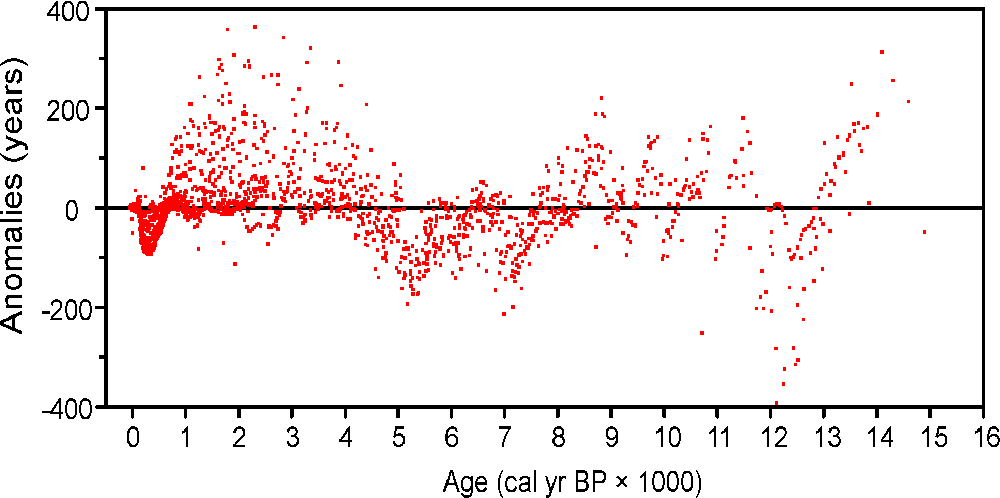

--- 
title: "Neotoma Paleoecology Manual v2.0"
description: "The manual for the Neotoma Paleoecology Database, including SQL and R code examples."
author: "Simon Goring"
date: "`r Sys.Date()`"
site: bookdown::bookdown_site
documentclass: book
bibliography: [assets/references.bib]
biblio-style: apalike
link-citations: yes
delete_merged_file: true
always_allow_html: true
graphics: yes
url: https://neotomadb.org
output:
  bookdown::gitbook:
    css: ./style.css
    config:
      toc:
        max-depth: 4
      edit: null
      download: null
  bookdown::pdf_book:
    latex_engine: xelatex
    citation_package: natbib
    keep_tex: yes
  bookdown::epub_book: default
---

# Acknowledgements

The documentation for the [Neotoma Paleoecology Database](https://neotomadb.org) would not be possible without the extrordinary work of Dr. Eric C. Grimm [@Jacobson2021] who spent countless hours developing the original database manual, and was the center of an incredible community built around the database. Neotoma rests on the work of a number of researchers who contributed to the original North American Pollen Database, and subsequent data contributors, including FAUNMAP contributors and the data contributions of Allan Ashworth. The Neotoma Database would not exist were it not for the ongoing contributions of authors, data analysts and funding agencies, in particular the National Sciences Foundation. This manual draws heavily from Eric Grimm's original Neotoma manual (v2), published as [@grimm2008neotoma].

The Postgres snapshot of the database is accessible from [the Neotoma Snapshots page](http://www.neotomadb.org/snapshots). For users who may be interested in loading the database using Docker, a GitHub repository is available to install the latest snapshot and build a container locally.

```{r, packageload, echo=FALSE, messages=FALSE, warnings='false', results='hide', include=FALSE}
Sys.setenv(OPENSSL_CONF="/dev/null")
if (!require("pacman")) install.packages("pacman")
suppressPackageStartupMessages(library(pacman))
packages <- read.delim('requirements.txt')
p_load(char = unlist(packages))

dbLogin <- fromJSON('connect_remote.json')
db <- DBI::dbConnect(RPostgres::Postgres(),
                 dbname = dbLogin$database, 
                 host = dbLogin$host, 
                 port = dbLogin$port, 
                 user= dbLogin$user, 
                 password= dbLogin$password)

showTable <- function(db, tablename) {
  query <- "SELECT
                atr.attname AS column,
                pg_catalog.format_type(atr.atttypid, atr.atttypmod) AS data_type,
                array_to_string(array_remove(array_agg(DISTINCT con.conname), NULL), ', ') AS constraint
            FROM
                pg_catalog.pg_attribute AS atr
            INNER JOIN
                pg_catalog.pg_class AS cl ON cl.oid = atr.attrelid
            INNER JOIN
                pg_catalog.pg_namespace AS nsp ON nsp.oid = cl.relnamespace
            LEFT JOIN pg_catalog.pg_constraint AS con ON con.conrelid = atr.attrelid AND atr.attnum = ANY(con.conkey)
            WHERE
                atr.attnum > 0
                AND NOT atr.attisdropped
                AND nsp.nspname = 'ndb'
                AND cl.relname = $1
            GROUP BY atr.attname, atr.atttypid, atr.atttypmod, atr.attnum
            ORDER BY atr.attnum;"
  output <- dbGetQuery(db, query, tablename)
  DT::datatable(output, filter = 'none', rownames = FALSE, options = list(dom='ltip'))
}
```

<!--chapter:end:index.Rmd-->

# Introduction

The Neotoma Paleoecology Database is a public, community curated database containing fossil data from the Holocene, Pleistocene, and Pliocene, or approximately the last 5.3 million years [@Williams2018a]. Neotoma stores biological data, and associated physical data from fossil bearing deposits or the depositional environments from which datasets have been obtained. For example, sediment loss-on-ignition and geochemical data from lake sediments, or modern water chemistry data from water bodies from which diatoms have been collected. The database also stores data from modern samples that are used to interpret fossil data.

The initial development of Neotoma was funded by a grant from the U.S. National Science Foundation Geoinformatics program. The inital grant was a collaborative proposal between Penn State University [@nsf0622349] and the Illinois State Museum [@nsf0622289]. It had five Principle Investigators, Russell W. Graham, Eric C. Grimm, Stephen T. Jackson, Allan C. Ashworth, and John W. (Jack) Williams.

Initially, data within Neotoma were merged from four existing databases: the Global Pollen Database, [FAUNMAP](\@ref(FAUNMAP)), a database of mammalian fauna [@Group1994], the North American Plant Macrofossil Database, and a [fossil beetle database](\@ref(BEETLE)) assembled by Allan Ashworth. Although structurally different, these databases contain similar kinds of data, and merging them was quite practical. The rationale for this merging was twofold:

1. To facilitate analyses of past biotic communities at the ecosystem level
2. To reduce the overhead in maintaining and distributing several independent databases.

Because the proxy types that Neotoma integrated were sufficiently diverse, the data model had to focus on the commonalities as the core of the database structure, specifically elements of stratigraphy and chronology. This design facilitated the gradual inclusion of other database types including the addition of ostracode, diatom, chironmid, and freshwater mussel datasets.

The Neotoma database was initially designed by Eric C. Grimm and implemented in Microsoft® Access®. Neotoma was ported to SQL Server, where it was served from the [Center for Environmental Informatics](https://sites.psu.edu/environmentalinformatics/) at Penn State University. Subsequently the database was ported to PostgreSQL, to support a fully open data ecosystem with an Application-Program Interface (API) that could be integrated into R packages [e.g., @goring2015neotoma] or other programming languages.

## Whence Neotoma

|  |
|:--:|
| A packrat of the genus *Neotoma*. Credit: Alan Cressler, CC BY-SA 2.0 <https://creativecommons.org/licenses/by-sa/2.0>, via Wikimedia Commons |

Neotoma was called a "Late Neogene Terrestrial Ecosystem Database" in the [original NSF proposal](https://nsf.gov/awardsearch/showAward?AWD_ID=0622289). At the time this proposal was written, the Neogene Period included the Miocene, Pliocene, Pleistocene, and Holocene epochs. However, a proposal before the International Commission on Stratigraphy elevated the Quaternary to a System or Period following the Neogene [@gibbard2010formal], terminating the Neogene at the end of Pliocene. To account for the change in nomenclature, numerous names and companion acronyms were considered, but none engendered enthusiastic support. B. Brandon Curry proposed the name **Neotoma**, and this name struck a fancy. *Neotoma* is the [genus for the packrat](https://en.wikipedia.org/wiki/Pack_rat). Packrats are prodigious collectors of anything in their territory, and moreover they are collectors of fossil data. **Neotoma** packrats collect plant macrofossils and bones, and pollen is preserved in their amberat -- hardened, dried urine, which impregnates their middens and preserves them for millennia.

## Rationale

Paleobiological data from the recent geological past have been invaluable for understanding ecological dynamics at timescales inaccessible to direct observation, including ecosystem evolution, contemporary patterns of biodiversity, principles of ecosystem organization, particularly the individualistic response of species to environmental gradients, and the biotic response to climatic change, both gradual and abrupt. Understanding the dynamics of ecological systems requires ecological time series, but many ecological processes operate too slowly to be amenable to experimentation or direct observation. In addition to having ecological significance, fossil data have tremendous importance for climatology and global change research. Fossil floral and faunal data are crucial for climate-model verification and are essential for elucidating climate-vegetation interactions that may partly control climate.

Basic paleobiological research is site based, and paleobiologists have devoted innumerable hours to identifying, counting, and cataloging fossils from cores, sections, and excavations. These data are typically published in papers describing single sites or small numbers of sites. Often, the data are published graphically, as in a pollen diagram, and the actual data reside on the investigator's computer or in a file cabinet. These basic data are similar to museum collections, costly to replace, sometimes irreplaceable, and their value does not diminish with time. Also similar to museum collections, the data require cataloging and curation. Whereas physical specimens of large fossils, such as animal bones, are typically accessioned into museums, microfossils, such as pollen, are not accessioned, and the digital data are the primary objects, and their loss is equivalent to losing valuable museum specimens. The integrated database that we propose ensures safe, long-term archiving of these data.

Large independent databases exist for fossil pollen, plant macrofossils, and mammals: the Global Pollen Database (GPD), the North American Plant Macrofossil Database (NAPMD), and FAUNMAP. In addition, a database of fossil beetles (BEETLE) has been assembled and integrated into Neotoma. These databases, as with others in the Earth and ecosystem sciences, have become essential cyberinfrastructure. Nevertheless, these resources were originally developed as standalone databases in the early 1990's. GPD and NAPMD were stored in [Paradox®](https://en.wikipedia.org/wiki/Paradox_(database)) file formats; FAUNMAP in [Microsoft Access](https://en.wikipedia.org/wiki/Microsoft_Access). Since initial database development, emphasis has been placed on ingest of new and legacy data. However, database and Internet technology have advanced greatly since 1995, and the current relational database software, ingest programs, data retrieval algorithms, output formats, and analysis tools are outdated and minimal. Moreover, the databases are not linked, so that integrated analyses are difficult.

Although GPD, NAPMD, and FAUNMAP were developed independently, they have much in common. The basic data of all three databases as well as BEETLE are essentially lists of taxa from cores, excavations, or sections, often with quantitative measures of abundance. The three databases include similar metadata. The objective of Neotoma is to build a unified data structure that will incorporate all of these databases. The database will initially incorporate pollen, plant macrofossil, mammal, and beetle data. However, the database designed facilitates the incorporation of all kinds of fossil data.

Various teams of investigators have developed databases for paleobiological data that have been project or discipline based,
including the four databases to be integrated in this project. However, long-term maintenance and sustainability have been problematic because of the need to secure continuous funding. Nevertheless, these databases have become the established archives for their disciplines and, new data are continuously contributed. However, because of funding hiatuses, long spells may intervene between times of data contribution and their public availability. For example, the plant macrofossil database has not incorporated any new data since 1999. The number of different databases and disciplines exacerbates the problem, because each database requires a database manager. Consolidation of informatics technology helps address this overhead issue. However, specialists are still essential for management and supervision of data collection and quality control for their disciplines or organismal groups.

The purposes of Neotoma are:

* to facilitate studies of ecosystem development and response to climate change
* to provide the historical context for understanding biodiversity dynamics, including genetic diversity
* to provide the data for climate-model validation
* to provide a safe, long-term, low-cost archive for a wide variety of paleobiological data.

Site-based studies are invaluable in their own right, and they are the generators of new data. However, much is gained by marshalling data from geographic arrays of sites for synoptic, broad-scale ecosystem studies. In order to carry out such studies efficiently, a queryable database is required. Thus, it is much morethan an archive; it is essential cyberinfrastructure for paleoenvironmental research. The database facilitates integration, synthesis, and understanding, and it promotes information sharing and collaboration. The individual databases have been extensively used for scientific research, with several hundred scientific publications directly based upon data drawn from these databases. This project will enhance those databases and will continue their public access. By integrating these databases and by simplifying the contributor interface, we can reduce the number of people necessary for community-wide database maintenance, and thereby help ensure their long-term sustainability and existence.

## History of the Constituent Databases

### Global Pollen Database

In an early effort, the Cooperative Holocene Mapping Project [@Members1988;@Wright1993c] assembled pollen data in the 1970s and 1980s to test climate models. Although data-model comparison was the principal objective of the COHMAP project, the  synoptic analyses of the pollen data, particularly maps showing the constantly shifting ranges of species in response to climate change, were revelatory and led to much ecological insight [e.g. @Webb1981;@Webb1987a;@Webb1988b].

The COHMAP pollen "database" was a set of flat files with a fixed file format for data and for chronologies. FORTRAN programs were written to read these files and to assemble data for particular analyses. Thompson Webb III managed the COHMAP pollen database at Brown University, but as the quantity of data increased, data management became increasingly cumbersome; the data needed to be migrated to a relational database management system. Discussions with E. C. Grimm led to the initiation of the North American Pollen Database (NAPD) in 1990.

At the same time in , the International Geological Correlation Project IGCP 158 [@Church1989IGCPP1] was conducting a major collaborative synthesis of paleoecological data, primarily of pollen, making the need for a pollen database painfully obvious. In the forward to the book resulting from this project [@berglund1996palaeoecological], J.L. de Beaulieu describes the role that the IGCP 158 project had in launching the European Pollen Database [@Huntley1993b]. A workshop to develop a European Pollen Database (EPD) was held in in 1. North American representatives also attended, and the organizers of NAPD and EPD commenced a long-standing collaboration to develop compatible databases. NAPD and EPD held several joint workshops and developed the same data structure. Nevertheless, the two databases were independently established, partly because Internet capabilities were not yet sufficient to easily manage a merged database. The pollen databases were developed in Paradox, which at the time was the most powerful RDBMS readily available for the PC platform. NAPD and EPD established two important protocols:

* the databases were relational and queryable
* they were publicly available.

As the success the NAPD-EPD partnership escalated, working groups initiated pollen databases for other regions, including the Latin American Pollen Database (LAPD) in 1994, the Pollen Database for and the Russian Far East (PDSRFE) in 1995, and the African Pollen Database (APD) in 1996. At its initial organizational workshop, LAPD opted to merge with NAPD, rather than develop a standalone database, and the Global Pollen Database was born. PDSRFE also followed this model. APD developed independently, but uses the table structure of GPD and EPD. Pollen database projects have also been initiated in other regions, and the GPD contains some of these data, including the Indo-Pacific Pollen Database and the Japanese Pollen Database.

```{sql, ageSamples, connection=db, output.var="sampleroundcount", echo=FALSE}
SELECT ROUND(age::bigint, -2) AS age, COUNT(*) AS n
FROM ndb.sampleages
WHERE age IS NOT NULL
GROUP BY ROUND(age::bigint, -2);
```

```{r, agedistributions, echo=FALSE, fig.alt="Histogram of sample age distributions in Neotoma for the first 200000 years of samples showing that data is heavily skewed the the present.", fig.cap="Sample age distributions in Neotoma for a subset of Neotoma data.  Ages are heavily skewed to samples in the last 10,000 years, and moreso to the near-present.", warnings=FALSE}
ggplot(sampleroundcount, aes(x = age, y = n)) +
    geom_histogram(stat="identity", width=500) +
    scale_x_continuous() +
    theme_bw() +
    xlab('Years Before Present') +
    ylab('Age Count')
```

The pollen databases contain data from the Holocene, Pleistocene, and Pliocene, although most data are from the last 20,000 years (Fig. \@ref(fig:agedistributions)). Included are fossil data, mainly from cores and sections, and modern surface samples, which are essential for calibrating fossil data. NAPD data are not separate from the GPD, but rather the NAPD is the North American subset of GPD. EPD has both public and restricted data --- a concession that had to be made early on to assuage some contributors.

### North American Plant Macrofossil Database

Plant macrofossils include plant organs generally visible to the naked eye, including seeds, fruits, leaves, needles, wood, bud scales, and megaspores. Synoptic-scale mapping of plant macrofossils from modern assemblages [@Jackson1997] and fossil assemblages [@Jackson1997;@Jackson2000c;@Jackson2002] have shown the utility of plant macrofossils in providing spatially and taxonomically precise reconstructions of past species ranges. Although plant macrofossil records are spatially precise, synoptic networks of high-quality sites can scale up to yield aggregate views of past distributions [@Jackson1997]. In addition, macrofossils, with their greater taxonomic resolution, augment the pollen data by providing information on which species might have been present, and can resolve issues of long-distance transport [@Birks2003].

The North American Plant Macrofossil Database (NAPMD) has been directed by S.T. Jackson at the . Highest priority has been placed on data from the last 30,000 years, although some earlier Pleistocene and late Pliocene data are included. The database originated as a research database for selected taxa from Late Quaternary sediments of eastern North America [@Jackson1997]. In 1994, an effort was initiated with NOAA funding to build on this foundation to develop a cooperative, relational database comprising all of , a longer time span, and all plant taxa.

The structure of NAPMD was adapted from the pollen database and was also stored in a Paradox file format. Although the plant macrofossil database was well served by the data model structure, modifications were made to accommodate different organs from the same species and to deal with the various quantitative measures of abundance. The Plant Macrofossil database also included surface samples, which were not part of the pollen databases at the time, but are useful for the interpretation of fossil data.

### FAUNMAP {#FAUNMAP}

R.W. Graham, E.L. Lundelius, Jr., and a group of Regional Collaborators organized a project to develop a database for late Quaternary faunal data from the , which the U.S. NSF funded in 1990. This project had a research agenda, and its seminal paper focused on the individualistic behavior displayed by animal species [@Group1994].

Two FAUNMAP databases exist, FAUNMAP I and FAUNMAP II. Both databases were coordinated by R. W. Graham and E. L. Lundelius, Jr. and funded by NSF. Both are relational databases for fossil mammal sites. The data were extracted from peer-reviewed literature, selected theses and dissertations, and selected contract reports for both paleontology and archaeology (all data is currently contained within the Neotoma publications tables). Unpublished collections were not included. Data were originally captured in Paradox but were later migrated to Microsoft Access.

FAUNMAP I contains data from sites in the continental United States (the lower 48 States) that date between 500 BP and \~40,000 BP. Funding for FAUNMAP I ended in 1994, with the production of two major publications by the FAUNMAP Working Group [@Group1994;@Group1996], along with publications from individual members and many others who accessed the database on-line. Graham and Lundelius continued the FAUNMAP project, developing FAUNMAP II with funding from NSF beginning in 1998. FAUNMAP II [@faunmapTwo] shares the same structure as FAUNMAP I but expands the spatial coverage to include and and extends the temporal coverage to the Pliocene (5 Ma). In addition, sites published since 1994, when FAUNMAP I was completed, have been added for the contiguous 48 States. In all, FAUNMAP I and II contain more than 5000 fossil-mammal sites with more than 600 mammal species for all of North America north of Mexico that range in age from 0.5 ka to 5 Ma­.

The detailed structure of the FAUNMAP database is described in FAUNMAP Working Group [@Group1994]. Sites identified by name and location were subdivided into Analysis Units (AU's), which varied from site to site depending upon the definitions used in the original publications (e.g., stratigraphic horizons, cultural horizons, excavation levels, biostratigraphic zones). All data (*i.e.*, taxa identified, and counts of individual specimens) and metadata (sediment types, depositional environments, facies, radiometric and other geochronological dates, modifications of bone) were associated with the individual AUs. This structure -- analysis units within sites -- allows for information to be extracts at the site level, or at the smallest sample subdivision. The analysis unit permits fine-scale temporal resolution and analysis. Similar to the GPD and NAPMD, FAUNMAP contains archival and research tables. Similar to the plant macrofossil database, FAUNMAP contains a variety of quantitative measures of abundance (*e.g.*, MNI, NISP), and presence data are more commonly used for analysis.

### BEETLE {#BEETLE}

Many beetles have highly specific ecological and climatic requirements and are valuable indicators of past environments [@morgan1983late;@ashworth2001aapg;@ashworth2004coleoptera]. Coleoptera is one of the most diverse groups of organisms on Earth, and of the insects, perhaps the most commonly preserved as fossils. Allan Ashworth has assembled a database of fossil beetles from . The data, which were recorded in Excel, contain 5523 individual records of 2567 taxa from 199 sites and 165 publications. Metadata include site name, latitude and longitude, lithology of sediment, absolute age, and geological age. The basic data are similar to plant and mammal databases -- lists of taxa from sites. The metadata have not been recorded to the extent of the other databases, especially chronological data, but Ashworth has resolved the taxonomic issues and has assembled the publications, so that the additional metadata can be easily pulled together.

## Who Will Use Neotoma?

The existing databases have been used widely for a variety of studies. Because the databases have been available on-line, precise determination of how many publications have made use of them is difficult. In addition, the databases are widely used for instructional purposes. Below are examples of the kinds of people who have used these databases and who we expect will find the new, integrated database even more useful.

* **Paleoecologists** seeking to place a new record into a regional/continental/global context (e.g., Bell and Mead 1998, Czaplewski et al. 1999, Bell and Barnosky 2000, Newby et al. 2000, Futyma and Miller 2001, Gavin et al. 2001, Czaplewski et al. 2002, Schauffler and Jacobson 2002, Camill et al. 2003, Rosenberg et al. 2003, Willard et al. 2003, Pasenko and Schubert 2004, and many others).
* **Synoptic paleoecologists** interested in mapping regional to sub-continental to global patterns of vegetation change (e.g., Jackson et al. 1997, Williams et al. 1998, Jackson et al. 2000, Prentice et al. 2000, Thompson and Anderson 2000, Williams et al. 2000, Williams et al. 2001, Williams 2003, Webb et al. 2004, Williams et al. 2004, Asselin and Payette 2005).
* **Synoptic paleoclimatologists** building benchmark paleoclimatic reconstructions for GCM evaluation (e.g., Bartlein et al. 1998, Farrera et al. 1999, Guiot et al. 1999, Kohfeld and Harrison 2000, CAPE Project Members 2001, Kageyama et al. 2001, Kaplan et al. 2003).
* **Paleontologists** trying to understand the timing, patterns, and causes of extinction events (e.g., Jackson and Weng 1999, Graham 2001, Barnosky et al. 2004, Martínez-Meyer et al. 2004, Wroe et al. 2004).
* **Evolutionary biologists** mapping the genetic legacies of Quaternary climatic variations (e.g., Petit et al. 1997, Fedorov 1999, Tremblay and Schoen 1999, Hewitt 2000, Comps et al. 2001, Good and Sullivan 2001, Petit et al. 2002, Kropf et al. 2003, Lessa et al. 2003, Petit et al. 2003, Hewitt 2004, Lascoux et al. 2004, Petit et al. 2004, Whorley et al. 2004, Runck and Cook 2005).

* **Macroecologists** interested in temporal records of species turnover and biodiversity and historical controls on modern patterns of floristic diversity (e.g., Silvertown 1985, Qian and Ricklefs 2000, Brown et al. 2001, Haskell 2001).
* **Archeologists** who are studying human subsistence patterns and interactions with their environment (e.g., Grayson 2001, Grayson and Meltzer 2002, Cannon and Meltzer 2004, Grayson in press).
*  **Natural resource managers** who need to know historical ranges and abundances of plants and animals for designing conservation and management plans (e.g., Graham and Graham 1994, Cole et al. 1998, Noss et al. 2000, Owen et al. 2000, Committee on Ungulate Management in Yellowstone National Park 2002, Burns et al. 2003)
* **Scientists** trying to understand the potential response of plants, animals, biomes, ecosystems, and biodiversity to global warming (e.g., Bartlein et al. 1997, Davis et al. 2000, Barnosky et al. 2003, Burns et al. 2003, Kaplan et al. 2003, Schmitz et al. 2003, Jackson and Williams 2004, Martínez-Meyer et al. 2004)
* **Teachers** who use the databases for teaching purposes and class exercises [@goring].

<!--chapter:end:chapters/01-neotoma_introduction.Rmd-->

# Working with the Raw Data

Neotoma is a Postgres database. The data is stored on a database server in the cloud and most people interact with the database indirectly, either through the [Neotoma Explorer](https://apps.neotomadb.org), the [`neotoma2` R package](gttps://github.com/NeotomaDB/neotoma2), [Range Mapper](https://open.neotomadb.org/RangeMapper) or other tools.  Much of this manual discusses the raw, underlying data that powers these tools. They all pull their data from the Neotoma API, which is an application that sends data from the database over the internet using specially constructed URLs.

An open API, like Neotoma's is useful because all you need to access the data is an internet connection and the ability to understand JSON (either by scanning it visually, or using a programming language like Python, R or JavaScript).  For example:

```
https://api.neotomadb.org/v2.0/data/sites?sitename=Marion Lake
```

returns a JSON object that provides metadata about the sites in Neotoma that use the name "Marion Lake". More details about the API can be obtained from the online help for the API at https://api.neotomadb.org.


## Using the Database Locally

Users who wish to gain more experience working directly with SQL, or who need to undertake specialized analysis that is not supported by the R package or available APIs may choose to use the database directly. This involves installing PostgreSQL and associated add-ons (PostGIS in particular). Users should be aware that the database is not a program that they are commonly familiar with. The database runs in the background and users will generally "connect" to the database from R, Python, or another programming language, or they may use a database tool such as pgAdmin or dBeaver. Postgres also comes with the commandline tool `psql`, where a user can connect directly to the database from the terminal and type their queries directly.


<!--chapter:end:chapters/working_with_db.md-->

## Using R

The [`neotoma2` R package](https://github.com/NeotomaDB/neotoma2) provides a set of functions to download and work with data from Neotoma within the R programming environment. The package has been designed for users who wish to work with multiple sites or datasets, and supports users who wish to add their own data into Neotoma.

The functions in the R package act as *wrappers* for the API calls, and also provide some secondary services to help the data work efficiently in the R environment. For example, a user who wishes to search for all sites named 'Marion Lake' using R simply uses the `get_sites()` function:

```{r}
library(neotoma2)
marion <- get_sites(sitename = "Marion Lake")
marion
```

The following sections will detail several workflows using the R package. To help the end user we have created an instance of RStudio that is available from the browser, with all packages installed. You can access this version of RStudio from the [myBinder link](https://mybinder.org/v2/gh/NeotomaDB/Current_Workshop/main?urlpath=rstudio):

[](https://mybinder.org/v2/gh/NeotomaDB/Current_Workshop/main?urlpath=rstudio)

While many of our examples are drawn directly from existing workshop materials, you may find more complete details about using the R package on the GitHub page for the package, or in one or more of our posted workshops:

* European Pollen Database Workshop (May 22, 2022 -- [https://open.neotomadb.org/EPD_binder/simple_workflow.html]())
* AMQUA Pollen Workshop (May 22, 2022 -- [https://open.neotomadb.org/Workshops/AMQUA-June2022/simple_workflow.html]())
* IAL/IPA Diatom Workshop (November 2022 -- SPANISH [https://open.neotomadb.org/Workshops/IAL_IPA-November2022/simple_workflow_ES.html])

Other workshop materials are available within the [Neotoma Workshops GitHub repository](https://github.com/NeotomaDB/Workshops). Some workshops are highly specialized, and some contain links to cloud-based versions of RStudio so that users can work on the problems and workflows under standardized conditions.

<!--chapter:end:chapters/startingR.md-->

### Searching for Sites

There are several ways to find sites in `neotoma2` using the R package. We think of `sites` as being primarily spatial objects. `sites` have names, locations, and are found within the context of geopolitical units. Within the API and in the package, the site itself does not have associated information about taxa, dataset types or ages. The site is the container into which we add that information.  So, when we search for sites we can search by:

| Parameter | Description |
| --------- | ----------- |
| sitename | A valid site name (case insensitive) using `%` as a wildcard. |
| siteid | A unique numeric site id from the Neotoma Database |
| loc | A bounding box vector, geoJSON or WKT string. |
| altmin | Lower altitude bound for sites. |
| altmax | Upper altitude bound for site locations. |
| database | The constituent database from which the records are pulled. |
| datasettype | The kind of dataset (see `get_tables(datasettypes)`) |
| datasetid | Unique numeric dataset identifier in Neotoma |
| doi | A valid dataset DOI in Neotoma |
| gpid | A unique numeric identifier, or text string identifying a geopolitical unit in Neotoma |
| keywords | Unique sample keywords for records in Neotoma. |
| contacts | A name or numeric id for individuals associuated with sites. |
| taxa | Unique numeric identifiers or taxon names associated with sites. |

All sites in Neotoma contain one or more datasets. It's worth noting that the results of these search parameters may be slightly unexpected. For example, searching for sites by sitename, latitude, or altitude will return all of the datasets for the particular site. Searching for terms such as datasettype, datasetid or taxa will return the site, but the only datasets returned will be those matching the dataset-specific search terms. We'll see this later.

#### Site names: `sitename="%Lago%"`

We may know exactly what site we're looking for ("Lago Grande di Monticchio"), or have an approximate guess for the site name (for example, we know it's something like "Lago Grande", or "Grande Lago Grande", but we're not sure how it was entered specifically), or we may want to search all sites that have a specific term, for example, *Lago*.

We use the general format: `get_sites(sitename="%Lago%")` for searching by name.

PostgreSQL (and the API) uses the percent sign as a wildcard.  So `"%Lago%"` would pick up ["Lago Grande di Monticchio"](https://data.neotomadb.org/26607) for us (and picks up "Lago di Martignano" and "Lago Padule").  Note that the search query is also case insensitive, so you could simply write `"%LAGO%"`.

##### Code

```{r sitename, eval=FALSE}
lac_sites <- neotoma2::get_sites(sitename = "%Lago %")
plotLeaflet(lac_sites)
```

##### 3.1.1.2. Result

```{r sitenamePlot, echo=FALSE}
lac_sites <- neotoma2::get_sites(sitename = "%Lago %")
plotLeaflet(lac_sites)
```

#### 3.1.2. Location: `loc=c()` {.tabset}

The original `neotoma` package used a bounding box for locations, structured as a vector of latitude and longitude values: `c(xmin, ymin, xmax, ymax)`.  The `neotoma2` R package supports both this simple bounding box, but also more complex spatial objects, using the [`sf` package](https://r-spatial.github.io/sf/). Using the `sf` package allows us to more easily work with raster and polygon data in R, and to select sites from more complex spatial objects.  The `loc` parameter works with the simple vector, [WKT](https://arthur-e.github.io/Wicket/sandbox-gmaps3.html), [geoJSON](http://geojson.io/#map=2/20.0/0.0) objects and native `sf` objects in R.

As an example of searching for sites using a location, we've created a rough representation of Italy as a polygon.  To work with this spatial object in R we also transformed the `geoJSON` element to an object for the `sf` package.  There are many other tools to work with spatial objects in R. Regardless of how you get the data into R, `neotoma2` works with almost all objects in the `sf` package.

```{r boundingBox}
geoJSON <- '{"coordinates":
  [[
      [8.22, 44.13],
      [12.44, 41.72],
      [15.86, 37.82],
      [18.61, 39.99],
      [12.20, 45.39],
      [13.62, 45.86],
      [13.45, 46.46],
      [12.21, 47.11],
      [10.41, 46.69],
      [6.99, 45.97],
      [6.87, 44.34],
      [8.22, 44.13]
      ]],
  "type":"Polygon"}'

italy_sf <- geojsonsf::geojson_sf(geoJSON)

# Note here we use the `all_data` flag to capture all the sites within the polygon.
# We're using `all_data` here because we know that the site information is relatively small
# for Italy. If we were working in a new area or with a new search we would limit the
# search size.
italy_sites <- neotoma2::get_sites(loc = italy_sf, all_data = TRUE)
```

You can always simply `plot()` the `sites` objects, but you will lose some of the geographic context.  The `plotLeaflet()` function returns a `leaflet()` map, and allows you to further customize it, or add additional spatial data (like our original bounding polygon, `sa_sf`, which works directly with the R `leaflet` package):

##### 3.1.2.1. Code

```{r plotL, eval=FALSE}
neotoma2::plotLeaflet(italy_sites) %>% 
  leaflet::addPolygons(map = ., 
                       data = italy_sf, 
                       color = "green")
```

##### 3.1.2.2. Result

```{r plotLeaf, echo=FALSE}
neotoma2::plotLeaflet(italy_sites) %>% 
  leaflet::addPolygons(map = ., 
                       data = italy_sf, 
                       color = "green")
```

<!--chapter:end:chapters/RSiteSearch.md-->

# SQL Quickly

SQL (Sturctured Query Language) is a standard language for querying and modifying relational databases. There is an official standard for SQL, which means that statements such as `SELECT` and `WHERE` are common across most SQL implementations. While many properties are common, individual vendors do maintain proprietary formatting. Neotoma is implemented using PostgreSQL, which has [extensive documentation online](https://www.postgresql.org/docs/14/index.html). It is beyond the scope of this document to teach SQL, however, we have included a large number of SQL queries along with the documentation to provide templates for queries, and to help the user understand how to directly work with the database. These queries can by typed or copied and pasted into database tools such as [pgAdmin](https://www.pgadmin.org/).

For the purposes of database development, the Neotoma team uses the following SQL tools:

* [pgAdmin](https://www.pgadmin.org/)
* [VS Code](https://code.visualstudio.com/)
* [psql](https://www.postgresql.org/docs/current/app-psql.html)
* [SchemaSpy](https://schemaspy.org/)

Throughout the Neotoma Database Manual we will refer to tables using the format `schema.tablename`.  The `ndb` namespace is the schema for most of the data tables within the Neotoma database, so you will see things like `ndb.taxa` and `ndb.sites` frequently. There are other schema, including `apps`, `doi` and `public`, but the data tables themselves are kept in the `ndb` schema. You can see all available data tables in the `ndb` schema using the [Neotoma database schema website](https://open.neotomadb.org/dbschema).

## SQL Example

The following SQL example lists the number of sites by the geopolitical unit, where the geopolitical unit is a country.  It uses three tables, `ndb.sites`, which contains **site** information, `ndb.geopoliticalunits`, which lists all geopolitical units (countries, provinces, towns, etc.), and a `JOIN` table, which helps to link the `ndb.sites` table to the `ndb.geopoliticalunits` table.

By convention, SQL first defines the output, using the `SELECT` statement.  The `FROM` block is used to explain how the information is brought together, and the `WHERE` (and subsequent blocks) are meant to help filter and aggregate data as generated within the `FROM` block.

Throughput this document we will use `AS` statemements to help us write our SQL queries neatly, and we will use `INNER JOIN` calls with `ON` statements, rather than `NATURAL INNER JOIN` calls. Using `AS` helps us create an alias so that we don't have to write so much in our query.  As much as possible we will use the same aliases for tables throughout this guide. For example, `FROM ndb.sites AS st` is commonly used, where `st` becomes the alias for the `ndb.sites` table, and stands in for it elsewhere in the query. Often you will see `gpu` used for `ndb.geopoliticalunits`, or `tx` for `ndb.taxa`.  In Postgres SQL it is not neccessary to use the term `AS` (we use it here to make the queries clearer for folks just learning how to use SQL), so it's possible to see things like `ndb.sites st` in place of `ndb.sites AS st`. 

The `NATURAL INNER JOIN` assumes that any columns with common names are used in a `JOIN`. Because Neotoma enforces naming consistency (in general) between [primary and foreign keys](#table-keys-table-keys), we ought to be able to perform `NATURAL` joins. However, a trigger on most Neotoma tables adds the columns `recdatecreated` and `recdatemodified` to almost all tables. For this reason we make it practice within SQL queries to be explicit about the joining columns.

The following example show the use of queries with and without `AS`:

### SQL Query

```{sql, sampleCall, echo=TRUE, connection=db, output.var="geopoliticalsort"}
SELECT
  COUNT(*) AS sites,
  gpu.geopoliticalname, 
  gpu.geopoliticalunit
FROM
  ndb.geopoliticalunits AS gpu
  INNER JOIN ndb.sitegeopolitical AS sgp ON sgp.geopoliticalid = gpu.geopoliticalid
  INNER JOIN ndb.sites st ON st.siteid = sgp.siteid
WHERE 
  gpu.geopoliticalunit = 'country'
GROUP BY
  gpu.geopoliticalid
HAVING COUNT(*) > 0
ORDER BY sites DESC;
```

```{r}
DT::datatable(geopoliticalsort)
```

## Table Keys {#table-keys}

Within tables there are often Keys. A Key may be a **Primary Key** (PK), which acts as a unique identifier for individual records within a table, or they may be a **Foreign Key** (FK) which refers to a unique identifier in another table. Primary Keys and Foreign Keys are critical to join tables in a SQL query. 

In relational databases such as Neotoma you will often have "entity" tables, that represent explicit things (e.g., people, sites), and then tables that express the relationship between entities using foreign keys.  So, for example the table `ndb.sitegeopoliticalunits` expresses the relationship between `ndb.sites` and `ndb.geopoliticalunits`.  Both `ndb.sites` and `ndb.geopoliticalunits` represent entities; a country is a thing, with properties, as is a site.  The `ndb.sitegeopoliticalunits` defines the relationship betwen these things.  It is a table with two columns, one is an FK that refers back to the PK, `siteid`s, in `ndb.sites`, and one is an FK for the primary key of the `ndb.geopoliticalunits`.

Switching to the *SQL Query* tab in the above example will show you that we are using the PK for the `geopoliticalunits`, `geopoliticalid`. It links the complete information in the `ndb.geopoliticalunits` table to the `ndb.sites` table, through a `JOIN` table, that has two columns, the `siteid` that is the PK for `ndb.sites` and the `geopoliticalid` column, that is the PK for `ndb.geopoliticalunits`.  In this way, `siteid` is the PK in `ndb.sites` and an FK in `ndb.sitegeopoliticalunits`.

## Data Types

Neotoma uses several standard SQL data types.  You can find out more about these individual data types in the Postgres [data type documentation](https://www.postgresql.org/docs/current/datatype.html).

### Query {.tabset}

#### SQL Query

```{sql, dataTypeCall, echo=FALSE, connection = db, fig.cap="Common data types within the Neotoma database.", output.var="datatypes"}
SELECT LOWER(data_type) AS DataType, count(*) AS columns 
FROM information_schema.columns
WHERE table_schema = 'ndb' 
GROUP BY data_type
HAVING COUNT(*) > 1;
```

#### Data {.active}

```{r}
DT::datatable(datatypes)
```

<!--chapter:end:chapters/sql_quickly.Rmd-->

# Database Design Concepts

The Neotoma database itself is a highly normalized object that contains over 150 distinct tables, allowing us to uniquely and precisely describe individual occurrences of paleoecological elements in space and time, and ascribe to those observations information about the mode of preparation, collection and publication. An [interactive database schema](https://open.neotomadb.org/dbschema) is available through the Neotoma website.


## Sites, Collection Units, Analysis Units, Samples, and Datasets {#sitedesign}

Fossil data are **site** based. A [`site`](#Sites) has a name, latitude-longitude coordinates (with a projection), altitude, and areal extent. In Neotoma, *sites* are designated geographically as points or polygons, and subsequently converted into bounding boxes with north and south latitude coordinates and east and west longitude coordinates. Neotoma uses a Postgres database, and represents spatial data using [postgis's geography object](http://postgis.net/workshops/postgis-intro/geography.html). Most legacy sites in Neotoma are represented only using point coordinates.

![**Figure 2**. Three panels showing context for Neotoma's geographic representation of sites. In panel **a** a site is defined by the boundaries of a lake. The site also has a bounding box, and the core location is defined by a collection unit within the site that is defined with precise coordinates. In panel **b** a site is defined as a single point, for example, from a textual reference indicating the site is at the intersection of two roads. Here the site and collection unit share the unique point location. In panel **c** we show how that site location may be obfuscated using a bounding box as the site delimiter. In this case the collection unit would not be defined (but is represented as the triangle for illustration).](assets/images/siteboundarydiagram.svg)

The lat-long box can circumscribe the site, for example a lake (*Figure 2a*), or it may circumscribe a larger area in which the site lies either because the exact location of the site is not known or because the exact location is purposely kept vague (*Figure 2c*). In the case of many legacy sites, the exact location is not know precisely; for example, it may have been described as *on a gravel bar 5 miles east of town*. The exact locations of some sites have purposely been kept vague to prevent looting and vandalism.

A [`Collection Unit`](#CollectionUnits) is a unit from a site from which a collection of fossils or other data have been made. Typical Collection Units are cores, sections, and excavation units. A site may have several Collection Units. A Collection Unit is located spatially within a site and may have precise GPS latitude-longitude coordinates. Its definition is quite flexible. For pollen data, a Collection Unit is typically a core, a section, or surface sample. A Collection Unit can also be a composite core comprised of two or more adjacent cores pieced together to form a continuous stratigraphic sequence. A Collection Unit can also be an excavation unit. For faunal data, a Collection Unit could be as precise as an excavation square, or it could be a group of squares from a particular feature within a site. For example, consider a pit cave with three sediment cones, each with several excavation squares. Collection Units could be defined as the individual squares, or as three composite Collection Units, one from each sediment cone. Another example is an archaeological site, from which the reported Collection Units are different structures, although each structure may have had several excavation squares. The precision in the database depends on how data were entered or reported.

For many published sites, the data are reported from composite Collection Units. If faunal data are reported from a site or locality without explicit Collection Units, then data are assigned to a single Collection Unit with the name *Locality*.

Different kinds of data may have been collected from a single Collection Unit, for example fauna and macrobotanicals from an excavation, or pollen and plant macrofossils from a lake-sediment core. A composite Collection Unit may include data from different milieus, which, nevertheless, are associated with each other, for example a diatom sample from surficial lake sediments and an associated lake-water sample for water-chemistry measurements.

The Collection Unit is equivalent to the *Entity* in the Global Pollen Database but was not defined in FAUNMAP. When the FAUNMAP data were imported into Neotoma, most localities were assigned a single *Locality* Collection Unit. However, for some localities, the data were assigned to different Collection Units that were clearly identifiable in FAUNMAP (see **Figure 3**).


**Figure 3**. A diagram showing the relationships between tables in Neotoma, the Pollen Database, and FAUNMAP. Because the Global Pollen Database had only pollen, no need existed for the concept of Analysis Units, which may have multiple data types. FAUNMAP did not make a hierarchical distinction between Collection Units and Analysis Units, and the data for both Analysis Units and fauna are contained in the Faunal table, although within the Faunal table, implicit one-to-many relationships exist between Localities and Analysis Units and between Analysis Units and faunal data.

An [`Analysis Unit`](#AnalysisUnits) is a stratigraphic unit within a Collection Unit and is typically defined in the vertical dimension. An Analysis Unit may be a natural stratigraphic unit with perhaps irregular depth and thickness or it may be an arbitrary unit defined by absolute depth and thickness. An excavation may have been dug in arbitrary units, for example 10 cm levels, or it may have followed natural stratagraphic boundaries, for example the *red zone* or a feature in an archaeological site. Although Analysis Units could be designated by an upper depth and lower depth, in Neotoma they are designated by their midpoint depth and thickness, which is more convenient for developing age models. Pollen and other microfossils are typically sampled at arbitrary depths, and although these samples have thicknesses corresponding to the thickness of the sampling device (usually 1 cm or less), these thicknesses are often not reported, just the depths. Different kinds of samples may have been taken from a single analysis unit, for example pollen, diatoms, and ostracodes. The Analysis Unit links these various samples together.

In larger excavations, natural stratigraphic Analysis Units may cut across excavation squares or Collection Units, and the data are reported by Analysis Unit rather than by Collection Unit. In this case, the fossil data are assigned to a generic composite Collection Unit named *Locality*, which has the explicitly defined Analysis Units. If the Analysis Units are not described or reported, then the data are assigned to a single Analysis Unit with the name *Assemblage*. Thus, for a locality published with only faunal list, the fauna are assigned to a Collection Unit named *Locality* and to an Analysis Unit named *Assemblage*.

In FAUNMAP, Analysis Units are the primary sample units, and fauna are recorded by Analysis Unit. In the GPD, Analysis Units correspond to samples.

[`samples`](#Samples) are of a single data type from an Analysis Unit. For example, there may be a vertebrate faunal sample and a macrobotanical sample from the same Analysis Unit; or there may be a pollen sample and an ostracode sample from the same Analysis Unit. There can be multiple samples of the same data type from an Analysis Unit, for example two pollen samples counted by different analysts. Normally, vertebrate fossils from an Analysis Unit comprise a single sample; however, if the fossils are of mixed age, individually dated bones may be treated as separate samples, each with a precise age. In addition to fossils, samples may also be used for physical measurements, such as loss-on-ignition. Geochronologic measurements, such as radiocarbon dates, are made on geochronologic samples.

A [`dataset`](#Datasets) is a set of Samples of a single data type from a Collection Unit. For example the pollen data from a core comprise a pollen Dataset. The geochronologic samples from a Collection Unit form a geochronologic Dataset. Every Sample is assigned to a Dataset, and every Dataset is assigned to a Collection Unit. Samples from different Collection Units cannot be assigned to the same Dataset (although they may be assigned to Aggregate Datasets).

## Taxa and Variables

In general, a single `sample` in Neotoma has an associated set of taxa, from the same dataset type, with some measure of abundance. The [`data`](#Data) table in Neotoma has fields for `sampleid`, `variableid`, and `value`. **Variables** -- listed in the [`variables`](#Variables) table -- consist of a **`taxon`**, referenced by the [`taxa`](#Taxa) table, as well as the identified **`element`**, measurement **`units`**, **`context`**, and **`modification`**. Because of the way Neotoma data is structured, non-biological elements are also contained within the `taxa` table; for example, there is an entry for *loss-on-ignition*. For this reason, the field `taxagroupid` identifies the "taxon" type, and the hierarchy (the column `highertaxonid`) helps the user understand the context of the taxon name.

**Table 1.** The `taxa` table entry for *loss-on-ignition*, showing the `taxagroupid`. The `highertaxonid` value of 5783 points to the `loss-on-ignition` entry itself, it does not belong to a hierarchy.

 taxonid | taxoncode |    taxonname     | author | valid | highertaxonid | extinct | taxagroupid | publicationid | validatorid | validatedate | notes
---------+-----------+------------------+--------+-------+---------------+---------+-------------+---------------+-------------+--------------+-------+---------------------+---------------------
    5783 | LOI       | loss-on-ignition |        | t     |          5783 | f       | LOI         |               |          44 | 2013-02-18   |

* For biological taxa, the **`element`** is the organ or skeletal element. Typical faunal elements are bones, teeth, scales, and other hard body parts. Bone and tooth elements may be specifically identified (e.g. *tibia* or even more precisely *tibia, distal, left*, *M2, lower, left*). Some soft elements also occur in the database (e.g. *hair* and *dung*). For mammals, an unspecified element is *bone/tooth*. Elements for plant macrofossils are the organs identified (e.g. *seed*, *needle*, *cone bract*). Pollen and spores are treated simply as taxon elements. Thus, *Picea* seeds, *Picea* needles, and *Picea* pollen are three different `variables`. All three refer to a single entry in the [`taxa`](#Taxa) table for *Picea*.
* Variable **Units** are the measurement units. For faunal data, the most common are *present/absent*, *number of individual specimens* (NISP), and *minimum  number of individuals* (MNI). Plant macrofossils have many different quantitative and semi-quantitative measurement Units, including concentrations and relative abundance scales. Measurement Units for pollen are NISP (counts) and *percent*. For pollen the preferred measurement Unit is NISP, but for some sites only percentage data are available. *Picea* pollen NISP and *Picea* pollen percent are two different Variables.
* Variable **Contexts** for fauna include *articulated*, *intrusive*, and *redeposited*. A context for pollen is *anachronic*, which refers to a pollen type known to be too old for the contemporary sedimentary deposit. Most Variables do not have a specified context.
* Variable **Modifications** include various modifications to fossils or modifiers to Variables, including human modifications to bones (e.g. *bone tool*, *human butchering*, *burned*) and preservational and taphonomic modifications (e.g. *carnivore gnawed*, *fragment*). Modifications for pollen include preservational classifications such as *corroded* and *degraded*.

## Taxonomy and Synonymy

Neotoma does not change or question identifications from original sources, although taxonomic names may be synonymized to currently accepted names. Thus, for example, the old (although still valid) non-standard plant family names such as Gramineae and Compositae are synonimized to their standard family names terminated with *-aceae*, viz. Poaceae and Asteraceae. Neotoma has not attempted to establish complete or comprehensive synonymies. However, the [`synonyms`](#Synonyms) table lists commonly encountered synonyms. The descriptions of the [`synonymtypes`](#SynonymTypes) and [`taxa`](#Taxa) tables contain fuller discussions of synonymiztions made in Neotoma.

An important feature of Neotoma is that the [`taxa`](#Taxa) table is hierarchical. Each Taxon has a HigherTaxonID, which is the TaxonID of the next higher taxonomic rank. Thus, data are stored at the highest taxonomic resolution reported by the original investigators, but can be extracted
at a higher taxonomic level.

Synonymy presents a challenge for any organismal database, particularly for one such as Neotoma, which archives data collected for over a century and which archives extinct taxa, often for which few and fragmentary specimens exist. Many changes are due to increased understanding of the diversity within taxonomic groups and of the phylogenetic relationships within and among groups. Other changes are due purely to taxonomic rules or conventions set by the International Code of Botanical Nomenclature (McNeill et al. 2006) and the International Code of Zoological Nomenclature (International Commission on Zoological Nomenclature 1999). Working groups representing the different taxonomic groups included in Neotoma have established appropriate taxonomic authorities:

* Plants -- There is no worldwide authority. The International Plant Names Index[^1] lists validly published names, but a listed name is not necessarily the accepted name for a given taxon. For families, Neotoma follows the Angiosperm Phylogeny Group II (2003) and Stevens (2007+), which follows and updates APG II. The APG is an international consortium of plant taxonomists, and the APG classification utilizes the great quantity of phylogenetic data generated in recent years. For lower taxonomic ranks, the various pollen database cooperatives follow appropriate regional floras:
* North American Pollen Database/North American Plant Macrofossil Database: Insofar as possible, follows the *Flora of North America* (Flora of North America Editorial Committee 1993+); about half of the planned FNA volumes have been published. Otherwise, appropriate regional floras are followed.
* European Pollen Database: The EPD has a Taxonomy Support Group. In general, nomenclature follows *Flora Europaea* (Tutin 1964-1993).
* African Pollen Database: The APD has a Committee for Nomenclature, which has produced a list of pollen types with misspellings, synonymy, and nomenclature corrected[^2]. APD nomenclature follows *Enumération des plantes à fleurs d\'Afrique Tropicale* (Lebrun and Stork 1991-1997).
* Latin American Pollen Database: has a tremendously rich and diverse flora and no comprensive flora is available. Various regional floras are followed.
* Indo-Pacific Pollen Database: For Australia and adjacent areas follows the *Australian Plant Name Index* (Chapman 1991). For other regions, appropriate regional floras are followed.
* Pollen Database for Siberia and the Russian Far East Follows *Vascular Plants of Russia and Adjacent States* (Czerepanov 1995).
* Mammals -- For extant taxa, the authority is Wilson and Reeder's (2005) *Mammal Species of the World* . Original sources are followed for extinct species, and the database is considered authoritative.
* Birds -- For North America, the authority is the American Ornithologists' Union *Check-list of North American Birds* (American Ornithologists\' Union 1983).
* Fish -- Follows the *Catalog of Fishes* (Eschmeyer 1998).
* Mollusks -- For North America, follows *Common and Scientific Names of Aquatic Invertebrates from the United States and Canada: Mollusks* (Turgeon et al. 1998).
* Beetles -- Comprehensive manuals do not exist. Original taxonomic authorities are cited, and the database is considered authoritative.

## Taxa and Ecological Groups

In the [`taxa`](#Taxa) table, each taxon is assigned a TaxaGroupID, which refers to the [`taxagrouptypes`](#TaxaGroupTypes) table. These are major taxonomic groups, such as *Vascular plants*, *Diatoms*, *Testate amoebae*, *Mammals*, *Reptiles and amphibians*, *Fish*, and *Molluscs*. Also included are *Charcoal* and *Physical variables*. 

**Ecological Groups** are groupings of taxa within Taxa Groups, which may be ecological or taxonomic. Ecological Groups are assigned in the [`ecolgroups`](#EcolGroups) table, in which taxa are assigned an `ecolgroupid`, which links to the [`ecolgrouptypes`](#EcolGroupTypes) table, and an EcolSetID, which links to the [`ecolsettypes`](#EcolSetTypes) table.

Ecological Groups are commonly used to organize taxa lists and stratigraphic diagrams. For any taxonomic group, more than one Ecological Set may be assigned. For example, beetles may be assigned to a set of ecological groups, such as dung and bark beetles, and to second set based on taxonomy. Vascular plants are assigned to a *Default plant* set comprised of groups such as *Trees and Shrubs*, *Upland Herbs*, and *Terrestrial Vascular Cryptogams*. Default pollen diagrams can then be generated based on a pollen sum of these three groups. Mammals are assigned to a *Vertebrate orders* set.

## Chronology

Neotoma stores both the archival data used to reconstruct chronologies as well as interpreted chronologies derived from the archival data. The basic data used to reconstruct chronologies occurs in three tables:

* [`geochronology`](#Geochronology),
* [`tephrachronology`](#Tephrachronology), and
* [`relativechronology`](#RelativeChronology).

The [`geochronology`](#Geochronology) table includes geophysical measurements such as radiocarbon, thermoluminescence, uranium series, and potassium-argon dates. This table also includes dendrochronological dates derived from tree-ring chronologies, for example logs in archaeological structures. The [`tephrachronology`](#Tephrachronology) table records tephras in Analysis Units. This table refers to the [`tephras`](#Tephras) lookup table, which stores the ages for known tephras. The [`relativechronology`](#RelativeChronology) table stores relative age information for Analysis Units. Relative age scales include the archaeological time scale, geologic time scale, geomagnetic polarity time scale, marine isotope stages, North American land mammal ages, and Quaternary event classification. For example, diagnostic artifacts from an archaeological site may have cultural associations with a known age ranges, which can be assigned to Analysis Units. The faunal assemblage from an Analysis Unit may be assignable to particular land mammal age, which places it within a broad time range. Sedimentary units may be assigned to particular geomagnetic chrons, marine isotope stages, or Quaternary events, such as a particular interglacial. Many of these relative ages have rather broad time spans, but do provide some chronologic control.

Actual Chronologies are constructed from the basic chronologic data in the [`geochronology`](#Geochronology), [`tephrachronology`](#Tephrachronology), and [`relativechronology`](#RelativeChronology) tables. These chronologies are stored in the [`chronologies`](#Chronologies) table. A Chronology applies to a Collection Unit and consists of a number of Chron Controls, which are ages assigned to Analysis Units. A Chron Control may be an actual geochronologic measurement, such as a radiocarbon date, or it may be derived from the actual measurement, such as a radiocarbon date adjusted for an old carbon reservoir or calibrated to calendar years. A Chron Control may by an average of several radiocarbon dates from the same Analyis Unit. Different kinds of basic chronologic data may be used to assign an age to an Analysis Unit, for example radiocarbon dates and diagnostic archaeological artifacts. Some relative Chron Controls are not from one of the established relative time scales. Examples of these are local biostratigraphic controls, which may be based on dated horizons from nearby sites. A familiar example in is the *Ambrosia*-rise, which marks European settlement. The exact date varies regionally, depending on when settlement occurred locally. For a given site, the date assigned to the *Ambrosia*-rise may be based on historical information about when settlement occurred or possibly on geophysical dating (e.g. ^210^Pb) of a nearby site.


For continuous stratigraphic sequences, such as cores, not every Analysis Unit may have a direct date. Therefore, ages are commonly interpolated between dated Analysis Units. In this case, the ChronControls are the age-depth control points for an age model, which may be linear interpolation between Chron Controls or a fitted curve or spline.

**Figure 4. Smoothed quick radiocarbon calibration curve. At the scale of this figure the difference is mostly less than the line thickness.**

Age is measured in different time scales, the two most commn being radiocarbon years before present (^14^C yr BP) or presumed calendar years before present (cal yr BP). For a calibrated radiocarbon date, *cal yr BP* technically stands for *calibrated years before present*, i.e. calibrated to calendar years. In Neotoma, *cal yr BP* is used for both calibrated radiocarbon years and for other ages scales presumed to be in calendar years, viz. dendrochronologic years and other geochronlogic ages believed to be in calendar years. The zero datum for any *BP* age is ad 1950, regardless of its derivation. Thus, BP ages younger than ad 1950 are negative---ad 2000 = ‑50 BP.


Ages may be reported in ad/bc age units, in which case bc years are stored as negative values. If ages are reported with a datum other than ad 1950 for BP years, the ages must be converted to an ad 1950 datum or to the ad/bc age scale before entry into Neotoma. For example, ^210^Pb dates are often reported relative to the year of analysis; these must be converted to either ad/bc or *cal yr BP* with an ad 1950 datum.


**Figure 5. An enlarged portion of Figure 2 showing the monontonic smoothed curve**

Radiocarbon years can be calibrated to calendar years with a calibration curve. The current calibration curve for ≤26,000 cal yr BP (=21,341^14^C yr BP) is the INTCAL04 calibration curve (Reimer et al. 2004). Various programs, both online and standalone, are available for calibrating individual radiocarbon dates, two of the more popular are CALIB[^3] (Stuiver and Reimer 1993) and OxCal[^4] (Bronk Ramsey 1995, 2001), both available online for download. Calibration of radiocarbon years beyond the INTCAL04 curve is more controversial. However, the Fairbanks0107 curve is available for calibration of radiocarbon dates to 50,000 cal yr BP, the practial limit of radiocarabon dating (Fairbanks et al. 2005, Chiu et al. 2007), with an online application[^5].


**Figure 6**. Sample ages calculated from the Neotoma quick calibraton curve vs. ages calculated from traditional age models.

Calibrated radiocarbon dates better represent the true time scale and the true errors and probability distributions of the age estimates. In addition, other important paleo records, notably the ice cores and tree-ring records, have calendar-year time-scales. Therefore, for comparison among proxies and records, it is clearly desirable to place all records on the same time-scale, viz. a calendar-year time-scale. Although this goal is laudable, most of the data ingested into Neotoma from other databases is on a radiocarbon time scale. The majority of assigned ages and almost all the ages from the pollen database are interpolated ages derived from age models. The proper method for deriving calibrated ages is to calibrate the radiocarbon dates and then reinterpolate new ages between these calibrated dates.

Virtually all age models are problematic. A key problem is that most age models linearly interpolate between age-depth points or fit functions or splines to points. However, radiocarbon ages are not points, but probability distributions. Moreover, the probability distributions of calibrated ages are non-Gaussian. Each calibrated age has a unique probability distribution, and many are bimodal or multimodal. Various investigators have used different points, including the intercepts of the radiocarbon age with the calibration curve and the midpoint of the 1σ or 2σ probability distributon. The former is particularly inappropriate (Telford et al. 2004b). The 50% median probability is probably the best single point; however, because of multimodality, this particular point may, in fact, be very unlikely. Nevertheless, if it falls between more-or-less equally probable modes, it may still be the best single point. Most age models for cores are based on relataively few radiocarbon dates, and the uncertainties of the interpolated ages are unknown and large (Telford et al. 2004a). Indeed, chronology is perhaps the greatest challenge for future research with this database.



**Figure 7**. Anomalies (Sample ages from Neotoma default calendar-year age models minus ages calculated with the Neotoma quick calibration curve) vs. time.

Given the need for a common age scale and the enormity of the task to properly develop new age models, a [`radiocarboncalibration`](#RadiocarbonCalibration) conversion table was developed to quickly convert sample ages in radiocarbon years to calendar years. These calibrated ages are for perusal and data exploration; however, the differences between these ages and those calculated with traditional age models are relatively small. The table contains radiocarbon ages from -100 to 45,000 in 1-year increments with corresponding calibrated values. The table was generated by smoothing the INTCAL04 calibration curve with an FFT filter so that the curve is monotonically increasing, i.e. so that there are no age reversals in calibrated age. The INTCAL04 curve is in 5-yr increments from -5 to 12,500 ^14^C yr BP, 10-yr increments from 12,500 to 15,000 ^14^C yr BP, and 20-yr increments from 15,000 to 26,000 ^14^C yr BP. The FFT filter was 50 points (250 yr) for the first interval, 25 points (250 yr) for the second interval, and 10 points (200 yr) for the third interval. For the calibration beyond 26,000 ^14^C yr BP, a calibrated age was determined with the Fairbanks0107 calibration curve every 100 years with a standard deviation of ±100 years from 20,000±100 ^14^C yr BP to 46,700±100 ^14^C yr BP. These were then smoothed with a 5-sample (500-yr) FFT filter. The curve kinks sharply after 45,000 ^14^C yr BP, so the quick calibration curve was terminated at this date. The Fairbanks0107 curve diverges somewhat from the INTCAL04 curve for the portion they overlap in age. From 20,000 to 26,000 ^14^C yr BP, the difference was prorated linearly from zero divergence from the INTCAL04 curve at 20,000 ^14^C yr BP to zero divergence from the Fairbanks0107 curve at 26,000 ^14^C yr BP. **Figure 4** shows the smoothed curve, and Error! Reference source not found. shows an enlargement of part of the curve.

An analysis was made to assess the deviation between ages derived from traditionally calibrated age models and ages derived from the quick calibration curve. From the database, 57 default Chronologies in calibrated radiocarbon years were selected. The Chron Controls were all calibrated radiocarbon dates, except for top dates, European settlement dates, and ^210^Pb dates in the uppermost portions of the cores. A few Chronologies used the Zdanowicz et al. (1999) calendar-year age from the GISP2 ice core. Ages beyond the reliable age limit (`chronologies.ageboundolder`[#Chronologies]) were not used. These 57 Chronologies had a total of 1945 Sample Ages in calibrated radiocarbon years. **Figure 4** shows graph of ages from the Neotoma age models vs. the ages calculated with the quick calibration curve. Error! Reference source not found. shows the anomalies vs. time and **Figure 6** shows a histogram of the distribution of anomalies. Nearly half (47%) of the anomalies are \<25 years, 86% are \<100 years, 97% are \<200 years, and 99.4% are \<300 years. The average absolute anomaly is 49.2 years, and the median is 29 years. Thus, the quick calibration curve provides remarkably good results. The ages have no confidence limits, but neither do the interpolated ages of most age models.


Figure 8. Binned distribution of anomalies between Neotoma default calendar-year age models and ages calculated with the Neotoma quick calibration curve.

## Sediment and Depositional Environments

Several tables deal with depositional environments, depositional agents, and sediment descriptions. In Neotoma, the **Depositional Environment**
refers to the Depositional Environment of the site today, for example, *Fen*, *Cave*, *Colluvial Fan*. Depositional Environments may vary within a Site. For example, a lake with a marginal fen has lake and fen Depositional Environments. Thus, Depositional Environments are an attribute of Collection Units and are assigned in the [`collectionunits`](#CollectionUnits) table. Depositional Environments are listed in the in the [`depenvttypes`](#DepEnvtTypes) lookup table, and they are hierarchical, for example:

> Glacial Lacustrine

Any of these Depositional Environments may be assigned to a Collection Unit, but because they are hierarchical, Collection Units may be grouped at higher levels, for example, all Collection Units from natural lakes. The top level Depositional Environments, with some examples, are:

```{sql, topleveldepenv, connection=db}
SELECT depenvt AS "Depositional Environment" 
FROM ndb.depenvttypes 
WHERE depenvtid = depenvthigherid 
LIMIT 10;
```

The Depositional Environment may change through time. For example, as a basin fills with sediment, it may convert from a lake to a fen and perhaps later to a bog. A colluvial slope may have alluvial sediments at depth. A modern playa lake may have a buried paleosol. Thus, a sediment section may have units with different facies and depositional agents. The **Facies** is the sum total of the characteristics that distinguish a sedimentary unit. Facies are listed in the
[`faciestypes`](#FaciesTypes) lookup table and are assigned to Analysis Units in the `AnalysisUnits.FaciesID <AnalysisUnits>`{.interpreted-text role="ref"} field. A sedimentary unit may have one or more agents of deposition. For example, a cave deposit may be partly owing to human habitation and partly to carnivore activity. Depositional Agents are listed in the [`depagenttypes`](#DepAgentTypes) lookup
table and are assigned to Analysis Units in the [`depagents`](#DepAgents) table.

Whereas Facies and Depositional Agents are both keyed to Analysis Units, the [`lithology`](#Lithology) table is keyed to Collection Units. Analysis Units, especially from cores, may not be contiguous but be placed at discrete intervals down section. Lithologic units are defined by depth in the Collection Unit. Whereas Facies have short descriptions and are keyed to the [`faciestypes`](#FaciesTypes) lookup table, the `Lithology.Description`[#Lithology] field is a memo, and lithologic descriptions much more detailed than Facies descriptions. FAUNMAP, which was built around Analysis Units, stores Facies and Depositional Agent data; whereas the pollen database, which was centered on Collection Units, stores lithologic data.

## Date Fields

Neotoma uses date fields in several tables. Dates are stored internally as a double precision floating point number, which facilitates calculations and functions involving dates. The disadvantage is that complete dates must be stored, i.e. year, month, and day; whereas in many cases only the year or month are known, for example the month a core was collected. Neotoma had adapted the convention that if only the month is known, the day is set to the first of the month; if only the year is known, the month and day are set to January 1. Thus, *June 1984* is set to *June 1, 1984*; and *1984* is set to *January 1, 1984*. The drawback, of course, is that these imprecise dates cannot be distinguished from precise dates on the first of the month. However, it was determined that the advantages of the date fields outweighed this disadvantage.

[^1]: <http://www.ipni.org>

[^2]: <http://medias.obs-mip.fr/apd/>

[^3]: <http://calib.qub.ac.uk/calib/>

[^4]: <http://c14.arch.ox.ac.uk/embed.php?File=oxcal.html>

[^5]: <http://radiocarbon.ldeo.columbia.edu/research/radcarbcal.htm>

<!--chapter:end:chapters/db_design_concepts.Rmd-->

# Neotoma Tables

The Neotoma Database contains more than 150 tables, and, as new proxy types get added or new metadata is stored, the number of tables may increase. As a result, this manual should not be considered the final authority, but it should provide nearly complete coverage of the database and its structure. In particular, do our best to divide tables into logical groupings: Chronology & Age related tables, Dataset related tables, Site related tables, Contact tables, Sample tables and so on.

## Site Related Tables

Tables for key geographic information relating to the dataset. Specifically geographic coordinates, geo-political units and any situational information such as images of the site itself.

* [`geopoliticalunits`](GeoPoliticalUnits)
* [`lakeparameters`](#lakeparameters)
* [`lakeparametertypes`](#lakeparametertypes)
* [`sitegeopolitical`](#SiteGeoPolitical)
* [`siteimages`](#SiteImages)
* [`sites`](#Sites)

## Dataset & Collection Related Tables

Tables related to complete datasets, or collections of samples. These include Collection information, but only refer to sites, since, as described in the Design Concepts, datasets are conceptually nested within sites, even if a site contains only a single dataset.

* [`accumulationrates`](#accumulationrates)
* [`aggregatedatasets`](#AggregateDatasets)
* [`aggregateordertypes`](#AggregateOrderTypes)
* [`collectiontypes`](#CollectionTypes)
* [`collectionunits`](#CollectionUnits)
* [`contextsdatasettypes`](#contextsdatasettypes)
* [`datasetdatabases`](#datasetdatabases)
* [`datasetdoi`](#datasetdoi)
* [`datasetpis`](#DatasetPIs)
* [`datasetpublications`](#DatasetPublications)
* [`datasets`](#Datasets)
* [`datasetsubmissions`](#DatasetSubmissions)
* [`datasetsubmissiontypes`](#DatasetSubmissionTypes)
* [`datasettaxagrouptypes`](#datasettaxagrouptypes)
* [`datasettaxonnotes`](#datasettaxonnotes)
* [`datasettypes`](#DatasetTypes)
* [`datasetvariables`](#datasetvariables)
* [`depenvttypes`](#DepEnvtTypes)

## Chronology & Age Related Tables

Information about the age models and chronological controls used to assess sample ages. Includes secondary information on tephras, and geochronological data types.

* [`agetypes`](#AgeTypes)
* [`aggregatechronologies`](#AggregateChronologies)
* [`aggregatesampleages`](#AggregateSampleAges)
* [`calibrationcurves`](#calibrationcurves)
* [`calibrationprograms`](#calibrationprograms)
* [`chroncontrolaccuracydirections`](#chroncontrolaccuracydirections)
* [`chroncontrolaccuracydistributions`](#chroncontrolaccuracydistributions)
* [`chroncontrolaccuracyranks`](#chroncontrolaccuracyranks)
* [`chroncontrolprecisionranks`](#chroncontrolprecisionranks)
* [`chroncontrolranks`](#chroncontrolranks)
* [`chroncontrols`](#ChronControls)
* [`chroncontrolscal14c`](#chroncontrolscal14c)
* [`chroncontroltypes`](#ChronControlTypes)
* [`chronologies`](#Chronologies)
* [`eventchronology`](#eventchronology)
* [`eventpublications`](#eventpublications)
* [`events`](#events)
* [`eventtypes`](#eventtypes)
* [`geochroncontrols`](#geochroncontrols)
* [`geochronology`](#Geochronology)
* [`geochronpublications`](#GeochronPublications)
* [`geochrontypes`](#GeochronTypes)
* [`radiocarbon`](#radiocarbon)
* [`radiocarboncalibration`](#RadiocarbonCalibration)
* [`radiocarbonmethods`](#radiocarbonmethods)
* [`relativeagepublications`](#RelativeAgePublications)
* [`relativeages`](#RelativeAges)
* [`relativeagescales`](#RelativeAgeScales)
* [`relativeageunits`](#RelativeAgeUnits)
* [`relativechronology`](#RelativeChronology)
* [`tephras`](#Tephras)

## Sample Related Tables

Information relating to individual samples or analysis units. This includes the age of the sample, the data content of the sample, and information relating to the physical condition or situation of the samples themselves.

* [`aggregatesamples`](#AggregateSamples),
* [`analysisunitaltdepths`](#analysisunitaltdepths)
* [`analysisunitaltdepthscales`](#analysisunitaltdepthscales)
* [`analysisunitlithostrat`](#analysisunitlithostrat)
* [`analysisunits`](#AnalysisUnits),
* [`data`](#Data)
* [`datataxonnotes`](#datataxonnotes)
* [`depagents`](#DepAgents)
* [`depagenttypes`](#DepAgentTypes),
* [`elementdatasettaxagroups`](#elementdatasettaxagroups)
* [`elementmaturities`](#elementmaturities)
* [`elementportions`](#elementportions)
* [`elementsymmetries`](#elementsymmetries)
* [`elementtaxagroupmaturities`](#elementtaxagroupmaturities)
* [`elementtaxagroupportions`](#elementtaxagroupportions)
* [`elementtaxagroups`](#elementtaxagroups)
* [`elementtaxagroupsymmetries`](#elementtaxagroupsymmetries)
* [`elementtypes`](#elementtypes)
* [`faciestypes`](#FaciesTypes),
* [`keywords`](#Keywords)
* [`lithology`](#Lithology)
* [`lithostrat`](#lithostrat)
* [`rocktypes`](#rocktypes)
* [`sampleages`](#SampleAges),
* [`sampleanalysts`](#SampleAnalysts),
* [`samplekeywords`](#SampleKeywords),
* [`samples`](#Samples),
* [`summarydatataphonomy`](#summarydatataphonomy)

## Specimen Related Tables

* [`fractiondated`](#fractiondated)
* [`repositoryinstitutions`](#repositoryinstitutions)
* [`repositoryspecimens`](#repositoryspecimens)
* [`specimendates`](#specimendates)
* [`specimendatescal`](#specimendatescal)
* [`specimendomesticstatustypes`](#specimendomesticstatustypes)
* [`specimengenbank`](#specimengenbank)
* [`specimens`](#specimens)
* [`specimensextypes`](#specimensextypes)
* [`specimentaphonomy`](#specimentaphonomy)
* [`taphonomicsystems`](#taphonomicsystems)
* [`taphonomicsystemsdatasettypes`](#taphonomicsystemsdatasettypes)
* [`taphonomictypes`](#taphonomictypes)

## Taxonomy Related Tables

Tables related to taxonomic information, phylogenetic information and ecological classifications. These tables also include hierarchy based on morphological or phylogenetic relationships.

* [`ecolgroups`](#EcolGroups)
* [`ecolgrouptypes`](#EcolGroupTypes)
* [`ecolsettypes`](#EcolSetTypes)
* [`externaltaxa`](#externaltaxa)
* [`formtaxa`](#formtaxa)
* [`synonyms`](#Synonyms)
* [`synonymtypes`](#SynonymTypes)
* [`synonymy`](#synonymy)
* [`taxa`](#Taxa)
* [`taxaalthierarchy`](#taxaalthierarchy)
* [`taxaalthierarchytypes`](#taxaalthierarchytypes)
* [`taxagrouptypes`](#TaxaGroupTypes)
* [`taxonpaths`](#taxonpaths)
* [`variablecontexts`](#VariableContexts)
* [`variableelements`](#VariableElements)
* [`variables`](#Variables)
* [`variableunits`](#VariableUnits)

## Individual Related Tables

Tables associated with individuals, institutions and organizations.

* [`collectors`](#Collectors),
* [`contacts`](#Contacts),
* [`contactstatuses`](#ContactStatuses)
* [`dataprocessors`](#dataprocessors)

## Publication Related Tables

Information relating to the publication of primary or derived data within the Neotoma Paleoecological Database.

* [`externalpublications`](#externalpublications)
* [`publicationauthors`](#PublicationAuthors),
* [`publicationeditors`](#PublicationEditors),
* [`publications`](#Publications),
* [`publicationtranslators`](#publicationtranslators)
* [`publicationtypes`](#PublicationTypes)

## Supporting Resources

* [`constituentdatabases`](#constituentdatabases)
* [`embargo`](#embargo)
* [`externaldatabases`](#externaldatabases)

## Isotope Data Management

* [`isobiomarkerbandtypes`](#isobiomarkerbandtypes)
* [`isobiomarkertypes`](#isobiomarkertypes)
* [`isoinstrumentation`](#isoinstrumentation)
* [`isoinstrumentationtypes`](#isoinstrumentationtypes)
* [`isomatanalsubstrate`](#isomatanalsubstrate)
* [`isomaterialanalyzedtypes`](#isomaterialanalyzedtypes)
* [`isometadata`](#isometadata)
* [`isopretreatmenttypes`](#isopretreatmenttypes)
* [`isosampleintrosystemtypes`](#isosampleintrosystemtypes)
* [`isosampleorigintypes`](#isosampleorigintypes)
* [`isosamplepretreatments`](#isosamplepretreatments)
* [`isoscaletypes`](#isoscaletypes)
* [`isospecimendata`](#isospecimendata)
* [`isosrmetadata`](#isosrmetadata)
* [`isostandards`](#isostandards)
* [`isostandardtypes`](#isostandardtypes)
* [`isostratdata`](#isostratdata)
* [`isosubstratetypes`](#isosubstratetypes)
* [`isovariablescaletypes`](#isovariablescaletypes)

<!--chapter:end:chapters/tables/neotoma_tables.Rmd-->

# Contact and Individual Related Tables

## `collectors` {#Collectors}

The `collectors` table lists the people who were responsible for collecting a particular collection unit. This is part of the complete set of individuals who collect, analyze, publish and process the data for contribution to Neotoma. Other related tables include [`publicationsauthors`](#PublicationAuthors), [`sampleanalysts`](#SampleAnalysts), and [`datasetsubmissions`](#DatasetSubmissions).

```{r, collectorstable, echo=FALSE}
showTable(db, 'collectors')
```

* **`collectorid` (primary key)**: An arbitrary Collector identification number.
* **`collectionunitid` (foreign key)**]: The `collectionunitid` for the record that was collected. Field links to the [`collectionunits`](#CollectionUnits) table.
* **`contactid` (foreign key)**: Person who collected the CollectionUnit. Multiple individuals are listed in separate records. Field links to the [`contacts`](#Contacts) table.
* **`collectororder`**: Order in which the collectors should be listed.

### SQL Example

We want to see the top contributors for each constitutent database, so we calculate the sum of each appearance of a contributor/database, and then return the `COUNT(*)`. The `DISTINCT ON` pattern allows us to select a single instance of the field `db.databasename`, that has been ordered by the descending `COUNT(*)` per individual, and database. This then ensures we have the top `collectionunit` collector for each constituent database.

```{sql, topcontribdb, connection=db}
SELECT DISTINCT ON (db.databasename)
       ct.contactname, 
       db.databasename,
       COUNT(*)
FROM ndb.contacts AS ct
INNER JOIN ndb.collectors AS co ON co.contactid = ct.contactid
INNER JOIN ndb.collectionunits AS cu ON cu.collectionunitid = co.collectionunitid
INNER JOIN ndb.datasets AS ds ON ds.collectionunitid = cu.collectionunitid
INNER JOIN ndb.datasetdatabases AS dsdb ON dsdb.datasetid = ds.datasetid
INNER JOIN ndb.constituentdatabases AS db ON db.databaseid = dsdb.databaseid
GROUP BY db.databasename, ct.contactname
ORDER BY db.databasename, COUNT(*) DESC;
```

## `contacts` {#Contacts}

This table lists persons and organizations. The table is referenced
through Foreign Keys in the following tables:
* [`Chronologies`](#Chronologies),
* [`Collectors`](#Collectors),
* [`DatasetPIs`](#DatasetPIs),
* [`DatasetSubmissions`](#DatasetSubmissions),
* [`Projects`](#Projects),
* [`PublicationAuthors`](#PublicationAuthors),
* [`SampleAnalysts`](#SampleAnalysts), and
* [`SiteImages`](#SiteImages) tables.

```{r, contactstable, echo=FALSE}
showTable(db, 'contacts')
```

* **`contactid (primary key)`**: An arbitrary `contactid` number.
* **`aliasid (foreign key)`**: The `contactid` of a person's current name. If the `aliasid` is different from the `contactid`, the `contactid` refers to the person's former name. For example, if J. L. Bouvier became J. B. Kennedy, the `contactid` for J. B. Kennedy is the `aliasid` for J. L. Bouvier.
* **`contactname`**: Full name of the person, last name first (e.g. *Simpson, George Gaylord*) or name of organization or project (e.g. *Great Plains Flora Association*).
* **`contactstatusid (foreign key)`**: Current status of the person, organization, or project. Field links to the [`contactstatuses`](#ContactStatuses) lookup table.
* **`familyname`**: Family or surname name of a person.
* **`leadinginitials**: leading initials for given or forenames **without`** spaces (e.g. *G.G.*).
* **`givennames`**: Given or forenames of a person (e.g. *George Gaylord*). Initials with spaces are used if full given names are not known (e.g. *G. G*).
* **`suffix`**: Suffix of a person's name (e.g. «Jr.», «III»).
* **`title`**: A person's title (e.g. «Dr.», «Prof.», «»).
* **`phone`**: Telephone number.
* **`fax`**: Fax number.
* **`email`**: Email address.
* **`url`**: Universal Resource Locator, an Internet World Wide Web address.
* **`address`**: Full mailing address.
* **`notes`**: Free form notes or comments about the person, organization, or project.

## `contactstatuses` {#ContactStatuses}

Lookup table of Contact Statuses. Table is referenced by the
[`contacts`](#Contacts) table.

```{r, contactstatusestable, echo=FALSE}
showTable(db, 'contactstatuses')
```

* **`contactstatusid (primary key)`**: An arbitrary Contact Status identification number.
* **`contactstatus`**: Status of person, organization, or project.
* **`statusdescription`**:
  * Description of the status. The following statuses exist (with descriptions):
    * **active**: Person, project, or organization is active in the field
    * **deceased**: Person is deceased
    * **defunct**: Project or organization is defunct or non-operational
    * **extant**: Project or organization is extant
    * **inactive**: Person is inactive in the field
    * **retired**: Person is retired
    * **unknown**: Status is unknown

<!--chapter:end:chapters/tables/tables_contacts.Rmd-->

# Dataset & Collection Related Tables

## `accumulationrates` {#accumulationrates}

This table represents estimated accumulation rates based on particular chronologies associated with collectionunits. Units are defined within the table. Accumulation rates play an important role in understanding surficial and depositional processes [@Bennett2016], and can be critical for defining relevant priors for Bayesian chronologies [@Goring2012]. While accumulation rates can be calculated on-the-fly, Neotoma also stores accumulation rates when reported, however, at present only 11 chronologies have reported accumulation rates.

```{r, accumulationtable, echo=FALSE}
showTable(db, 'accumulationrates')
```

* **`analysisunitid` (foreign key)**: The identifier for the associated analysis unit.
* **`chronologyid` (foreign key)**
* **`accumulationrate`**: The rate at which sediment accumulations within a particular analysis unit, defined (generally) as the length of time required to accumulate some depth of sediment (*e.g.*, *yr/cm*).
* **`variableunitsid` (foreign key)**: Foreign key referencing variable units, describing the units in which the accumulation rate is reported.

## `aggregatedatasets` {#AggregateDatasets}

Aggregate Datasets are aggregates of samples of a particular [`datasettypes`](#datasettypes).

Some examples:

* Plant macrofossil samples from a group of packrat middens collected from a particular valley, mountain range, or other similarly defined geographic area. Each midden is from a different `site` or `collectionunit`, but they are grouped into time series for that area and are published as single dataset.
* Samples collected from 32 cutbanks along several kms of road. Each sample is from a different site, but they form a time series from 0 -- 12,510 ^14^C yr BP, and pollen, plant macrofossils, and beetles were published and graphed as if from a single site.
* A set of pollen surface samples from particular region or study that were published and analyzed as a single dataset and submitted to the database as a single dataset.

The examples above are datasets predefined in the database. New aggregate datasets could be assembled for particular studies, for example all the pollen samples for a given time slice for a given geographic region.

```{r, AggregateDatasetstable, echo=FALSE}
showTable(db, 'aggregatedatasets')
```

* **`aggregatedatasetid` (primary key)**:   An arbitrary Aggregate Dataset identification number.
* **`aggregatedatasetname`**:   Name of Aggregate Dataset.
* **`aggregateordertypeid` (foreign key)**:   Aggregate Order Type identification number. Field links to the [`aggregateordertypes`](#AggregateOrderTypes) lookup table.
* **`notes`**:   Free form notes about the Aggregate Order Type.

## `aggregateordertypes` {#AggregateOrderTypes}

Lookup table for Aggregate Order Types. Table is referenced by the
[`aggregatedatasets`](#AggregateDatasets) table.

```{r, aggregateordertypestable, echo=FALSE}
showTable(db, 'aggregateordertypes')
```

* **`aggregateordertypeid` (primary key)**:   An arbitrary Aggregate Order Type identification number.
* **`aggregateordertype`**:   The Aggregate Order Type.
* **`notes`**: Free form notes or comments about the Aggregate Order Type.  The Aggregate Order Types are:
  * **Latitude**: AggregateDataset samples are ordered by, in order of priority, either (1) [`collectionunits`](#CollectionUnits) GPSLatitude or (2) the mean of [`sites`](#Sites).LatitudeNorth and [`sites`](#Sites) LatitudeSouth.
  * **Longitude** AggregateDataset samples are ordered by, in order of priority, either (1) [`collectionunits`](#CollectionUnits) GPSLongitude or (2) the mean of [`sites`](#Sites).LongitudeWest and [`sites`](#Sites).LongitudeEast.
  * **Altitude** AggregateDataset samples are ordered by [`sites`](#Sites) Altitude.
  * **Age** AggregateDataset samples are ordered by [`sampleages`](#SampleAges).Age, where [`sampleages`](#SampleAges).SampleAgeID is from [`aggregatesampleages`](#AggregateSampleAges).SampleAgeID.
  * **Alphabetical by site name** AggregateDataset samples are ordered alphabetically by [`sites`](#Sites).SiteName.
  * **Alphabetical by collection unit name** AggregateDataset samples are ordered alphabetically by [`collectionunits`](#CollectionUnits).CollUnitName.
  * **Alphabetical by collection units handle** AggregateDataset samples are ordered alphabetically by [`collectionunits`](#CollectionUnits).Handle.

## `collectiontypes` {#CollectionTypes}

This table is a lookup table of for types of Collection Units, or Collection Types. Table is referenced by the [`collectionunits`](#CollectionUnits) table.

```{r, CollectionTypestable, echo=FALSE}
showTable(db, 'collectiontypes')
```

* **`colltypeid` (primary key)**: An arbitrary Collection Type identification number.

* **`colltype`**: The Collection Type. Types include cores, sections, excavations, and
    animal middens. Collection Units may be modern collections, surface
    float, or isolated specimens. Composite Collections Units include
    different kinds of Analysis Units, for example a modern surface
    sample for ostracodes and an associated water sample.

## `collectionunits` {#CollectionUnits}

This table stores data for Collection Units.

```{r, CollectionUnitstable, echo=FALSE}
showTable(db, 'collectionunits')
```

* **`collectionunitid` (primary key)**:   An arbitrary Collection Unit identification number.
* **`siteid` (foreign key)**:   Site where CollectionUnit was located. Field links to [`sites`](#Sites) table.
* **`colltypeid` (foreign key)**:   Type of Collection Unit. Field links to the [`collectiontypes`](#CollectionTypes) table.
* **`depenvtid` (foreign key)**:   Depositional environment of the CollectionUnit. Normally, this key refers to the modern environment. For example, the site may be located on a colluvial slope, in which case the Depositional Environment may be Colluvium or Colluvial Fan. However, an excavation may extend into alluvial sediments, which represent a different depositional environment. These are accounted for by the Facies of the AnalysisUnit. Field links to the [`depenvttypes`](#DepEnvtTypes) table.
* **`handle`**:   Code name for the Collection Unit. This code may be up to 10 characters, but an effort is made to keep these to 8 characters or less. Data are frequently distributed by Collection Unit, and the Handle is used for file names.
* **`collunitname`**:   Name of the Collection Unit. Examples: Core BPT82A, Structure 9, P4A Test 57. If faunal data are reported from a site or locality without explicit Collection Units, then data are assigned to a single Collection Unit with the name «Locality».
* **`colldate`**:   Date Collection Unit was collected.
* **`colldevice`**:   Device used for obtain Collection Unit. This field applies primarily to cores, for example «Wright square-rod piston corer (5 cm)».
* **`gpslatitude`**:   Precise latitude of the Collection Unit, typically taken with a GPS, although may be precisely measured from a map.
* **`gpslongitude`**:   Precise longitude of the Collection Unit, typically taken with a GPS, although may be precisely measured from a map.
* **`gpsaltitude`**:   Precise altitude of the Collection Unit, typically taken with a GPS or precisely obtained from a map.
* **`gpserror`**:   Error in the horizontal GPS coordinates, if known.
* **`waterdepth`**:   Depth of water at the Collection Unit location. This field applies mainly to Collection Units from lakes.
* **`substrateid` (foreign key)**:   Substrate or rock type on which the Collection Unit lies. Field links to the RockTypes table. This field is especially used for rodent middens.
* **`slopeaspect`**:   For Collection Units on slopes, the horizontal direction to which a slope faces measured in degrees clockwise from north. This field is especially used for rodent middens.
* **`slopeangle`**:   For Collection Units on slopes, the angle of slope from horizontal. The `slopeangle` field is especially used for rodent middens.
* **`location`**:   Short description of the location of the Collection Unit within the site.
* **`notes`**:   Free form notes or comments about the Collection Unit.

## `contextsdatasettypes` {#contextsdatasettypes}

Reporting for the set of variable contexts associated with each datasettype. This table is used to relate dataset type to variable context to provide users with a custom set of terms when entering and uploading data for a particular datasettype. For example, *Neotoma Pollen:broken* is not available for geochronologic datasets.

```{r, contextsdatasettypestable, echo=FALSE}
showTable(db, 'contextsdatasettypes')
```

* **`datasettypeid` (foreign key)**: Link to the datasettype for a particular variable.
* **`variablecontextid` (foreign key)**: Link to the variable context type.

## `datasetdatabases` {#datasetdatabases}

The constituent database to which a dataset belongs.

## `datasetdoi` {#datasetdoi}

The doi for a dataset.


## `datasetpis` {#DatasetPIs}

This table lists the Principle Investigators for Datasets.

```{r, DatasetPIstable, echo=FALSE}
showTable(db, 'datasetpis')
```

* **`datasetid` (primary key, foreign key)**:   Dataset identification number. Field links to Dataset table.
* **`contactid` (primary key, foreign key)**:   Contact identification number. Field links to
    [`contacts`](#Contacts) table.
* **`piorder`**:   Order in which PIs are listed.

## `datasetpublications` {#DatasetPublications}

This table lists the publications for datasets.

```{r, DatasetPublicationstable, echo=FALSE}
showTable(db, 'datasetpublications')
```

* **`datasetid` (primary key, foreign key)**:   Dataset identification number. Field links to [`datasets`](#Datasets) table.
* **`publicationid` (primary key, foreign key)**:   Publication identification number. Field links to [`publications`](#Publications) table.
* **`primarypub`**:   Is «True» if the publication is the primary publication for the dataset.

## `datasets` {#Datasets}

This table stores the data for Datasets. A Dataset is the set of samples for a particular data type from a Collection Unit. A Collection Unit may have multiple Datasets for different data types, for example one dataset for pollen and another for plant macrofossils. Every Sample is assigned to a Dataset, and every Dataset is assigned to a Collection Unit. Samples from different Collection Units cannot be assigned to the same Dataset (although they may be assigned to [`aggregatedatasets`](#AggregateDatasets)).

```{r, Datasetstable, echo=FALSE}
showTable(db, 'datasets')
```

* **`datasetid` (primary key)**:   An arbitrary Dataset identification number.
* **`collectionunitid` (foreign key)**:   Collection Unit identification number. Field links to the
    [`collectionunits`](#CollectionUnits) table.
* **`datasettypeid` (foreign key)**:   Dataset Type identification number. Field links to the
    [`datasettypes`](#DatasetTypes) lookup table.
* **`datasetname`**:   Optional name for the Dataset.
* **`notes`**:   Free form notes or comments about the Dataset.

### SQL Example

The following query lists the Dataset Types for the site **Vaifanaura’amo’ora**. Note the kind of apostrophe used here.  Strings with single quotes can be escaped using `''` a double single quote. Here we are using an ASCII apostrophe character.

```{sql, datasettypesbysitename, connection=db}
 SELECT dst.datasettype
 FROM ndb.sites AS st 
 INNER JOIN ndb.collectionunits AS cu ON cu.siteid = st.siteid 
 INNER JOIN ndb.datasets AS ds ON ds.collectionunitid = cu.collectionunitid
 INNER JOIN ndb.datasettypes AS dst ON dst.datasettypeid = ds.datasettypeid
 WHERE st.sitename = 'Vaifanaura’amo’ora';
```

### SQL Example

This query lists the plant macrofossil taxa located at sites in Neotoma with a defined *plant macrofossil* dataset type. We have to apply a second filter to ensure we are only returning taxa that fit within the vascular plant taxonomic group.

```{sql, planttaxasitename, connection=db}
SELECT st.sitename,
       st.siteid,
       ds.datasetid,
       array_agg(DISTINCT tx.taxonname)
FROM ndb.sites AS st 
INNER JOIN ndb.collectionunits AS  cu ON           cu.siteid = st.siteid
INNER JOIN        ndb.datasets AS  ds ON ds.collectionunitid = cu.collectionunitid 
INNER JOIN    ndb.datasettypes AS dst ON   dst.datasettypeid = ds.datasettypeid 
INNER JOIN         ndb.samples AS smp ON       smp.datasetid = ds.datasetid
INNER JOIN            ndb.data AS  dt ON         dt.sampleid = smp.sampleid 
INNER JOIN       ndb.variables AS var ON      var.variableid = dt.variableid
INNER JOIN            ndb.taxa AS  tx ON         var.taxonid = tx.taxonid
WHERE st.sitename LIKE '%Lake%' AND 
      dst.datasettype = 'plant macrofossil' 
      AND tx.taxagroupid = 'VPL'
GROUP BY st.siteid, st.sitename, ds.datasetid
LIMIT 5;
```

## ``datasetsubmissions`` {#DatasetSubmissions}

Submissions to the database are of Datasets. Submissions may be original
submissions, resubmissions, compilations from other databases, or
recompilations. See the description of the
[`datasetsubmissiontypes`](#DatasetSubmissionTypes) table.

```{r, DatasetSubmissionstable, echo=FALSE}
showTable(db, 'datasetsubmissions')
```

* **`submissionid` (primary key)**:   An arbitrary submission identification number.
* **`datasetid` (foreign key)**:   Dataset identification number. Field links to the [`datasets`](#Datasets) table. Datasets may occur
    multiple times in this table (e.g. once for the original compilation into a different database and a second time for the recompilation into Neotoma).
* **`projectid` (foreign key)**:   Database project responsible for the submission or compilation.
* **`contactid` (foreign key)**:   Contact identification number. Field links to the [`contacts`](#Contacts) table. The Contact is the person who submitted, resubmitted, compiled, or recompiled the data. This person is not necessarily the Dataset PI; it is the person who submitted the data or compiled the data from the literature.
* **`submissiondate`**:   Date of the submission, resubmission, compilation, or recompilation.
* **`submissiontypeid` (foreign key)**:   Submission Type identification number. Field links to the [`datasetsubmissiontypes`](#DatasetSubmissionTypes) table.
* **`notes`**:   Free form notes or comments about the submission.

## `datasetsubmissiontypes` {#DatasetSubmissionTypes}

Lookup table of Dataset Submission Types. Table is referenced by the [`datasetsubmissions`](#DatasetSubmissions) table.

```{r, DatasetSubmissionTypestable, echo=FALSE}
showTable(db, 'datasetsubmissiontypes')
```

* **`submissiontypeid` (primary key)**:   An arbitrary Submission Type identification number.
* **`submissiontype`**:   Type of submission. The database has the following types:
  * Original submission from data contributor
  * Resubmission or revision from data contributor
  * Compilation into a flat file database
  * Compilation into a another relational database
  * Recompilation or revisions to a another relational database
  * Compilation into Neotoma from another database
  * Recompilation into Neotoma from another database
  * Compilation into Neotoma from primary source
  * Recompilation into or revisions to Neotoma: The initial development of Neotoma involved merging the data from several existing databases, including FAUNMAP, the Global Pollen Database, and the North American Plant Macrofossil Database. Thus original compilation of Datasets was into one of these databases, which were then recompiled into Neotoma. The original compilation and the recompilation into Neotoma are separate submissions.

### SQL Example

This query gives a list of Dataset Submissions for the site «Bear River No. 3» ordered by date.

``` {.sourceCode .sql}
SELECT DatasetTypes.DatasetType, Projects.ProjectName,
DatasetSubmissions.SubmissionDate,
DatasetSubmissionTypes.SubmissionType, DatasetSubmissions.Notes

FROM Sites INNER JOIN (Projects INNER JOIN (DatasetTypes INNER JOIN
(DatasetSubmissionTypes INNER JOIN ((CollectionUnits INNER JOIN Datasets
ON CollectionUnits.CollectionUnitID = Datasets.CollectionUnitID) INNER
JOIN DatasetSubmissions ON Datasets.DatasetID =
DatasetSubmissions.DatasetID) ON DatasetSubmissionTypes.SubmissionTypeID
= DatasetSubmissions.SubmissionTypeID) ON DatasetTypes.DatasetTypeID =
Datasets.DatasetTypeID) ON Projects.ProjectID =
DatasetSubmissions.ProjectID) ON Sites.SiteID = CollectionUnits.SiteID

WHERE (((Sites.SiteName)="Bear River No. 3"))
ORDER BY DatasetSubmissions.SubmissionDate;
```

## `datasettaxagrouptypes` {#datasettaxagrouptypes}

Taxon groups associated with a dataset.

## `datasettaxonnotes` {#datasettaxonnotes}

Notes associated with taxa within a particular dataset.

## `datasettypes` {#DatasetTypes}

Lookup table for Dataset Types. Table is referenced by the [`datasets`](#Datasets) table.

```{r, datasettypestable, echo=FALSE}
showTable(db, 'datasetsubmissions')
```

* **`datasettypeid` (primary key)**:   An arbitrary Dataset Type identification number.
* **`datasettype`**:   The Dataset type, including the following:
  * geochronologic
  * loss-on-ignition
  * pollen
  * plant macrofossils
  * vertebrate fauna
  * mollusks

## `datasetvariables` {#datasetvariables}

The variables associated with a particular dataset.

## `depenvttypes` {#DepEnvtTypes}

Lookup table of Depostional Environment Types. Table is referenced by
the [`collectionunits`](#CollectionUnits) table.

```{r, DepEnvtTypestable, echo=FALSE}
showTable(db, 'depenvttypes')
```

* **`depenvtid` (primary key)**:   An arbitrary Depositional Environment Type identification number.
* **`depenvt`**:   Depositional Environment.
* **`depenvthigherid`**:   The Depositional Environment Types are hierarchical. DepEnvtHigherID is the DepEnvtID of the higher ranked Depositional Environment. The linked example provides some context:

### SQL Example

This query gives a list of the top level depostional environment types.

```{sql, deptypetoplevel, connection=db}
SELECT dt.depenvtid, dt.depenvt
FROM ndb.depenvttypes AS dt
WHERE dt.depenvtid = dt.depenvthigherid;
```

### SQL Example

This query uses a recursive CTE to provide a list of all the types of *Sampler* in Neotoma. The array in `deagg` represents the hierarchy of the sampler. So, for example, we see that the *Gosling Trap* is considered a form of *Pollen Trap (Terrestrial)*, which is a form of *Pollen Trap*.

``` {sql, deptypesamplers, connection=db}
WITH RECURSIVE dephierarchy AS (
  SELECT de.depenvtid,
         de.depenvt,
         ARRAY[de.depenvtid] AS deagg
  FROM ndb.depenvttypes AS de
  WHERE de.depenvt = 'Sampler'
  UNION ALL 
  SELECT de.depenvtid,
         de.depenvt,
         dephierarchy.deagg || de.depenvtid
  FROM ndb.depenvttypes AS de 
  INNER JOIN dephierarchy ON de.depenvthigherid = dephierarchy.depenvtid
  WHERE NOT de.depenvtid = dephierarchy.depenvtid
)
SELECT * FROM dephierarchy;
```

### SQL Example

This query uses a recursive CTE to list every depositional environment and the top level environment to which it relates:

```  {sql, deptypetoplevels, connection=db}
WITH RECURSIVE dephierarchy AS 
(SELECT de.depenvtid,
        de.depenvt,
        ARRAY[de.depenvt::varchar] AS deagg 
 FROM ndb.depenvttypes AS de 
 UNION ALL 
 SELECT de.depenvtid, 
        de.depenvt, 
        dephierarchy.deagg || de.depenvt 
 FROM ndb.depenvttypes AS de  
 INNER JOIN dephierarchy ON de.depenvthigherid = dephierarchy.depenvtid
 WHERE NOT de.depenvtid = dephierarchy.depenvtid)
 SELECT depenvtid, 
        depenvt,
        deagg[1] FROM dephierarchy 
 WHERE dephierarchy.deagg[1] = ANY(SELECT depenvt FROM ndb.depenvttypes AS det WHERE det.depenvthigherid = det.depenvtid);
```

<!--chapter:end:chapters/tables/tables_dataset.Rmd-->

# Publication Related Tables

## `publicationauthors` {#publicationauthors}

This table lists authors as their names are given in publications. Only the initials are stored for authors' given names. The ContactID links to the author's full name and contact data in the [`contacts`](#contacts) table. Thus, for a bibliographic entry, Charles Robert Darwin is listed as C. R. Darwin, or as C. Darwin if the publication did not include his middle name. Book editors are also stored in this table if the entire book is cited. However, if a book chapter or section is cited, authors are stored in this table, but the book editors are stored in the [`publicationeditors`](#publicationeditors) table. Thus, for the following reference, G. C. Frison is stored in the [`publicationauthors`](#publicationauthors) table.

> Frison, G. C., editor. 1996. The Mill Iron site. University of New Mexico Press, Albuquerque, New Mexico, USA.

Whereas for the following publication, L. S. Cummings is listed in the PublicationAuthors table, and G. C. Frison is listed in the [`publicationeditors`](#PublicationEditors) table.

> Cummings, L. S. 1996. Paleoenvironmental interpretations for the Mill Iron site: stratigraphic pollen and phyrolith analysis. Pages 177-193 in G. C. Frison, editor. The Mill Iron site. University of New Mexico Press, Albuquerque, New Mexico, USA.

```{r, pubauthorstable, echo=FALSE}
showTable(db, 'publicationauthors')
```

* **`authorid` (Primary Key)**:   An arbitrary Author identification number.
* **`publicationid` (foreign key)**: Publication identification number. Field links to the [`publications`](#publications) table.
* **`authororder`**: Ordinal number for the position in which the author\'s name appears in the publication's author list.
* **`familyname`**: Family name of author
* **`initials`**: Initials of author's given names
* **`suffix`**: Authors suffix (e.g. «Jr.»)
* **`contactid` (foreign key)**: Contact identification number. Field links to the [`contacts`](#contacts) table.

### SQL Example

The following query lists authors of publications from the province of Ontario, and provides the publicationids as an array, along with a total count of the publications they have authored about sites in the province:

``` {sql, authnames, connection=db}
SELECT ct.contactname, array_agg(DISTINCT pa.publicationid) AS publications, COUNT(DISTINCT pa.publicationid) AS pubcount
FROM         ndb.geopoliticalunits AS gpu
INNER JOIN    ndb.sitegeopolitical AS sgp ON  sgp.geopoliticalid = gpu.geopoliticalid
INNER JOIN     ndb.collectionunits AS  cu ON           cu.siteid = sgp.siteid
INNER JOIN            ndb.datasets AS  ds ON ds.collectionunitid = cu.collectionunitid
INNER JOIN ndb.datasetpublications AS dsp ON       dsp.datasetid = ds.datasetid
INNER JOIN  ndb.publicationauthors AS  pa ON    pa.publicationid = dsp.publicationid
INNER JOIN            ndb.contacts AS  ct ON        ct.contactid = pa.contactid
WHERE gpu.geopoliticalname = 'Ontario' 
  AND gpu.rank = 2
GROUP BY ct.contactname
ORDER BY COUNT(DISTINCT pa.publicationid) DESC
LIMIT 10;
```

## `publicationeditors` {#publicationeditors}

This table stores the editors of publications for which chapters or sections are the primary bibliographic entries. Chapter authors are stored in the PublicatonAuthors table, where they are linked to the [`contacts`](#Contacts) table. However, publication editors are not cross-referenced in the [`contacts`](#Contacts) table, because chapter authors are the principal citation.

```{r, publicationeditorstable, echo=FALSE}
showTable(db, 'publicationeditors')
```

* **`editorid (primary key)`**: An arbitrary Editor identification number.
* **`publicationid (foreign key)`**: Publication identification number. Field links to the [`publications`](#Publications) table.
* **`editororder`**: Ordinal number for the position in which the editor's name appears the publication's author list.
* **`familyname`**: Family name of editor
* **`initials`**: Initials of editor's given names
* **`suffix`**: Authors suffix (e.g. «Jr.»)

## `publications` {#Publications}

This table stores publication or bibliographic data. The table is designed with fields for bibliographic data so that bibliographies can be formatted in different styles and potentially exported to bibliographic software such EndNote®. In the constituent databases that were originally merged into Neotoma, bibliographic entries were not parsed into separate fields, but rather were stored as free-form text.

Because complete parsing of these thousands of legacy bibliographic entries into individual fields would have been prohibitively time consuming, the existing bibliographic data were ingested "as is" with a PubTypeID = Other. However, for legacy publications, the year of publication was added to the Year field, and authors were parsed into the [`publicationauthors`](#PublicationAuthors) table and added to the [`contacts`](#Contacts) table. In addition, some global changes were made. For example, «Pp.» was changed to «Pages», «Ed.» to «Editor», and «Eds.» to «Editors». Also for FAUNMAP entries, abbreviated journal names were changed to fully spelled out names.

The merged databases used different bibliographic styles, and data entry personnel working on the same database sometimes followed different conventions. Consequently, the current bibliographic entries are not stylistically uniform. Eventually, the legacy bibliographic data will be parsed into separate fields.

The Publications table has fields to accommodate a number of different types of publications. Some fields contain different kinds of data for different kinds of publications. For example, the BookTitle field stores the titles of books, but stores the journal name for journal articles. The Publisher field stores the name of the publisher for books, but the name of the university for theses and dissertations.

Authors are stored in the [`publicationauthors`](#PublicationAuthors) table. Editors are also stored in the [`publicationauthors`](#PublicationAuthors) table if the entire publication is cited. The [`publicationauthors`](#PublicationAuthors) table has a ContactID field, which links to the [`contacts`](#Contacts) table, where full names and contact information is stored for authors and editors. The PubTypeID «Authored Book» or «Edited Book» indicates whether the PublicationAuathors records are authors or editors. If a book chapter or section is the primary bibliographic entry, then the book editors are stored in the [`publicationeditors`](#PublicationEditors) table, which does not have a ContactID field.

```{r, publicationstable, echo=FALSE}
showTable(db, 'publications')
```

* **`publicationid (primary key)`**: An arbitrary Publication identification number.
* **`pubtypeid (foreign key)`**: Publication type. Field links to the [`publicationtypes`](#PublicationTypes) lookup table.
* **`year`**: Year of publication.
* **`citation`**: The complete citation in a standard style. For Legacy citations inherited from other databases, this field holds the citation as ingested from the other databases.
* **`articletitle`**: The title of a journal or book chapter article.
* **`booktitle`**: The title of a book or journal
* **`volume`**: The volume number of a journal or the volume number of a book in a set. A set of books is comprised of a fixed number of volumes and normally have ISBN numbers, not ISSN numbers. Book sets are often published simultaneously, but not necessarily. For instance, many floras, such as *The* *Flora of North America north of* and *Flora Europaea*, consist of a set number of volumes planned in advance but published over a period of years.
* **`issue`**: Journal issue number, normally included only if issues are independently paginated.
* **`pages`**: Page numbers for journal or book chapter articles, or the number of pages in theses, dissertations, and reports.
* **`citationnumber`**: A citation or article number used in lieu of page numbers fordigital or online publications, typically used in conjunction with the DOI. For example, journals published by the American Geophysical Union since 1999 use citation numbers rather than page numbers.
* **`doi`**: Digital Object Identifier. A unique identifier assigned to digital publications. The DOI consists of a prefix and suffix separated by a slash. The portion before the slash stands for the publisher and is assigned by the International DOI Foundation. For example, 10.1029 is the prefix for the American Geophysical Union. The suffix is assigned by the publisher according to their protocols. For example, the DOI 10.1029/2002PA000768 is for an article submitted to *Paleoceanography* in 2002 and is article number 768 submitted since the system was installed. An example of CitationNumber and DOI:

    > Barron, J. A., L. Heusser, T. Herbert, and M. Lyle. 2003. High-resolution climatic evolution of coastal northern during the past 16,000 years, Paleoceanography 18(1):**1020**. DOI:10.1029/2002PA000768.

* **`numvolumes`**: Number of volumes in a set of books. Used when the entire set is
    referenced. An example of NumVolumes and Edition:

    > Wilson, D. E., and D. M. Reeder. 2005. Mammal species of the world: a taxonomic and geographic reference. **Third edition. 2 volumes**. The Johns Hopkins University Press, Baltimore, Maryland, USA.

* **`edition`**: Edition of a publication.
* **`volumetitle`**: Title of a book volume in a set. Used if the individual volume is referenced. Example of Volume and VolumeTitle:

    > Flora of North America Editorial Committee. 2002. Flora of North America north of . **Volume 26**. **Magnoliophyta: Liliidae: Liliales and Orchidales**. Oxford University Press, New York, New York, USA.

* **`seriestitle`**: Title of a book series. Book series consist of a series of books, typically published at irregular intervals on sometimes related but different topics. The number of volumes in a series is typically open ended. Book series are often assigned ISSN numbers as well as ISBN numbers. However, in contrast to most serials, book series have individual titles and authors or editors. Citation practices for book series vary; sometimes they are cited as books, other times as journals. The default citation for Neotoma includes all information. An example of SeriesTitle and SeriesVolume:

> Curtis, J. H., and D. A. Hodell. 1993. An isotopic and trace element study of ostracods from , : A 10,500 year record of paleosalinity and paleotemperature changes in the . Pages 135-152 in P. K. Swart, K. C. Lohmann, J. McKensie, and S. Savin, editors. Climate change in continental isotopic records. **Geophysical Monograph 78**. American Geophysical Union, Washington, D.C., USA.

* **`seriesvolume`**: Volume number in a series.
* **`publisher`**: Publisher, including commercial publishing houses, university presses, government agencies, and non-governmental organizations, generally the owner of the copyright.
* **`city`**: City in which the publication was published. The first city if a list is given.
* **`state`**: State or province in which the publication was published. Used for the and , not used for many countries.
* **`country`**: Country in which the publication was published, generally the complete country name, but «» for the .
* **`originallanguage`**: The original language if the publication or bibliographic citation is translated from another language or transliterated from a non-Latin character set. Field not needed for non-translated publications in languages using the Latin character set. In the following example, the ArticleTitle is translated from Russian to English and the BookTitle (journal name) is transliterated from Russian:

    > Tarasov, P.E. 1991. Late Holocene features of the Kokchetav Highland. Vestnik Moskovskogo Universiteta. Series 5. Geography **6**:54-60 \[in **Russian**\].

* **`notes`**: Free form notes or comments about the publication, which may be added parenthetically to the citation.

## `publicationtypes` {#PublicationTypes}

Lookup table of publication types. This table is referenced by the [`publications`](#Publications) table.

```{r, publicationtypestable, echo=FALSE}
showTable(db, 'publicationtypes')
```

* **`pubtypeid`**: An arbitrary Publication Type identification number.
* **`pubtype`**: Publication Type. The database has the following types:
  * Authored Book: An authored book
  * Edited Book: An edited book
  * Master's Thesis: A Master's thesis
  * Doctoral Dissertation: A doctoral dissertation or Ph.D. thesis
  * Authored Report: An authored report
  * Edited Report: An edited report
  * Other Authored: An authored publication not fitting in any other category (e.g. web sites, maps)
  * Other Edited: A edited publication not fitting into any other category

Examples of the different Publication Types are given in the following sections. Shown for each Publication Type are the fields in the [`publications`](#Publications) table that may be filled for that type, with the exception that `originallanguage` and `notes` are not shown unless used.

### Legacy

Legacy citation ingested from another database and not parsed into separate fields:

```{sql, legpub, connection=db}
SELECT pub.publicationid, ARRAY_AGG(ct.contactname), pub.year, pub.citation
FROM ndb.publications AS pub
INNER JOIN ndb.publicationtypes AS pt ON pt.pubtypeid = pub.pubtypeid 
INNER JOIN ndb.publicationauthors AS pa ON pa.publicationid = pub.publicationid
INNER JOIN ndb.contacts as ct ON ct.contactid = pa.contactid
WHERE pt.pubtype = 'Legacy'
GROUP BY pub.publicationid
LIMIT 1;
```

### Journal Article

Articles published in a journal.

```{sql, journalpub, connection=db}
SELECT pub.publicationid, 
       ARRAY_AGG(ct.contactname),
       pub.year,
       pub.articletitle,
       pub.journal,
       pub.volume,
       pub.issue,
       pub.pages,
       pub.doi
FROM ndb.publications AS pub
INNER JOIN ndb.publicationtypes AS pt ON pt.pubtypeid = pub.pubtypeid 
INNER JOIN ndb.publicationauthors AS pa ON pa.publicationid = pub.publicationid
INNER JOIN ndb.contacts as ct ON ct.contactid = pa.contactid
WHERE pt.pubtype = 'Journal Article'
GROUP BY pub.publicationid
LIMIT 3;
```

### Book Chapter

Chapter or section in an edited book.

```{sql, bookchpub, connection=db}
SELECT pub.publicationid, 
       ARRAY_AGG(DISTINCT ct.contactname) AS authors,
       pub.year,
       pub.articletitle,
       ARRAY_AGG(pe.initials || ', ' || pe.familyname) AS editors,
       pub.volume,
       pub.pages,
       pub.booktitle,
       pub.edition,
       pub.volumetitle,
       pub.seriestitle,
       pub.seriesvolume,
       pub.publisher,
       pub.city,
       pub.state,
       pub.country
FROM ndb.publications AS pub
INNER JOIN ndb.publicationtypes AS pt ON pt.pubtypeid = pub.pubtypeid 
INNER JOIN ndb.publicationauthors AS pa ON pa.publicationid = pub.publicationid
INNER JOIN ndb.publicationeditors AS pe ON pe.publicationid = pub.publicationid
INNER JOIN ndb.contacts as ct ON ct.contactid = pa.contactid
WHERE pt.pubtype = 'Book Chapter'
GROUP BY pub.publicationid
LIMIT 3;
```

### Authored Book

A book published by a single, or multiple authors.

```{sql, authbookpub, connection=db}
SELECT pub.publicationid, 
       ARRAY_AGG(DISTINCT ct.contactname) AS authors,
       pub.year,
       pub.volume,
       pub.booktitle,
       pub.edition,
       pub.numvolumes,
       pub.volumetitle,
       pub.seriestitle,
       pub.seriesvolume,
       pub.publisher,
       pub.city,
       pub.state,
       pub.country
FROM ndb.publications AS pub
INNER JOIN ndb.publicationtypes AS pt ON pt.pubtypeid = pub.pubtypeid 
INNER JOIN ndb.publicationauthors AS pa ON pa.publicationid = pub.publicationid
INNER JOIN ndb.contacts as ct ON ct.contactid = pa.contactid
WHERE pt.pubtype = 'Authored Book'
GROUP BY pub.publicationid
LIMIT 3;
```

### Edited Book

```{sql, edbookpub, connection=db}
SELECT pub.publicationid, 
       ARRAY_AGG(DISTINCT ct.contactname) AS authors,
       ARRAY_AGG(DISTINCT pe.initials || ', ' || pe.familyname) AS editors,
       pub.year,
       pub.volume,
       pub.booktitle,
       pub.edition,
       pub.numvolumes,
       pub.volumetitle,
       pub.seriestitle,
       pub.seriesvolume,
       pub.publisher,
       pub.city,
       pub.state,
       pub.country
FROM ndb.publications AS pub
INNER JOIN ndb.publicationtypes AS pt ON pt.pubtypeid = pub.pubtypeid 
INNER JOIN ndb.publicationauthors AS pa ON pa.publicationid = pub.publicationid
LEFT OUTER JOIN ndb.publicationeditors AS pe ON pe.publicationid = pub.publicationid
INNER JOIN ndb.contacts as ct ON ct.contactid = pa.contactid
WHERE pt.pubtype = 'Edited Book'
GROUP BY pub.publicationid
LIMIT 3;
```

### Master's Thesis

```{sql, mtpub, connection=db}
SELECT pub.publicationid, 
       ARRAY_AGG(DISTINCT ct.contactname) AS authors,
       pub.year,
       pub.pages,
       pub.articletitle,
       pub.publisher,
       pub.city,
       pub.state,
       pub.country
FROM ndb.publications AS pub
INNER JOIN ndb.publicationtypes AS pt ON pt.pubtypeid = pub.pubtypeid 
INNER JOIN ndb.publicationauthors AS pa ON pa.publicationid = pub.publicationid
INNER JOIN ndb.contacts as ct ON ct.contactid = pa.contactid
WHERE pt.pubtype = 'Master''s Thesis'
GROUP BY pub.publicationid
LIMIT 3;
```

### Doctoral Dissertation

```{sql, ddpub, connection=db}
SELECT pub.publicationid, 
       ARRAY_AGG(DISTINCT ct.contactname) AS authors,
       pub.year,
       pub.pages,
       pub.articletitle,
       pub.publisher,
       pub.city,
       pub.state,
       pub.country
FROM ndb.publications AS pub
INNER JOIN ndb.publicationtypes AS pt ON pt.pubtypeid = pub.pubtypeid 
INNER JOIN ndb.publicationauthors AS pa ON pa.publicationid = pub.publicationid
INNER JOIN ndb.contacts as ct ON ct.contactid = pa.contactid
WHERE pt.pubtype = 'Master''s Thesis'
GROUP BY pub.publicationid
LIMIT 3;
```

### Authored Report

```{sql, authreportpub, connection=db}
SELECT pub.publicationid, 
       ARRAY_AGG(DISTINCT ct.contactname) AS authors,
       pub.year,
       pub.pages,
       pub.articletitle,
       pub.seriestitle,
       pub.seriesvolume,
       pub.publisher,
       pub.city,
       pub.state,
       pub.country
FROM ndb.publications AS pub
INNER JOIN ndb.publicationtypes AS pt ON pt.pubtypeid = pub.pubtypeid 
INNER JOIN ndb.publicationauthors AS pa ON pa.publicationid = pub.publicationid
INNER JOIN ndb.contacts as ct ON ct.contactid = pa.contactid
WHERE pt.pubtype = 'Authored Report'
GROUP BY pub.publicationid
LIMIT 3;
```

### Edited Report

```{sql, editedreportpub, connection=db}
SELECT pub.publicationid, 
       ARRAY_AGG(DISTINCT ct.contactname) AS authors,
       ARRAY_AGG(DISTINCT pe.initials || ', ' || pe.familyname) AS editors,
       pub.year,
       pub.pages,
       pub.articletitle,
       pub.seriestitle,
       pub.seriesvolume,
       pub.publisher,
       pub.city,
       pub.state,
       pub.country
FROM ndb.publications AS pub
INNER JOIN ndb.publicationtypes AS pt ON pt.pubtypeid = pub.pubtypeid 
INNER JOIN ndb.publicationauthors AS pa ON pa.publicationid = pub.publicationid
LEFT OUTER JOIN ndb.publicationeditors AS pe ON pe.publicationid = pub.publicationid
INNER JOIN ndb.contacts as ct ON ct.contactid = pa.contactid
WHERE pt.pubtype = 'Edited Report'
GROUP BY pub.publicationid
LIMIT 3;
```

### Other Authored Publication

```{sql, otherauthpub, connection=db}
SELECT pub.publicationid,
       ARRAY_AGG(DISTINCT ct.contactname) AS authors,
       pub.year,
       pub.pages,
       pub.articletitle
FROM ndb.publications AS pub
INNER JOIN ndb.publicationtypes AS pt ON pt.pubtypeid = pub.pubtypeid 
INNER JOIN ndb.publicationauthors AS pa ON pa.publicationid = pub.publicationid
INNER JOIN ndb.contacts as ct ON ct.contactid = pa.contactid
WHERE pt.pubtype = 'Other Authored'
GROUP BY pub.publicationid
LIMIT 3;
```

### Other Edited Publication

```{sql, otheredpub, connection=db}
SELECT pub.publicationid,
       ARRAY_AGG(DISTINCT ct.contactname) AS authors,
       pub.year,
       pub.pages,
       pub.articletitle
FROM ndb.publications AS pub
INNER JOIN ndb.publicationtypes AS pt ON pt.pubtypeid = pub.pubtypeid 
INNER JOIN ndb.publicationauthors AS pa ON pa.publicationid = pub.publicationid
INNER JOIN ndb.contacts as ct ON ct.contactid = pa.contactid
WHERE pt.pubtype = 'Other Edited'
GROUP BY pub.publicationid
LIMIT 3;
```

<!--chapter:end:chapters/tables/tables_publications.Rmd-->

# Sample Related Tables

## `aggregatesamples` {#AggregateSamples}

This table stores the samples in Aggregate Datasets.

```{r, aggregatesamplestable, echo=FALSE}
showTable(db, 'aggregatesamples')
```

* **``aggregatedatasetid (primary key, foreign key)``**: An arbitrary Aggregate Dataset identification number. Field links to the [`AggregateDatasets`](#AggregateDatasets) table.
* **``sampleid (primary key, foreign key)``**: Sample ID number. Field links to the [`Samples`](#Samples) table.

## `analysisunits` {#AnalysisUnits}

This table stores the data for Analysis Units.

```{r, analysisunitstable, echo=FALSE}
showTable(db, 'analysisunits')
```

* **``analysisunitid (primary key)``**: An arbitrary Analysis Unit identification number.
* **``collectionunitid (foreign key)``**: Collection Unit ID number. Field links to [`CollectionUnits`](#CollectionUnits) table. Every     Analysis Unit belongs to a Collection Unit.
* **``analysisunitname``**: Optional name for an Analysis Unit. Analysis Units are usually designated with either a depth or a name, sometimes both.
* **``depth``**: Optional depth of the Analysis Unit in cm. Depths are typically designated for Analysis Units from cores and for Analysis Units excavated in arbitrary (e.g. 10 cm) levels. Depths are normally the midpoints of arbitrary levels. For example, for a level excavated from 10 to 20 cm or for a core section from 10 to 15 cm, the depth is 15. Designating depths as midpoints and thicknesses facilitates calculation of ages from age models that utilize single midpoint depths for Analysis Units rather than top and bottom depths. Of course, top and bottom depths can be calculated from midpoint depths and thicknesses. For many microfossil core samples, only the midpoint depths are known or published; the diameter or width of the sampling device is often not given.
* **``thickness``**: Optional thickness of the Analysis Unit in cm. For many microfossil core samples, the depths are treated as points, and the thicknesses are not given in the publications, although 0.5 to 1.0 cm would be typical.
* **``faciesid``**: Sedimentary facies of the Analysis Unit. Field links to the [`FaciesTypes`](#FaciesTypes) table.
* **``mixed``**: Indicates whether specimens in the Analysis Unit are of mixed ages, for example Pleistocene fossils occurring with late Holocene fossils. Although Analysis Units may be mixed, samples from the Analysis Unit may not be, for example individually radiocarbon dated specimens.
* **``igsn``**: International Geo Sample Number. The IGSN is a unique identifier for a Geoscience sample. They are assigned by the SESAR, the System for Earth Sample Registration ([www.geosamples.org](http://www.geosamples.org)), which is a registry that provides and administers the unique identifiers. IGSN's may be assigned to all types of geoscience samples, including cores, rocks, minerals, and even fluids. Their purpose is to facilitate sharing and correlation of samples and sample-based data. For data in Neotoma, their primary value would be for correlation various samples from the same Analysis Units, for example pollen, charcoal, diatoms, and geochemical analyses. Conceivably, the AnalysisUnitID could be used for this purpose; however, IGSN's could be assigned by projects before their data are submitted to the database. Moreover, AnalysisUnitID's are intended to be internal to the database. Although IGSN's could be assigned to Neotoma Collection Units and Samples, their primary value lies in their assignment to Analysis Units. IGSN's are not yet assigned to Neotoma Analysis Units; however, that may change after consultation with SESAR.
* **``notes``**: Free form notes or comments about the Analysis Unit.

## `data` {#Data}

The primary data table in the database. Each occurrence of a Variable in a sample comprises a record in the Data table.

```{r, datatable, echo=FALSE}
showTable(db, 'data')
```

* **``sampleid (primary key, foreign key)``**: Sample identification number. Field links to [`Samples`](#Samples) table.
* **``variableid (primary key, foreign key)``**: Variable identification number. Field links to [`Variables`](#Variables) table.
* **``value``**: The value of the variable.

### SQL Example

The following SQL example gives a list of vertebrate taxa by Analysis Unit for all sites. Also listed are Variable Measurement Units and Values.

```{sql, vertTaxaAU, connection=db}
SELECT
  au.analysisunitname,
  tx.taxonname,
  vu.variableunits,
  data.value
FROM ndb.datasettypes AS dst
  INNER JOIN ndb.datasets AS ds ON ds.datasettypeid = dst.datasettypeid
  INNER JOIN ndb.samples AS smp ON smp.datasetid = ds.datasetid
  INNER JOIN ndb.data AS data ON smp.sampleid = data.sampleid
  INNER JOIN ndb.variables AS var ON var.variableid = data.variableid
  INNER JOIN ndb.analysisunits AS au ON au.analysisunitid = smp.analysisunitid
  INNER JOIN ndb.taxa AS tx ON tx.taxonid = var.taxonid
  INNER JOIN ndb.variableunits AS vu ON vu.variableunitsid = var.variableunitsid
WHERE dst.datasettype = 'vertebrate fauna'
LIMIT 5;
```

## `depagents` {#DepAgents}

Deposition Agents for Analysis Units. Individual Analysis Units may be listed multiple times with different Deposition Agents.

```{r, depagentstable, echo=FALSE}
showTable(db, 'depagents')
```

* **``analysisunitid (primary key)``**: Analysis Unit identification number. Field links to [`AnalysisUnits`](#AnalysisUnits) table.
* **``depagentid``**: Deposition Agent identification number. Field links to [`DepAgentTypes`](#DepAgentTypes) table.

## `depagenttypes` {#DepAgentTypes}

Lookup table of Depositional Agents. Table is referenced by the [`DepAgents`](#DepAgents) table.

```{r, depagenttypestable, echo=FALSE}
showTable(db, 'depagenttypes')
```

* **``depagentid (primary key)``**: An arbitrary Depositional Agent identification number.
* **``depagent``**: Depostional Agent.

## `faciestypes` {#FaciesTypes}

Lookup table of Facies Types. Table is referenced by the [`AnalysisUnits`](#AnalysisUnits) table.

```{r, faciestypestable, echo=FALSE}
showTable(db, 'faciestypes')
```

* **`faciesid (primary key)`**: An arbitrary Facies identification number.
* **`facies`**: Short Facies description.

## `keywords` {#Keywords}

Lookup table of keywords referenced by the [`samplekeywords`](#SampleKeywords) table. The table provides a means to identify samples sharing a common attribute. For example, the keyword "*modern sample*" identifies modern surface samples in the database. These samples include individual surface samples, as well as core tops. Although not implemented, a "pre-European settlement" keyword would be a means to identify samples just predating European settlement.

```{r, keywordstable, echo=FALSE}
showTable(db, 'keywords')
```

* **`keywordid (primary key)`**: An arbitrary Keyword identification number.
* **`keyword`**: A keyword for identifying samples sharing a common attribute.

## `lithology` {#Lithology}

This table stores the lithologic descriptions of Collection Units.

```{r, Lithologytable, echo=FALSE}
showTable(db, 'lithology')
```

* **`lithologyid (primary key)`**:   An arbitrary identification number for a lithologic unit.
* **`collectionunitid (foreign key)`**:   Collection Unit identification number. Field links to the [`CollectionUnits`](#CollectionUnits) table.
* **`depthtop`**:   Depth of the top of the lithologic unit in cm.
* **`depthbottom`**:   Depth of the bottom of the lithologic unit in cm.
* **`lowerboundary`**:   Description of the nature of the lower boundary of the lithologic unit, e.g. «gradual, over ca. 10 cm».
* **`description`**:   Description of the lithologic unit. These can be quite detailed, with Munsell color or Troels-Smith descriptions. Some examples:
  * interbedded gray silt and peat
  * marly fine-detritus copropel
  * humified sedge and Sphagnum peat
  * sedge peat 5YR 5/4
  * gray sandy loam with mammoth and other animal bones
  * grey-green gyttja, oxidizing to gray-brown
  * Ag 3, Ga 1, medium gray, firm, elastic
  * nig3, strf0, elas2, sicc0; Th2 T12 Tb+
  * Ld°4, , Dg+, Dh+

## `sampleages` {#SampleAges}

This table stores sample ages. Ages are assigned to a Chronology. Because there may be more than one Chronology for a Collection Unit, samples may be assigned different ages for different Chronologies. A simple example is one sample age in radiocarbon years and another in calibrated radiocarbon years. The age units are an attribute of the Chronology.

```{r, sampleagestable, echo=FALSE}
showTable(db, 'sampleages')
```

* **``sampleageid (primary key)``**: An arbitrary Sample Age identification number.
* **``sampleid (foreign key)``**: Sample identification number. Field links to the [`Samples`](#Samples) table.
* **``chronologyid (foreign key)``**: Chronology identification number. Field links to the [`Chronologies`](#Chronologies) table.
* **``age``**: Age of the sample
* **``ageyounger``**: Younger error estimate of the age. The definition of this estimate is an attribute of the Chronology. Many ages do not have explicit error estimates assigned.
* **``ageolder``**: Older error estimate of the age.

### SQL Example

This query lists the Sample Ages for the default Chronologies for Muskox Lake. The CollectionUnit.Handle indicates that there is only one Collection Unit from this site. There are two default Chronologies, one in «Radiocarbon years BP» and the other in «Calibrated radiocarbon years BP».

```{sql, sampAgesChron, connection=db}
SELECT
   st.sitename,
   cu.handle,
   array_agg(sa.age),
   at.agetype
FROM ndb.sites AS st
INNER JOIN ndb.collectionunits AS cu ON cu.siteid = st.siteid
INNER JOIN ndb.chronologies AS ch ON ch.collectionunitid = cu.collectionunitid
INNER JOIN ndb.sampleages AS sa ON sa.chronologyid = ch.chronologyid
INNER JOIN ndb.agetypes AS at ON at.agetypeid = ch.agetypeid
WHERE st.sitename = 'Muskox Lake'
  AND ch.isdefault = TRUE
GROUP BY st.sitename, cu.handle, at.agetype;
```

## `sampleanalysts` {#SampleAnalysts}

This table lists the Sample Analysts.

```{r, sampleanalyststable, echo=FALSE}
showTable(db, 'sampleanalysts')
```

* **``analystid (primary key)``**: An arbitrary Sample Analyst identification number.
* **``sampleid (foreign key)``**: Sample identification number. Field links to the [`Samples`](#Samples) table.
* **``contactid (foreign key)``**: Contact identification number. Field links to the [`Contacts`](#Contacts) table.
* **``analystorder``**: Order in which Sample Analysts are listed if more than one (rare).

## `samplekeywords` {#SampleKeywords}

This table links keywords to samples. For example, it identifies modern pollen surface samples.

```{r, samplekeywordstable, echo=FALSE}
showTable(db, 'samplekeywords')
```

* **``sampleid (primary key, foreign key)``**: Sample identification number. Field links to the [`Samples`](#Samples) table.
* **``keywordid (primary key, foreign key)``**: Keyword identification number. Field links to the [`Keywords`](#Keywords) lookup table.

### SQL Example

This query provides a list of modern pollen surface samples from the United States. We listed the site name, collection type, the contact person, and the depositional environment from which the sample was obtained. We link sites and geopoliticalunits using the [`sitegeopolitical`](#sitegeopolitical) table, then we link to the samples to find samples with the *modern* keyword.

```{sql, geopolmodern, connection=db}
SELECT smp.sampleid,
  st.sitename,
  cut.colltype,
  ct.contactname,
  dpv.depenvt,
  kw.keyword
FROM ndb.geopoliticalunits AS gpu
  INNER JOIN ndb.sitegeopolitical AS sgp ON sgp.geopoliticalid = gpu.geopoliticalid
  INNER JOIN ndb.sites AS st ON st.siteid = sgp.siteid
  INNER JOIN ndb.collectionunits AS cu ON cu.siteid = st.siteid
  INNER JOIN ndb.collectiontypes AS cut ON cut.colltypeid = cu.colltypeid
  INNER JOIN ndb.depenvttypes AS dpv ON dpv.depenvtid = cu.depenvtid
  INNER JOIN ndb.datasets AS ds ON ds.collectionunitid = cu.collectionunitid
  INNER JOIN ndb.datasettypes AS dst ON dst.datasettypeid = ds.datasettypeid
  INNER JOIN ndb.samples AS smp ON smp.datasetid = ds.datasetid
  INNER JOIN ndb.samplekeywords AS skw ON skw.sampleid = smp.sampleid
  INNER JOIN ndb.keywords AS kw ON kw.keywordid = skw.keywordid
  INNER JOIN ndb.datasetpis AS dspi ON dspi.datasetid = ds.datasetid
  INNER JOIN ndb.contacts AS ct ON ct.contactid = dspi.contactid
WHERE  dst.datasettype = 'pollen' 
  AND kw.keyword = 'modern'
  AND gpu.geopoliticalname = 'United States'
ORDER BY cu.colltypeid
LIMIT 10;
```

## `samples` {#Samples}

This table stores sample data. Samples are the link between [`analysisunit`s](#analysisunits-analysisunits) (which belong to the [`collectionunit`](#collectionunits)) and a [`dataset`](#datasets) of a particular [`datasettype`](#datasettypes). Thus, there can be multiple samples from the same analysis unit, one for each datasettype within the collection unit.  For example one sample in an analysis unit at a collection unit might belong to a pollen dataset, the other to a plant macrofossil dataset.

```{r, samplestable, echo=FALSE}
showTable(db, 'samples')
```

* **``sampleid (primary key)``**: An arbitrary Sample identification number.
* **``analysisunitid (foreign key)``**: Analysis Unit identification number. Field links to the [`AnalysisUnits`](#AnalysisUnits) table.
* **``datasetid (foreign key)``**: Dataset identification number. Field links to the [`Datasets`](#Datasets) table.
* **``samplename``**: Sample name if any.
* **``analysisdate``**: Date of analysis.
* **``labnumber``**: Laboratory number for the sample. A special case regards geochronologic samples, for which the LabNumber is the number, if any, assigned by the submitter, not the number assigned by the radiocarbon laboratory, which is in the [`Geochronology`](#Geochronology) table.
* **``preparationmethod``**: Description, notes, or comments on preparation methods. For faunal samples, notes on screening methods or screen size are stored here.
* **``notes``**: Free form note or comments about the sample.

### SQL Example

This query provides a list of samples from the site *Canaleja*. The collection unit name, analysis unit name, dataset type, and preparation methods are listed.

```{sql, prepmethods, connection=db}
SELECT DISTINCT cu.collunitname,
  au.analysisunitname,
  dst.datasettype,
  smp.preparationmethod
FROM ndb.sites AS st
INNER JOIN ndb.collectionunits AS cu ON cu.siteid = st.siteid
INNER JOIN ndb.analysisunits AS au ON au.collectionunitid = cu.collectionunitid
INNER JOIN ndb.datasets AS ds ON ds.collectionunitid = cu.collectionunitid
INNER JOIN ndb.datasettypes AS dst ON dst.datasettypeid = ds.datasettypeid
INNER JOIN ndb.samples AS smp ON smp.analysisunitid = au.analysisunitid
WHERE st.sitename = 'Canaleja' AND dst.datasettype = 'pollen'
ORDER BY cu.collunitname, au.analysisunitname
```

<!--chapter:end:chapters/tables/tables_samples.Rmd-->

# Site Related Tables

These tables are broadly associated with defining the geospatial position of sampling sites and the properties of these sites.  Sites are the central organizing object within Neotoma, and are used to represent the spatial context of any single dataset, or the spatial extent of aggregate datasets. As described in the [Database Design Concept](#sitedesign), a site contains one or more collection units, each with one or more datasets.  Thus, properties such as [`lakeparameters`](#lakeparameters), or [`geopoliticalunits`](#geopoliticalunits) are associated with the `site`, and not directly with the `dataset`.

## `geopoliticalunits` {#GeoPoliticalUnits}

Lookup table of GeoPoliticalUnits. Table is referenced by the [`SiteGeoPolitical`](#SiteGeoPolitical) table. These are countries and various subdivisions. Countries and subdivisions were acquired from the U.S. Central Intelligence Agency World Factbook[^1] and the ISO 3166-1 and ISO 3166-2 databases[^2].

Each GeoPolitical Unit has a rank. GeoPolitical Units with Rank 1 are generally countries. There are a few exceptions, including Antarctica and island territories, such as , which although a Danish territory, is geographically separate and distinct. Rank 2 units are generally secondary political divisions with various designations: e.g. states in the , provinces in , and regions in . For some countries, the secondary divisions are not political but rather distinct geographic entities, such as islands. The secondary divisions of some island nations include either groups of islands or sections of more highly populated islands; however, the actual island on which a site is located is more important information. Some countries also have Rank 3 units, e.g. counties in the
and metropolitan departments in . In addition to purely political units, various other administrative regions and geographic entities can be
contained in this table. Examples of administrative regions are National Parks and Forests. It might be quite useful, for example, to have a record of all the sites in . These additional units are Rank 4, and they can be added to the database as warranted.

```{r, geopoliticaltable, echo=FALSE}
showTable(db, 'geopoliticalunits')
```

* **`geopoliticalid` (primary key)**: An arbitrary GeoPolitical identification number.
* **`geopoliticalname`**: Name of the GeoPolitical Unit, e.g. , .
* **`geopoliticalunit`**: The name of the unit, e.g. country, state, county, island, governorate, oblast.
* **`rank`**: The rank of the unit.
* **`highergeopoliticalid`**: The GeoPoliticalUnit with higher rank, e.g. the country in which a state lies.

### SQL Example

This query lists `geopoliticalunits` for Canada, along with their political unit name (*e.g.*, "province"), and the rank of that unit. The query uses a [recursive CTE](https://www.cybertec-postgresql.com/en/recursive-queries-postgresql/), which allows us to move through the table's internal hierarchy. The recursive query first pulls all rows in which the `geopoliticalname` is 'Canada', and then accumulates rows as it queries repeatedly to accumulate rows in which the `highergeopoliticalid` is contained within the set of `geopoliticalid` values in the accumulating table. 

```{sql, geoPolCanadaSQL, connection=db}
WITH RECURSIVE gpuset AS (
  SELECT gpu.geopoliticalid,
         gpu.geopoliticalname,
         gpu.geopoliticalunit,
         gpu.rank,
         gpu.highergeopoliticalid
  FROM ndb.geopoliticalunits AS gpu
  WHERE geopoliticalname = 'Canada'
  UNION ALL
  SELECT gpu.geopoliticalid, 
         gpu.geopoliticalname, 
         gpu.geopoliticalunit,
         gpu.rank,
         gpu.highergeopoliticalid 
  FROM ndb.geopoliticalunits AS gpu
  INNER JOIN gpuset ON gpu.highergeopoliticalid = gpuset.geopoliticalid
)
SELECT geopoliticalid, 
       geopoliticalname,
       geopoliticalunit,
       rank
FROM gpuset
ORDER BY rank;
```

### SQL Example 

The above query does not sort or structure the data into any sort of hierarchy or internally ordered list.  We can use array operators to aggregate the `geopoliticalid`s as we move through the hierarchy, so that we add a column `gpuhier` that is an integer array, containing each of the levels of the hierarchy.  This way we can see that `geopoliticalid` 10018, "Baffin Island" is an island that is contained within Nunavut, which is a territory within Canada.

```{sql, geoPolCanadaArraySQL, connection=db}
WITH RECURSIVE gpuset AS (
  SELECT gpu.geopoliticalid,
         ARRAY[gpu.geopoliticalid] AS gpuhier,
         gpu.geopoliticalname,
         gpu.geopoliticalunit,
         gpu.rank,
         gpu.highergeopoliticalid
  FROM ndb.geopoliticalunits AS gpu
  WHERE geopoliticalname = 'Canada'
  UNION ALL
  SELECT gpu.geopoliticalid, 
         gpuset.gpuhier || gpu.geopoliticalid,
         gpu.geopoliticalname, 
         gpu.geopoliticalunit,
         gpu.rank,
         gpu.highergeopoliticalid 
  FROM ndb.geopoliticalunits AS gpu
  INNER JOIN gpuset ON gpu.highergeopoliticalid = gpuset.geopoliticalid
)
SELECT geopoliticalid, 
       gpuhier,
       geopoliticalname,
       geopoliticalunit,
       rank
FROM gpuset
ORDER BY rank;
```

## `lakeparameters` {#lakeparameters}

Many sites within Neotoma are lacustrine sites (see [`depositionalenvironments`](#depositionalenvironments)). These sites often have associated parameters that can define taphonomic properties for particular dataset types.  For example, the literature strongly links basin area to the propoertion of regional and local pollen within a site.  Thus `lakeparameters` are critical to understanding the depositional environment and context for many datasets. The `lakeparameters` table links specific [`lakeparametertypes`](#lakeparametertypes) to `siteid`, and associated the parameter type with a value.

```{r, lakeparamstable, echo=FALSE}
showTable(db, 'lakeparameters')
```

* **`siteid` (foreign key)**: THe `siteid` to which the parameter is applied.
* **`lakeparameterid` (foreign key)**: The parameter associated with the value.
* **`value`**: The value for the parameter, in units defined by the `lakeparameterid`.

### SQL Example

We want to get all lake areas for sites with diatom records where the lake size is over 1km^2^. Because some lakes have more than one dataset, we aggregate by `siteid`, and then aggregate the `datasetid`s into an array so that each site is in its own row.

```{sql, diatomlakeareasSQL, connection=db}
SELECT st.siteid, 
       st.sitename,
       lpt.lakeparameter,
       ROUND(lp.value),
       ARRAY_AGG(ds.datasetid)
FROM ndb.sites AS st 
INNER JOIN ndb.collectionunits    AS  cu ON           cu.siteid = st.siteid
INNER JOIN ndb.datasets           AS  ds ON ds.collectionunitid = cu.collectionunitid
INNER JOIN ndb.datasettypes       AS dst ON   dst.datasettypeid = ds.datasettypeid 
INNER JOIN ndb.lakeparameters     AS  lp ON           lp.siteid = st.siteid 
INNER JOIN ndb.lakeparametertypes AS lpt ON lpt.lakeparameterid = lp.lakeparameterid
WHERE dst.datasettype LIKE 'diatom%'
AND lpt.lakeparametershortname = 'Lake Area'
AND lp.value > 100
GROUP BY st.siteid, st.sitename, lpt.lakeparameter, lp.value
ORDER BY lp.value DESC
LIMIT 12;
```

## `lakeparametertypes` {#lakeparametertypes}

The set of distinct lake parameters currently supported by Neotoma as data objects. These include direct measurements of lake basin parameters (area, perimeter, depth) as well as watershed parameters and proportional land use around watersheds. This list can be modified to include new parameters as needed, however these must be added at the database level (rather than through Tilia or the R package).

```{r, lakeparamtypestable, echo=FALSE}
showTable(db, 'lakeparametertypes')
```

* **`lakeparameterid` (primary key)**: Primary key for the lake parameter types.
* **`lakeparametercode`**: A text string representing a contraction of the full lake parameter name.
* **`lakeparametershortname`**: A shortened form of the lake parameter name.
* **`lakeparameter`**: The full lake parameter name with units.

### SQL Example

We want to see the coverage of various lake parameters for all records identified as lacustrine within the database.  Because depositional environments are stored as a hierarchical table we need to use a [recursive CTE](https://www.postgresql.org/docs/current/queries-with.html) to resolve the hierarchy.  The CTE `dephierarchy` resolves to a table with a row for each of the types of lacustrine depositional environment, along with an array of the "path" required to travel from the depositional environment `Lacustrine` to the particular environment name (*e.g.*, *Nonspecific Floodplain Lake*). 

We use the CTE `dephierarchy` to generate a total count of all sites that are part of the *Lacustrine* hierarchy and return that as part of the CTE `sitecount`. Finally, we select each of the different lake parameter types, count the number of sites with those records, and divide that value by the total number of lacustrine-type sites in Neotoma.

```{sql, depenvreportingSQL, connection=db}
WITH RECURSIVE dephierarchy AS (
  SELECT de.depenvtid,
         de.depenvt,
         ARRAY[de.depenvtid] AS deagg
  FROM ndb.depenvttypes AS de
  WHERE de.depenvt = 'Lacustrine'
  UNION ALL 
  SELECT de.depenvtid,
         de.depenvt,
         dephierarchy.deagg || de.depenvtid
  FROM ndb.depenvttypes AS de 
  INNER JOIN dephierarchy ON de.depenvthigherid = dephierarchy.depenvtid
  WHERE NOT de.depenvtid = dephierarchy.depenvtid
),
sitecount AS (
       SELECT COUNT(DISTINCT st.siteid) AS total
       FROM ndb.sites AS st
       INNER JOIN ndb.collectionunits AS cu ON    cu.siteid = st.siteid
       INNER JOIN        dephierarchy AS dh ON dh.depenvtid = cu.depenvtid   
)
SELECT lpt.lakeparameter, 
       ROUND((COUNT(DISTINCT st.siteid)::decimal / (SELECT total FROM sitecount)::decimal) * 100) AS pct
FROM ndb.sites AS st
INNER JOIN     ndb.collectionunits AS  cu ON           cu.siteid = st.siteid
INNER JOIN        ndb.depenvttypes AS dev ON       dev.depenvtid = cu.depenvtid
INNER JOIN      ndb.lakeparameters AS  lp ON           lp.siteid = st.siteid
INNER JOIN  ndb.lakeparametertypes AS lpt ON lpt.lakeparameterid = lp.lakeparameterid
INNER JOIN            dephierarchy AS  dh ON        dh.depenvtid = cu.depenvtid
GROUP BY lpt.lakeparameterid
ORDER BY pct DESC;
```

## `sitegeopolitical` {#SiteGeoPolitical}

This table lists the GeoPolitical units in which sites occur. A site may appear in the table multiple times, for example, some sites may be listed as being in both "Alsace" and "France", so be sure to use terms such as `DISTINCT` or provide some post-processing to your data returns a single instance of each site if you are doing querying across multiple geopolitical ranks.

```{r, sitegeopoltable, echo=FALSE}
showTable(db, 'sitegeopolitical')
```

* **`sitegeopoliticalid` (primary key)**: An arbitrary Site GeoPolitical identification number.
* **`siteid` (foreign key)**: Site identification number. Field links to the [`Sites`](#Sites) table.
* **`geopoliticalid` (foreign key)**: GeoPolitical identification number. Field links to the [`GeoPoliticalUnits`](#GeoPoliticalUnits) lookup table.

### SQL Example

The following query provides a short list of sites at each geopolitical level, for sites in France, using the `sitegeopolitical` and `geopoliticalunits`. We make use of the `array_agg()` aggregator to produce an array of siteids for each geopolitical unit, and we limit the return to a maximum of five elements per unit.

```{sql, geoPolFranceSitesSQL, connection=db}
WITH RECURSIVE gpuset AS (
  SELECT gpu.geopoliticalid,
         gpu.highergeopoliticalid
  FROM ndb.geopoliticalunits AS gpu
  WHERE geopoliticalname = 'France'
  UNION ALL
  SELECT gpu.geopoliticalid, 
         gpu.highergeopoliticalid 
  FROM ndb.geopoliticalunits AS gpu
  INNER JOIN gpuset ON gpu.highergeopoliticalid = gpuset.geopoliticalid
)
SELECT (array_agg(sgp.siteid))[1:5],
       gpu.geopoliticalname
FROM gpuset
INNER JOIN  ndb.sitegeopolitical AS sgp ON gpuset.geopoliticalid = sgp.geopoliticalid
INNER JOIN ndb.geopoliticalunits AS gpu ON    gpu.geopoliticalid = sgp.geopoliticalid
GROUP BY gpu.geopoliticalname
LIMIT 10;
```

## `siteimages` {#SiteImages}

This table stores hyperlinks to jpeg images of sites. At present there are very few records with stored site images (9 records, as of June 2022), and the links appear to be largely dead. The table is retained since it may provide utility in the future.

```{r, siteimagetable, echo=FALSE}
showTable(db, 'siteimages')
```

* **`siteimageid` (primary key)**: An arbitrary Site Image identification number.
* **`siteid` (foreign key)**: Site identification number. Field links to the [`Sites`](#Sites) table.
* **`contactid` (foreign key)**: Contact identification number for image attribution from the [`Contacts`](#Contacts) table.
* **`caption`**: Caption for the image.
* **`credit`**: Credit for the image. If null, the credit is formed from the    ContactID.
* **`date`**: Date of photograph or image.
* **`siteimage`**: Hyperlink to a URL for the image.

## `sites` {#Sites}

The `sites` table stores information about the geographic information specific to a sampling location, including the name, geographic bounding box, spatial polygon, and site description. Sites generally have an areal extent and can be circumscribed by a latitude-longitude box (using the `latitudenorth` and other numeric bounding variables), but the geospatial object is also stored as a PostGIS `geog` object using a WGS84 projection. Site data ingested from legacy databases may have included only point locations, and additionally, may have been recorded using DMS notation, meaning the decimal expression may appear overly accurate.

The lat-long box can be used either to circumscribe the areal extent of a site or to provide purposeful imprecision to the site location. Site location may be imprecise because of the original description was vague, e.g. «a gravel bar 5 miles east of town», or because the investigators, land owner, or land management agency may not want the exact location made public, perhaps to prevent looting and vandalism. In the first case, the lat-long box can be made sufficiently large to encompass the true location and in the second case to prevent exact location.

```{r, sitetable, echo=FALSE}
showTable(db, 'sites')
```

* **`siteid` (Primary Key)**: An arbitrary Site identification number.
* **`sitename`**: Name of the site.
  * Alternative names, including archaeological site numbers, are placed in square brackets, for example: "New #4 [Lloyd's Rock Hole]" and "Modoc Rock Shelter [11RA501]".
  * A search of the `sitename` field for any of the alternative names or for the archaeological site number will find the site. Some archaeological sites are known only by their site number. Modifiers to site names are placed in parentheses. Authors are added for generic sites names, especially for surface samples, that are duplicated in the database, for example: "Site 1 (Heusser 1978)", "Site 1 (Delcourt et al. 1983)", "Site 1 (Elliot-Fisk et al. 1982)", "Site 1 (Whitehead and Jackson 1990)"
  * Historically, when sitenames were duplicated in the database the name was followed by the 2-letter country code and state or province, for example: "Big Lake (US:Maine)", and "Big Lake (US:Arkansas)". This past practice has declined as the number of database stewards has increased and the capacity to provide improved geospatial searching has improved.
* **`longitudeeast`**: East bounding longitude for a site. Currently generated from an internal trigger through PostGIS to extract the bounding box based on the object spatial polygon.
* **`latitudenorth`**: North bounding latitude for a site.
* **`longitudewest`**: West bounding longitude for a site.
* **`latitudesouth`**: South bounding latitude for a site.
* **`altitude`**: Altitude of a site in meters. **NOTE** Altitude may be positive or negative, but should not reflect the depth of the sample site within a basin (ocean or lake). This is described by the [`collectionunits`](#CollectionUnits) `waterdepth` field.
* **`area`**: Area of a site in hectares.
* **`sitedescription`**: Free form description of a site, including such information as    physiography and vegetation around the site.
* **`notes`**: Free form notes or comments about the site.

### SQL Example

Site names are often repeated, because geographic names are not required to be unique. Here we examine sites with common names and use PostGIS to calculate the minimum distance between sites with similar names.

First we use a CTE to clean the names of the sites. Given the `sitename` protocol described above, we remove the terminal bracketed term from all site names using `regexp_replace()`. We place this into a table called `cleannames` that contains `siteid`, the cleaned name and the `geog` field, the geographic object representing the spatial location of the site.  From here, we join the table on itself (as `name_one` and `name_two`), linking the two tables by common `cleanname`. We also apply a `WHERE` statement that applies the condition `name_one.siteid < name_two.siteid` that makes sure we're not calculating self-distance, or calculating distances twice (*e.g.*, for site (**1 -> 2**) and site (**2 -> 1**)).

The actual inter-site distance is calculated using the *PostGIS* function `ST_Distance`, which returns distance in meters. We convert to km using a combination of rounding and multiplication.

```{sql, dubsitedistanceSQL, connection=db}
WITH cleannames AS (
       SELECT st.siteid, regexp_replace(st.sitename, ' \(.*$', '') AS cleanname, st.geog
       FROM ndb.sites AS st
       WHERE st.sitename LIKE '%\(%' ESCAPE '\'
)
SELECT name_one.cleanname,
       ROUND(MIN(ST_distance(name_one.geog, name_two.geog)) / 100) / 10 AS closest,
       COUNT(*) + 1 AS sites
FROM cleannames AS name_one
INNER JOIN cleannames AS name_two ON name_one.cleanname = name_two.cleanname
WHERE name_one.siteid < name_two.siteid
GROUP BY name_one.cleanname
ORDER BY sites DESC, cleanname
LIMIT 15;
```

[^1]: <https://www.cia.gov/library/publications/the-world-factbook/>

[^2]: <http://www.iso.org/iso/country_codes/iso_3166_databases.htm>

<!--chapter:end:chapters/tables/tables_site.Rmd-->

# Taxonomy Related Tables

## `ecolgroups` {#ecolgroups}

Ecological groups represent a method for organizing or representing taxa within particular ecological settings defined within the [`ecolsetname`](#EcolSetTypes) table. Some taxa have a single associated ecological group, others are associated with multiple groups. The taxon *Abies*, a tree genus, has only a single taxon group (*TRSH*, trees and shrubs), while the taxon *cf. Larix*, also a tree genus, is associated with *TRSH* group as well as the ecological group *UNID*. *UNID* represents unidentified taxa, since the term `cf`, as indicated in the [`taxa`](#Taxa) table means that the identified pollen resemble, but is not neccessarily *Larix*.

This table is the JOIN table between the [`ecolgrouptypes`](#EcolGroupTypes) which contain the full descriptive name of the ecological groups, and the taxa and ecological setting within which the taxa are found, with respect to the samples.

```{r, ecolgroupstable, echo=FALSE}
showTable(db, 'ecolgroups')
```

* **`taxonid (primary key, foreign key)`**: Taxon identification number. The field links to the [`taxa`](#Taxa) table.
* **`ecolsetid (primary key, foreign key)`**: Ecological Set identification number. Field links to the [`ecolsettypes`](#EcolSetTypes) table.
* **`ecolgroupid (foreign key)`**: A four-letter Ecological Group identification code. Field links to the [`ecolgrouptypes`](#EcolGroupTypes) table.

### SQL Example

The following query produces a list of the Ecological Groups for all vascular plants (VPL) within the database.

```{sql, ecolgroupSQL, connection=db}
SELECT DISTINCT
   tx.taxagroupid,
   eg.ecolgroupid,
   est.ecolsetname,
   egt.ecolgroup
FROM ndb.ecolgroups AS eg
INNER JOIN   ndb.ecolsettypes AS est ON   est.ecolsetid = eg.ecolsetid
INNER JOIN ndb.ecolgrouptypes AS egt ON egt.ecolgroupid = eg.ecolgroupid
INNER JOIN           ndb.taxa AS tx  ON      tx.taxonid = eg.taxonid
WHERE
   tx.taxagroupid = 'VPL'
GROUP BY
   tx.taxagroupid, eg.ecolgroupid, est.ecolsetname, egt.ecolgroup;
```

### SQL Example

This query lists all the taxa in the Ecological Group *Sirenia*.

```{sql, SireniaGroups, connection=db}
SELECT
   egt.ecolgroup,
   tx.taxonname
FROM
   ndb.taxa AS tx
   INNER JOIN     ndb.ecolgroups AS  eg ON      tx.taxonid = eg.taxonid
   INNER JOIN ndb.ecolgrouptypes AS egt ON egt.ecolgroupid = eg.ecolgroupid
WHERE egt.ecolgroup = 'Sirenia';
```

## `ecolgrouptypes` {#EcolGroupTypes}

Lookup table of Ecological Group Types. The table is referenced by the [`ecolgroups`](#EcolGroups) table.

```{r, ecolgrouptypestable, echo=FALSE}
showTable(db, 'ecolgrouptypes')
```

* **`ecolgroupid (primary key)`**: An arbitrary Ecological Group identification number.
* **`ecolgroup`**: Ecological Group.

## `ecolsettypes` {#EcolSetTypes}

Lookup table of Ecological Set Types. The table is referenced by the [`ecolgroups`](#EcolGroups) table.

```{r, ecolsettypestable, echo=FALSE}
showTable(db, 'ecolsettypes')
```

* **`ecolsetid (primary key)`**: An arbitrary Ecological Set identification number.
* **`ecolsetname`**: The Ecological Set name.

## `synonyms` {#Synonyms}

This table lists common synonyms for taxa in the [`taxa`](#Taxa) table. No effort has been made to provide a complete taxonomic synonymy, but rather to list synonyms commonly used in recent literature.

```{r, synonymstable, echo=FALSE}
showTable(db, 'synonyms')
```

* **`synonymid (primary key)`**: An arbitrary synonym identification number.
* **`synonymname`**:   Name of the synonym.
* **`taxonid (foreign key)`**: The accepted taxon name in Neotoma. This field links to the [`taxa`](#Taxa) table.
* **`publicationid (foreign key)`**: Published authority for synonymy. Field links to [`publications`](#Publications) table.
* **`synonymtypeid (foreign key)`**: Type of synonym. Field links to the [`synonymtypes`](#SynonymTypes) lookup table.
* **`notes`**: Free form notes or comments about the synonymy.

## `synonymtypes` {#SynonymTypes}

Lookup table of Synonym Types. Table is referenced by the [`synonyms`](#Synonyms) table.

```{r, synonymtypestable, echo=FALSE}
showTable(db, 'synonymtypes')
```

* **`synonymtypeid (primary key)`**: An arbitrary Synonym Type identification number.
* **`synonymtype`**: Synonym type. Below are some examples:
  * **nomenclatural, homotypic, or objective synonym**:   a synonym that unambiguously refers to the same taxon, particularly one with the same description or type specimen. These synonyms are particularly common above the species level. For example, Gramineae = Poaceae, *Clethrionomys gapperi* = *Myodes gapperi*. The term *objective* is used in zoology, whereas *nomenclatural* or *homotypic* is used in botany.
  * **taxonomic, heterotypic, or subjective synonym**: a synonym typically based on a different type specimen, but which is now regarded as the same taxon as the senior synonym. For example, *Iva ciliata* = *Iva annua*. The term *subjective* is used in zoology, whereas *taxonomic* or *heterotypic* is used in botany.
  * **genus merged into another genus**: heterotypic or subjective synonym; a genus has been merged into another genus and has not been retained at a subgeneric rank. This synonymy may apply to either the generic or specific level, for example: *Petalostemon* = *Dalea*, *Petalostemon purpureus* = *Dalea purpurea*.
  * **family merged into another family**:   Heterotypic or subjective synonym; a family has been merged into another family and has not been retained at a subfamilial rank. For example, the Taxodiaceae has been merged with the Cupressaceae. This synonymy creates issues for data entry, because palynologically the Taxodiaceae *sensu stricto* is sometimes distinguishable from the Cupressaceae sensu stricto. If a pollen type was identified as *Cupressaceae/Taxodiaceae*, then synonymizing to *Cupressaceae* results in no loss of information. However, synonymizing *Taxodiaceae* to *Cupressaceae* potentially does. In this case, consultation with the original literature or knowledge of the local biogeography may point to a logical name change that will retain the precision of the original identification. For example, in the southeastern , *Taxodiaceae* can be changed to **Taxodium** or **Taxodium*-type* in most situations. If *Cupressaceae* was also identified, then it should be changed to *Cupressaceae undiff.* or possibly *Juniperus-type* if other Cupressaceae such as Chamaecyperus are unlikely.
  * **rank change: species reduced to subspecific rank**: heterotypic or subjective synonym; a species has been reduced to a subspecies or variety of another species. These synonyms may be treated in two different ways, depending on the situation or protocols of the contributing data cooperative: (1) The taxon is reduced to the subspecific rank (e.g. *Alnus* *fruticosa* = *Alnus viridis* subsp. *fruticosa*, *Canis familiaris* = *Canis lupus familiaris*), either because the fossils can be assigned to the subspecies based on morphology, as is likely the case with the domestic dog, *Canis lupus familiaris*, or because the subspecies can be assigned confidently based on biogeography. (2) The taxon is changed to the new taxon and the subspecific rank is dropped because the fossil is not distinguishable at the subspecific level. For example, *Alnus rugosa* = *Alnus incana* subsp. *rugosa*, but may simply be changed to *Alnus incana* because the pollen of *A. incana* subsp. *rugosa* and *A. incana* subsp. *incana* are indistinguishable morphologically.
  * **rank change: genus reduced to subgenus**: heterotypic or subjective synonym; a genus has been reduced to subgeneric rank in another family. At the generic level, this synonymy is clear from the naming conventions, e.g. *Mictomys* = *Synaptomys (Mictomys)*; however, at the species level it is not, e.g. *Mictomys borealis* = *Synaptomys borealis*.
  * **rank change: family reduced to subfamily**: heterotypic or subjective synonym; a family has been reduced to subfamily rank in another family. By botanical convention the family name is retained, e.g. Pyrolaceae = Ericaceae subf. Monotropoideae; whereas by zoological convention it is not, e.g. Desmodontidae = Desmodontinae.
  * **rank change: subspecific rank elevated to species**: heterotypic or subjective synonym; a subspecies or variety has been raised to the species rank, e.g. *Ephedra fragilis* subsp. *campylopoda* = *Ephedra foeminea*.
  * **rank change: subgeneric rank elevated to genus**:   heterotypic or subjective synonym; a subgenus or other subgeneric rank has been raised to the generic rank. At the subgeneric level, this synonymy is clear from the naming conventions, e.g. *Potamogeton* subg. *Coleogeton* = *Stuckenia*; however, at the species level it is not, e.g. *Potamogeton pectinatus* = *Stuckenia pectinata*.
  * **rank change: subfamily elevated to family**: heterotypic or subjective synonym; a subfamily has been raised to the family rank, e.g. Liliaceae subf. Amaryllidoideae = Amaryllidaceae, Pampatheriinae = Pampatheriidae.
  * **rank elevated because of taxonomic uncertainty**: because the precise taxonomic identification is uncertain, the rank has been raised to a level that includes the universe of possible taxa. A common cause of such uncertainty is taxonomic splitting subsequent to the original identification, in which case the originally identified taxon is now a much smaller group. For example, the genus *Psoralea* has been divided into several genera; the genus *Psoralea* still exists, but now includes a much smaller number of species. Consequently, in the database *Psoralea* has been synonymized with Fabaceae tribe Psoraleeae, which includes the former *Psoralea* sensu lato. A zoological example is *Mustela* sp. The genus *Mustela* formerly included the minks, which have now been separated into the genus *Neovison*. Consequently, *Mustela* sp. = *Mustela/Neovison* sp.
  * **globally monospecific genus**: Although identified at the genus level, specimens assigned to this genus can be further assigned to the species level because the genus is monospecific.
  * **globally monogeneric family**: although identified at the family level, specimens assigned to this family can be further assigned to the genus level because the family is monogeneric.

### SQL Example

This query provides the preferred synonym in the database for *Bison alleni* along with the published authority for the synonymy and the notes in the database on the rationale for the synonymy. The notes indicate some potential problems with this synonymy.

```{sql, BisonTaxonExample, connection=db}
SELECT 
    syntx.taxonname AS preferred,
       tx.taxonname AS original,
       pub.citation AS publication,
          syn.notes AS synonymnotes
FROM ndb.taxa AS tx
  INNER JOIN     ndb.synonymy AS syn   ON       syn.taxonid = tx.taxonid
  INNER JOIN         ndb.taxa AS syntx ON    syn.reftaxonid = syntx.taxonid
  INNER JOIN ndb.publications AS pub   ON syn.publicationid = pub.publicationid
WHERE syntx.taxonname = 'Bison alleni';
```

## `taxa` {#Taxa}

This table lists all taxa in the database. Most taxa are biological taxa; however, some are biometric measures and some are physical parameters.

```{r, taxatable, echo=FALSE}
showTable(db, 'taxa')
```

* **`taxonid (primary key)`**: An arbitrary Taxon identification number.
* **`taxoncode`**: A code for the Taxon. These codes are useful for other software or output for which the complete name is too long. Because of the very large number of taxa, codes can be duplicated for different Taxa Groups. In general, these various Taxa Groups are analyzed separately, and no duplication will occur within a dataset. However, if Taxa Groups are combined, unique codes can be generated by prefixing with the TaxaGroupID, For example, **VPL:Cle** (*Clethra*) and **MAM:Cle** (*Clethrionomys*). A set of conventions has been established for codes. In some cases conventions differ depending on whether the organism is covered by rules of botanical nomenclature (BN) or zoological nomenclature (ZN).
  * **Genus**:   Three-letter code, first letter capitalized, generally the first three unless already used: **Ace** (*Acer*) or **Cle** (*Clethrionomys*).
  * **Subgenus**:   The genus code plus a two-letter subgenus code, first letter capitalized, separated by a period: **Pin.Pi** (*Pinus* subg. *Pinus*) or **Syn.Mi** (*Synaptomys (Mictomys)*).
  * **Species**:   The genus code plus a two-letter, lower-case species code, separated by a period: **Ace.sa** (*Acer saccharum*), **Ace.sc** (*Acer saccharinum*), or **Cle.ga** (*Clethrionomys gapperi*)
  * **Subspecies or variety**: The species code a two-letter, lower-case subspecies code, separated by a period: **Aln.vi.si** (*Alnus viridis* subsp. *sinuata*), or **Bis.bi.an** (*Bison bison antiquus*)
  * **Family**: Six-letter code, first letter capitalized, consisting of three letters followed by *eae* (BN) or *dae* (ZN): **Roseae** (Rosaceae), or **Bovdae** (Bovidae)
  * **Subfamily or tribe**: (BN) Family code plus two-letter subfamily code, first letter capitalized, separated by a period. (ZN) Six-letter code, first letter capitalized, consisting of three letters followed by *nae*: **Asteae.As** (Asteraceae subf. Asteroideae), **Asteae.Cy** (Asteraceae tribe Cynarea), or **Arvnae** Arvicolinae.
  * **Order**: (BN) Six-letter code, first letter capitalized, consisting of three letters followed by *les*. (ZN) Six-letter code, first letter capitalized, consisting of three letters, followed by the last three letters of the order name, unless the order name is ≤6 letters long, in which case the code = the order name. Zoological orders do not have a common ending: **Ercles** (Ericales), **Artyla** (Artiodactyla), or **Rodtia** (Rodentia).
  * **Taxonomic levels higher than order**: Six-letter code, first letter capitalized, consisting of three letters, followed by the last three letters of the order name, unless the order name is ≤6 letters long, in which case the code = the order name: **Magida** (Magnoliopsida), **Magyta** (Magnoliophyta), or **Mamlia** (Mammalia).
  * **Types**:   The conventional taxon code followed by *-type*: **Aln.in-t** (*Alnus incana*-type), **Amb-t** (*Ambrosia*-type)
  * **cf.**: *cf.* is placed in the proper position: **Odc.cf.he** (*Odocoileus* cf. *O. hemionus*), **cf.Odc.he** (cf. *Odocoileus hemionus*), or **cf.Odc** (cf. *Odocoileus*).
  * **aff.**: *aff.* is abbreviated to *af.*: **af.Can.di** (aff. *Canis dirus*)
  * **?**: *?* is placed in the proper position. **?Pro.lo** (?*Procyon lotor*)
  * **Alternative names**:   A slash is placed between the conventional abbreviations for the alternative taxa: **Ost/Cpn** (*Ostrya/Carpinus*), or **Mstdae/Mepdae** (Mustelidae/Mephitidae)
  * **Undifferentiated taxa**: (BN) *.ud* is added to the code. (ZN) *.sp* is added to the code: **Aln.ud** (*Alnus* undiff.), **Roseae.ud** (Rosaceae undiff.), **Mms.sp** (*Mammuthus* sp.), or **Taydae.sp** (*Tayassuidae* sp.).
  * **Parenthetic modifiers**:   The conventional taxon code with an appropriate abbreviation for the modifier separated by periods. Multiple modifiers also separated by periods. Abbreviations for pollen morphological modifiers follow Iversen and Troels-Smith (1950): **Raneae.C3** (Ranunculaceae (tricolpate)), **Raneae.Cperi** (Ranunculaceae (pericolpate)), **Pineae.ves.ud** (Pinaceae (vesiculate) undiff.), **Myteae.Csyn.psi** (Myrtaceae (syncolpate, psilate)), **Bet.\>20µ** (*Betula* (\>20 µm))
  * **Non-biological taxa**:   Use appropriate abbreviations: **bulk.dens** (Bulk density), **LOI** Loss-on-ignition, **Bet.pol.diam** (*Betula* mean pollen-grain diameter).
* **`taxonname`**: Name of the taxon. Most TaxonNames are biological taxa; however, some are biometric measures and some are physical parameters. In addition, some biological taxa may have parenthetic non-Latin modifers, e.g. **Betula* (\>20 µm)* for *Betula* pollen grains \>20 µm in diameter. In general, the names used in Neotoma are those used by the original investigator. In particular, identifications are not changed, although Dataset notes can be added to the database regarding particular identifications. However, some corrections and synonymizations are made.
  * These include:
    * Misspellings are corrected.
    * Nomenclatural, homotypic, or objective synonyms may be applied. Because these synonyms unambiguously refer to the same taxon, no change in identification is implied. For example, the old family name for the grasses *Gramineae* is changed to *Poaceae*.
    * Taxonomic, heterotypic, or subjective synonyms may be applied if the change does not effectively assign the specimen to a different taxon. Although two names may have been based on different type specimens, if further research has shown that these are in fact the same taxon, the name is changed to the accepted name. These synonymizations should not cause confusion. However, uncritical synonymization, although taxonomically correct, can result in loss of information, and should be avoided. For example, although a number of recent studies have shown that the Taxodiaceae should be merged with the Cupressaceae, simply synonymizing Taxodiaceae with Cupressaceae may expand the universe of taxa beyond that implied by the original investigator. For example, a palynologist in the southeastern United States may have used *Taxodiaceae* to imply **Taxodium**, which is the only genus of the family that has occurred in the region since the Pliocene, but used the the family name because, palynologically, *Taxodiuim* cannot be differentiated from other Taxodiaceae. However, well preserved *Taxodium* pollen grains can be differentiated from the other Cupressaceous genera in the regin, *Juniperus* and *Chamaecyperus*. Thus, the appropriate synonymization for *Taxodiaceae* in this region would be **Taxodium** or **Taxodium*-type*, which would retain the original taxonomic precision. On the other hand, the old *TCT* shorthand for *Taxodiaceae/Cupressaceae/Taxaceae* now becomes *Cupressaceae/Taxaceae* with no loss of information.
    * For alternative taxonomic desginations, the order may be changed. For example, **Ostrya/Carpinus** would be substituted for **Carpinus/Ostrya**.

    The database has a number of conventions for uncertainty in identification. The uncertainty is included in the taxon name. Thus, *Acer pensylvanicum* and *Acer* cf. *A. pensylvanicum* are two different taxa.

    * **cf.**:   Latin *confer*, which means compare. In taxonomy *cf.* generally means that the specimen compares well to or is similar to the type referred, but the identification is uncertain. Uncertainty may arise for a number of reasons. The specimen may not be well preserved. It may be nondescript. There may be other similar taxa that can not be ruled out. The analyst may not have access to a complete reference or comparative collection for the group, so other related taxa cannot be excluded with certainty. For uncertainty at the species level, the convention in Neotoma is, for example, *Odocoileus* cf. *O. hemionus*, not *Odocoileus* cf. *hemionus*. Placement of *cf.* is important, because it indicates the taxonomic level of uncertaintly. For example, *Odocoileus* cf. *O. hemionus* implies that the identification of *Odocoileus* is secure, but that the species identification is not; whereas *cf.* *Odocoileus hemionus* implies that not even the genus identification is certain. A further implication in the latter example is that if the genus identification is correct, then the the specimen must also be that species, perhaps because of biogeographic considerations. Although commonly overlooked, it is also important to indicate the proper level of uncertainly in family-genus identifications. For example, Brassicaceae *cf.* *Brassica* implies that assignment to the Brassicaceae is secure; whereas cf. *Brassica* does not indicate that even the family identification is certain.
        In FAUNMAP, the uncertainty is recorded in a separate field from the taxon name, and for species it is not discernable whether the uncertainty is at the genus or species level. When data were imported from FAUNMAP, the *cf.* uncertainty was conservatively assigned to the genus level. Thus, if **Bison bison** was indicated to have *cf.* uncertainty, this record was imported as cf. *Bison bison** rather than *Bison* cf. *B. bison*. However, in many cases, the uncertainty in the original data was probably at the species level.
    * **aff.**:   *aff.*, Latin *affinis*, which means having affinity with, but distinct from, the referred taxon. This desgination is often applied to a taxon thought to be undescribed. Thus, aff. *Canis dirus* implies an affinity to *Canus dirus*, but the specimen is likely from another species.
    * **?**: *?* is used to designate a questionable identification. It may indicate even less certainty than *cf.*. An example is *?Procyon lotor*.
    * **Types**: Many pollen taxa are designated as types, e.g. *Ambrosia*-type. A type denotes a morphological type that is consistent with the referred taxon, but also includes other taxa that are palynologically indistinguishable. For example, *Ambrosia*-type includes *Ambrosia* and *Iva axillaris*. The referred name commonly indicates the sporophyte taxon thought to be the most probable source of the pollen. An analyst may choose a *-type* designation referring to a lower taxonomic rank rather than an inclusive higher taxonomic rank because the referred taxon is thought to be the source taxon with very high probability. For example, in eastern North America, *Pinus strobus* is the only species of *Pinus* subg. *Strobus*, although several other species of this subgenus occur in western North America. Consequently, some analysts refer to **Pinus strobus*-type rather than *Pinus* subg. *Strobus*. Ideally, a *-type* would comprise a well defined universe of taxa, but in practice types are often vaguely defined. For example, in eastern North America, *Populus balsamifera*-type includes a large proportion of *P. balsamifera* and probably smaller proportions of *P. tremuloides*, *P. grandidentata*, and *P. deltoides*; whereas *Populus tremuloides*-type includes larger proportions of these latter three species and a smaller proportion of *P. balsamifera*. However, these proportions are ill-defined.
    * **Alternative taxonomic designations**:   In some cases, fossil specimens of two taxa are indistinguishable and are more-or-less equally likely. The names can then be separated by a slash, e.g. **Ostrya/Carpinus**, *Mustelidae/Mephitidae*. If one taxon is more likely, the analyst may choose to use a *-type* designation instead, e.g. **Ostrya*-type*. Although the order of alternative names may be changed by the database, a *-type* designation is not substituted for alternatives. However, the use of more two alternatives is discouraged. In cases in which taxonomic revisions have reduced the number of speices within a taxon, the original universe of species may be retained with the slash designation. An example is *Mustelidae*, which in older literature included the skunks, which have now been placed in their own family the Mephitidae; thus *Mustelidae/Mephitidae* retains the original set of possible taxa.
    * **Undifferentiated taxa**: Lower taxonomic ranks may not be differentiated. The convention among palynologists is to specify these by the suffix «undiff. ». Thus, *Rosaceae undiff.* designates undifferentiated Rosaceae. However, palynologists have inconsistently applied the *undiff.* appellation, and the pollen databases established a convention that taxa must be mutually exclusive within a dataset. Thus, if a higher-rank taxon is present in a dataset, the *undiff.* suffix is applied only if lower-rank taxa are also present. For example, if **Spiraea** occurs in a dataset, *Rosaceae* would be changed to *Rosaceae undiff.*, because *Spiraea* is a genus in the family Rosaceae. On the other hand, if *Rosaceae undiff.* occurs with no other Rosaceae, then *Rosaceae undiff.* is changed to simply *Rosaceae*; it is implicit that the family is not differentiated.

    Faunal analysts customarily use the appellation *sp.* to designate undifferentiated taxa. Thus, **Microtus* sp.* indicates undifferentiated *Microtus*. In addition, faunal analysts regularly use the *sp.* designation even when no lower-rank taxa are identified. The *sp.* appellation is most frequently used with genera. The principle of taxonomic mutual exclusivity has not been applied to fauanl datasets, although it should probably be considered.

* **`author`**: Author(s) of the name. Neither the pollen database nor FAUNMAP stored author names, so these do not currently exist in Neotoma for plant and mammal names. These databases follow standard taxonomic references (e.g. *Flora of North America*, *Flora Europaea*, Wilson and Reeder\'s *Mammal Species of the World*), which, of course, do cite the original authors. However, for beetles, the standard practice is to cite original author names; therefore, this field was added to Neotoma.
* **`highertaxonid`**: The`taxonid` of the next higher taxonomic rank, for example, the `highertaxonid` for **Bison** is the `taxonid` for *Bovidae*. For *cf.\'s* and *-types*, the next higher rank may be much higher owing to the uncertainty of the identification; the `highertaxonid` for cf. *Bison bison* is the `taxonid` for *Mammalia*. The `highertaxonid` implements the taxonomic hierarchy in Neotoma.
* **`extinct`**: Boolean (True/False) variable. The value is `True` if the taxon is extinct, `False` if extant.
* **`taxagroupid (foreign key)`**: The TaxaGroupID facilitates rapid extraction of taxa groups that are typically grouped together for analysis. Some of these groups contain taxa in different classes or phyla. For example, vascular plants include the Spermatophyta and Pteridophyta; the herps include Reptilia and Amphibia; the testate amoebae include taxa from different phyla. Field links to the `TaxaGroupTypes`{.interpreted-text role="ref"} table.
* **`publicationid (foreign key)`**:   Publication identification number. Field links to the `Publications`{.interpreted-text role="ref"} table.
* **`notes`**:  Free form notes or comments about the Taxon.

## `taxagrouptypes` {#TaxaGroupTypes}

Lookup table for Taxa Group Types. This table is referenced by the [`taxa`](#Taxa) table.

```{r, taxagrouptypeptable, echo=FALSE}
showTable(db, 'taxagrouptypes')
```

* **`taxagroupid (primary key)`**: A three-letter Taxa Group code.
* **`taxagroup`**: The taxa group. Below are some examples:

```{sql, taxonGroups, connection=db}
SELECT * FROM ndb.taxagrouptypes
LIMIT 5;
```

## `variables` {#Variables}

This table lists **variables**, which always consist of a *taxon* (linked by a **taxonid**) and units of measurement. Variables can also have [variable elements](#VariableElements), [variable contexts](#VariableContexts), and [variable modifications](#VariableModifications). Thus, the same taxon with different measurement units (e.g. present/absent, NISP, MNI) are different Variables.

```{r, variabletable, echo=FALSE}
showTable(db, 'variables')
```

* **`variableid (primary key)`**: An arbitrary Variable identification number.
* **`taxonid (foreign key)`**:   Taxon identification number. Field links to the [`Taxa`](#Taxa) table.
* **`variableelementid (foreign key)`**:   Variable Element identification number. Field links to the [`VariableElements`](#VariableElements) lookup table.
* **`variableunitsid (foreign key)`**:   Variable Units identification number. Field links to the [`VariableUnits`](#VariableUnits) lookup table.
* **`variablecontextid (foreign key)`**:   Variable Context identification number. Field links to the [`VariableContexts`](#VariableContexts) lookup table.
* **`variablemodificationid (foreign key)`**:   Variable Modification identification number. Field links to the [`VariableModifications`](#VariableModifications) lookup table.

### SQL Example

This query lists the different variables expressions for *Zea mays* with elements and measurement units:

``` {sql, getMeasurements, connection=db}
SELECT 
    tx.taxonname,
    ve.variableelement,
    vu.variableunits
FROM 
               ndb.taxa             AS tx
    INNER JOIN ndb.variables        AS var ON          var.taxonid = tx.taxonid
    INNER JOIN ndb.variableunits    AS vu  ON   vu.variableunitsid = var.variableunitsid
    INNER JOIN ndb.variableelements AS ve  ON ve.variableelementid = var.variableelementid
WHERE tx.taxonname = 'Zea mays'
GROUP BY tx.taxonname, 
         ve.variableelement,
         vu.variableunits;
```

### SQL Example

This query lists all sites with *Zea mays* pollen by designating the VariableElement as *pollen*. This helps disambiguate sites where we may find plant macrofossil samples, or perhaps environmental DNA. Similarly, we may search for charcoal with size constraints (`variableelement='>100 µm'`).

``` {sql, zeaPollenSites, connection=db}
SELECT DISTINCT tx.taxonname, 
       ve.variableelement, 
       st.sitename
FROM 
    ndb.taxa AS tx
    INNER JOIN ndb.variables        AS var ON          var.taxonid = tx.taxonid
    INNER JOIN ndb.variableelements AS ve  ON ve.variableelementid = var.variableelementid
    INNER JOIN ndb.data             AS dt  ON var.variableid = dt.variableid
    INNER JOIN ndb.samples          AS smp ON smp.sampleid = dt.sampleid
    INNER JOIN ndb.datasets         AS ds  ON ds.datasetid = smp.datasetid
    INNER JOIN ndb.collectionunits  AS cu  ON cu.collectionunitid = ds.collectionunitid
    INNER JOIN ndb.sites            AS st  ON st.siteid = cu.siteid
WHERE tx.taxonname = 'Zea mays'
  AND ve.variableelement = 'pollen'
LIMIT 10;
```

We can obtain a similar result if we search instead for all records from pollen datasets, as below. However, it may be the case that pollen is observed and recorded in datasets that are not, strictly speaking, pollen datasets.

``` {sql, ZeapollenByDataset, connection=db}
SELECT DISTINCT tx.taxonname, 
       dst.datasettype, 
       st.sitename
FROM 
    ndb.taxa AS tx
    INNER JOIN ndb.variables        AS var ON          var.taxonid = tx.taxonid
    INNER JOIN ndb.data             AS dt  ON var.variableid = dt.variableid
    INNER JOIN ndb.samples          AS smp ON smp.sampleid = dt.sampleid
    INNER JOIN ndb.datasets         AS ds  ON ds.datasetid = smp.datasetid
    INNER JOIN ndb.datasettypes     AS dst ON dst.datasettypeid = ds.datasettypeid
    INNER JOIN ndb.collectionunits  AS cu  ON cu.collectionunitid = ds.collectionunitid
    INNER JOIN ndb.sites            AS st  ON st.siteid = cu.siteid
WHERE tx.taxonname = 'Zea mays'
  AND dst.datasettype = 'pollen'
LIMIT 10;
```

### SQL Example

This example gives a list of all sites with samples that have been ascribed some form of taphonomic change.

```{sql, bisonButchering, connection=db}
SELECT DISTINCT tx.taxonname, 
  tt.taphonomictype,
  st.sitename
FROM         ndb.taphonomictypes AS tt
INNER JOIN ndb.specimentaphonomy AS spet ON spet.taphonomictypeid = tt.taphonomictypeid
INNER JOIN         ndb.specimens AS spe  ON       spe.specimenid = spet.specimenid
INNER JOIN              ndb.data AS dt   ON            dt.dataid = spe.dataid
INNER JOIN         ndb.variables AS var  ON       var.variableid = dt.variableid
INNER JOIN              ndb.taxa AS tx   ON          var.taxonid = tx.taxonid
INNER JOIN           ndb.samples AS smp  ON         smp.sampleid = dt.sampleid
INNER JOIN          ndb.datasets AS ds   ON         ds.datasetid = smp.datasetid
INNER JOIN   ndb.collectionunits AS cu   ON  cu.collectionunitid = ds.collectionunitid
INNER JOIN             ndb.sites AS st   ON            st.siteid = cu.siteid;
```

## `variablecontexts` {#VariableContexts}

Variable Contexts lookup table. Table is referenced by the [variables](#Variables) table.

```{r, variablecontexttable, echo=FALSE}
showTable(db, 'variablecontexts')
```

* **`variablecontextid (primary key)`**: An arbitrary Variable Context identification number.
* **`variablecontext`**: Depositional context. Examples are:
  * **anachronic**: A specimen older than the primary deposit, e.g. a Paleozoic spore in a Holocene deposit. The specimen may be redeposited from the catchment, or may be derived from long distance, e.g. Tertiary pollen grains in Quaternary sediments with no local Tertiary source. A Pleistocene specimen in a Holocene archaeological deposit, possibly resulting from aboriginal fossil collecting, would also be anachronic.
  * **intrusive**: A specimen, generally younger than the primary deposit, *e.g*. a domestic pig in an otherwise Pleistocene deposit.
  * **redeposited**: A specimen older than the primary deposit and assumed to have been redeposited from a local source by natural causes.
  * **articulated**: An articulated skeleton
  * **clump**: A clump, esp. of pollen grains

## `variableelements` {#VariableElements}

Lookup table of Variable Elements. Table is referenced by the
[variables](#Variables) table.

```{r, variableelementstable, echo=FALSE}
showTable(db, 'variableelements')
```

* **`variableelementid (primary key)`** An arbitrary Variable Element
identification number.
* **`variableelement`**:   The element, part, or organ of the taxon identified. For plants, these include pollen, spores, and various macrofossil organs, such as *seed*, *twig*, *cone*, and *cone bract*. Thus, *Betula* pollen and *Betula* seeds are two different Variables. For mammals, `variableelements` include the bone or tooth identified, e.g. *tibia*. *tibia, distal, left*, *M2, lower, left*. Some more unusual elements are *Neotoma* fecal pellets and *Erethizon dorsata* quills. If no element is indicated for mammalian fauna, then the genric element *bone/tooth* is assigned. Elements were not assigned in FAUNMAP, so all Variables ingested from FAUNMAP were assigned the *bone/tooth* element. Physical Variables may also have elements. For example, the Loss-on-ignition Variables have *Loss-on-ignition* as a Taxon, and temperature of analysis as an element, e.g. *500°C*, *900°C*. Charcoal Variables have the size fragments as elements, e.g. *75-100 µm*, *100-125 µm*.

## `variablemodifications` {#VariableModifications}

Lookup table of Variable Modifications. Table is referenced by the [variables](#Variables) table.

```{r, variablemodificationstable, echo=FALSE}
showTable(db, 'variablemodifications')
```

* **`variablemodificationid (primary key)`**: An arbitrary Variable Modification identification number.
* **`variablemodification`**:   Modification to a specimen. Examples of modifications to bones include *carnivore gnawed*, *rodent gnawed*, *burned*, *human butchering*. Modifications to pollen grains include various preservation states, e.g. *1/2 grains*, *degraded*, *corroded*, *broken*. Most Variables do not have a modification assigned.

## `variableunits` {#VariableUnits}

Lookup table of Variable Units. Table is referenced by the [variables](#Variables) table.

```{r, variableunitstable, echo=FALSE}
showTable(db, 'variableunits')
```

* **`variableunitsid (primary key)`**:   An arbitrary Variable Units identification number.
* **`variableunit`**:   The units of measurement. For fauna, these are *present/absent*, *NISP* (Number of Individual Specimens), and *MNI* (Minimum Number of Individals). For pollen, these are *NISP* (pollen counts) and *percent*. Units for plant macrofossils include *present/abesnt* and *NISP*, as well as a number of quantitative concentration measurements and semi-quantitative abundance measurements such as *1-5 scale*. Examples of charcoal measurement units are *fragments/ml* and *µm\^2/ml*.

## `repositoryinstitutions` {#RepositoryInstitutions}

A lookup table of institutions that are repositories for fossil specimens. Table is referenced by the [`repositoryspecimens`](#RepositorySpecimens) table.

```{r, repositoryinstitutionstable, echo=FALSE}
showTable(db, 'repositoryinstitutions')
```

* **`repositoryid (primarykey)`**:   An arbitrary Repository identification number. Repositories include museums, university departments, and various governmental agencies.
* **`acronym`**:   A unique acronym for the repository. Many repositories have well-established acronyms (e.g. AMNH = of Natural History); however, there is no official list. Various acronyms have been used for some institutions, and in some cases the same acronym has been used for different institutions. Consequently, the database acronym may differ from the acronym used in some publications. For example, *CMNH* has been used for the Carnegie Museum of Natural History, the Cleveland Museum of Natural History, and the Cincinnati Museum of Natural History. In Neotoma, two of these institutions were assigned different acronyms, ones that have been used for them in other publications: CM -- Carnegie Museum of Natural History, CLM -- Cleveland Museum of Natural History.
* **`repository`**: The full name of the physical sample repository.
* **`notes`**: Free form notes or comments about the physical sample repository, especially notes about name changes, closures, and specimen transfers. In some cases, it is known that the specimens were transferred, but their current disposition may be uncertain.

## `repositoryspecimens` {#RepositorySpecimens}

This table lists the repositories in which fossil specimens have been accessioned or reposited. The specimens in Neotoma are linked to the [`dataset`](#Dataset), the collection of specimens of a single [`datasettype`](#DatasetType) within a [`collectionunit`](#collectionunit). When specimens from a single `dataset` have been reposited at several institutions, there will be multiple records for that `dataset` in the `repositoryspecimens` table.

```{r, repositoryspecimentstable, echo=FALSE}
showTable(db, 'repositoryspecimens')
```

* **`datasetid (primary key, foreign key)`**:   Dataset identification number. Field links to the [`datasets`](#Datasets) table.
* **`repositoryid (primary key, foreign key)`**:   Repository identification number. Field links to the [`repositoryinstitutions`](#RepositoryInstitutions) lookup table.
* **`notes`**:   Free form notes or comments about the disposition of the specimens.

### SQL Example

This query lists the physical sample repositories for all specimens from the Kimmswick site, and gives us the number of speciments at each repository institution.

```{sql, repoSpecimenQuery, connection=db}
SELECT st.sitename, 
  cu.collunitname,
  COUNT(*) AS specimens,
  ri.repository
FROM ndb.sites AS st
INNER JOIN        ndb.collectionunits AS cu ON           cu.siteid = st.siteid
INNER JOIN               ndb.datasets AS ds ON ds.collectionunitid = cu.collectionunitid
INNER JOIN    ndb.repositoryspecimens AS rs ON        rs.datasetid = ds.datasetid
INNER JOIN ndb.repositoryinstitutions AS ri ON     ri.repositoryid = rs.repositoryid
WHERE st.sitename = 'Kimmswick'
GROUP BY st.sitename,
         cu.collunitname,
         ri.repository;
```

## `specimendates` {#SpecimenDates}

This table enables queries for dated specimens of indivual taxa. Although the `materialdated` field in the [`geochronology`](#Geochronology) table may list the taxa dated, this protocol is not enforced, and the field is not linked to the [`taxa`](#Taxa) table.

```{r, specimendatestable, echo=FALSE}
showTable(db, 'specimendates')
```

* **`specimendateid` (primary key)**: An arbitrary specicimen date ID.
* **`geochronid` (foreign key)**: Geochronologic identification number. Field links to the [`geochronology`](#Geochronology) table.
* **`taxonid` (foreign key)**: Accepted name in Neotoma. Field links to [`taxa`](#Taxa) table.
* **`variableelementid` (foreign key)**: Variable Element identification number. Field links to the [`variableelements`](#VariableElements) lookup table.
* **`sampleid` (primary key, foreign key)**: Sample ID number. Field links to the [`samples`](#Samples) table.
* **`notes`**: Free form notes or comments about dated specimen.

<!--chapter:end:chapters/tables/tables_taxa.Rmd-->

# Chronology & Age Related Tables

## `agetypes` {#AgeTypes}

Lookup table of Age Types or units. This table is referenced by the [`chronologies`](#Chronologies) and [`geochronology`](#Geochronology) tables.

```{r, agetypestable, echo=FALSE}
showTable(db, 'agetypes')
```

* **`agetypeid` (primary key)**: An arbitrary Age Type identification number.
* **`agetype`**: Age type or units. Includes the following:
  * Calendar years AD/BC
  * Calendar years BP
  * Calibrated radiocarbon years BP
  * Radiocarbon years BP
  * Varve years BP

## `aggregatechronologies` {#AggregateChronologies}

This table stores metadata for Aggregate Chronologies. An Aggregate Chronology refers to an explicit chronology assigned to a sample Aggregate. The individual Aggregate Samples have ages assigned in the [`aggregatesampleages`](#AggregateSampleAges) table. An Aggregate Chronology would be used, for example, for a set of packrat middens assigned to an [`aggregatedatasets`](#AggregateDatasets). The Aggregate Chronology is analagous to the Chronology assigned to samples from a single Collection Unit.

An Aggregate may have more than one Aggregate Chronology, for example one in radiocarbon years and another in calibrated radiocarbon years. One Aggreagate Chronology per Age Type may be designated the default, which is the Aggregate Chronology currently preferred by the database stewards.

```{r, AggregateChronologiestable, echo=FALSE}
showTable(db, 'aggregatechronologies')
```

* **`aggregatechronid` (primary key)**: An arbitrary Aggregate Chronology identification number.
* **`aggregatedatasetid` (foreign key)**: Dataset to which the Aggregate Chronology applies. Field links to the [`aggregatedatasets`](#AggregateDatasets) table.
* **`agetypeid` (foreign key)**: Age type or units. Field links to the [`agetypes`](#AgeTypes) table.
* **`isdefault`**: Indicates whether the Aggregate Chronology is a default or not. Default status is determined by a Neotoma data steward. Aggregate Datasets may have more than one default Aggregate Chronology, but may have only one default Aggregate Chronology per Age Type.
* **`chronologyname`**: Optional name for the Chronology.
* **`ageboundyounger`**: The younger reliable age bound for the Aggregate Chronology. Younger ages may be assigned to samples, but are not regarded as reliable. If the entire Chronology is considered reliable, AgeBoundYounger is assigned the youngest sample age rounded down to the nearest 10. Thus, for 72 BP, AgeBoundYounger = 70 BP; for -45 BP, AgeBoundYounger = -50 BP.
* **`ageboundolder`**: The older reliable age bound for the Aggregate Chronology. Ages older than AgeOlderBound may be assigned to samples, but are not regarded as reliable. This situation is particularly true for ages extrapolated beyond the oldest Chron Control. . If the entire Chronology is considered reliable, AgeBoundOlder is assigned the oldest sample age rounded up to the nearest 10. Thus, for 12564 BP, AgeBoundOlder is 12570.
* **`notes`**: Free form notes or comments about the Aggregate Chronology.

## `chroncontrols` {#ChronControls}

This table stores data for Chronology Controls, which are the age-depth control points used for age models. These controls may be geophysical controls, such as radiocarbon dates, but include many other kinds of age controls, such as biostratigraphic controls, archaeological cultural associations, and volcanic tephras. In the case of radiocarbon dates, a Chronology Control may not simply be the raw radiocarbon date reported by the laboratory, but perhaps a radiocarbon date corrected for an old carbon reservoir, a calibrated radiocarbon date, or an average of several radiocarbon dates from the same level. A common control for
lake-sediment cores is the age of the top of the core, which may be the year the core was taken or perhaps an estimate of 0 BP if a few cm of surficial sediment were lost.

```{r, ChronControlstable, echo=FALSE}
showTable(db, 'chroncontrols')
```

* **`chroncontrolid` (primary key)**: An arbitrary Chronology Control identification number.
* **`chronologyid` (foreign key)**: Chronology to which the ChronControl belongs. Field links to the Chronolgies table.
* **`chroncontroltypeid` (foreign key)**: The type of Chronology Control. Field links to the [`chroncontroltypes`](#ChronControlTypes) table.
* **`depth`**: Depth of the Chronology Control in cm.
* **`thickness`**: Thickness of the Chronology Control in cm.
* **`age`**: Age of the Chronology Control.
* **`agelimityounger`**: The younger age limit of a Chronology Control. This limit may be explicitly defined, for example the younger of the 2-sigma range limits of a calibrated radiocarbon date, or it may be more loosely defined, for example the younger limit on the range of dates for a biostratigraphic horizon.
* **`agelimitolder`**: The older age limit of a Chronology Control.
* **`notes`**: Free form notes or comments about the Chronology Control.

## `chroncontroltypes` {#ChronControlTypes}

Lookup table of Chronology Control Types. This table is referenced by the [`chroncontrols`](#ChronControls) table.

```{r, ChronControlTypestable, echo=FALSE}
showTable(db, 'chroncontroltypes')
```

* **`chroncontroltypeid` (primary key)**: An arbitrary Chronology Control Type identification number.
* **`chroncontroltype`**: The type of Chronology Control object. Chronology Controls include such geophysical controls as radiocarbon dates, calibrated radiocarbon dates, averages of several radiocarbon dates, potassium-argon dates, and thermoluminescence dates, as well as biostratigraphic controls, sediment stratigraphic contols, volcanic tephras, archaeological cultural associations, and any other types of age controls. In general these are calibrated or calendar year dates Before Present (BP). **Some ChronControlTypes are in Radiocarbon Years, so caution must be exercised.**

## `chronologies` {#Chronologies}

This table stores Chronology data. A Chronology refers to an explicit chronology assigned to a Collection Unit. A Chronology has Chronology Controls, the actual age-depth control points, which are stored in the [`chroncontrols`](#ChronControls) table. A Chronology is also based on an Age Model, which may be a numerical method that fits a curve to a set of age-depth control points or may simply be individually dated Analysis Units.

A Collection Unit may have more than one Chronology, for example one in radiocarbon years and another in calibrated radiocarbon years. There may be a Chronology developed by the original author and another developed by a later research project. Chronologies may be stored for archival reasons, even though they are now believed to have problems, if they were used for an important research project. One Chronology per Age Type may be designated the default Chronology, which is the Chronology currently preferred by the database stewards.

Based upon the Chronology, which includes the Age Model and the Chron Controls, ages are assigned to individual samples, which are stored in the [`sampleages`](#SampleAges) table.

A younger and older age bounds are assigned to the Chronology. Within these bounds the Chronology is regarded as reliable. Ages may be assigned to samples beyond the reliable age bounds, but these are not considered reliable.

```{r, Chronologiestable, echo=FALSE}
showTable(db, 'chronologies')
```

* **`chronologyid` (primary key)**: An arbitrary Chronology identification number.
* **`collectionunitid` (foreign key)**: Collection Unit to which the Chronology applies. Field links to the `collectionunits`[#CollectionUnits] table.
* **`agetypeid` (foreign key)**: Age type or units. Field links to the `AgeTypes`{.interpreted-text     role="ref"} table.
* **`contactid` (foreign key)**: Person who developed the Age Model. Field links to the `contacts`[#Contacts] table.
* **`isdefault`**: Indicates whether the Chronology is a default chronology or not. Default status is determined by a Neotoma data steward. Collection Units may have more than one default Chronology, but may have only one default Chronology per Age Type. Thus, there may be a default radiocarbon year Chronology and a default calibrated radiocarbon year Chronology, but only one of each. Default Chronologies may be used by the Neotoma web site, or other web sites, for displaying default diagrams or time series of data. Default Chronologies may also be of considerable use for actual research purposes; however, users may of course choose to develop their own chronologies.
* **`chronologyname`**: Optional name for the Chronology. Some examples are:
  * COHMAP chron 1 A Chronology assigned by the COHMAP project.
  * COHMAP chron 2 An alternative Chronology assigned by the COHMAP project
  * NAPD 1 A Chronology assigned by the North American Pollen Database.
  * Gajewski 1995 A Chronology assigned by Gajewski (1995).
* **`dateprepared`**: Date that the Chronology was prepared.
* **`agemodel`**: The age model used for the Chronology. Some examples are: linear interpolation, 3^rd^ order polynomial, and individually dated analysis units.
* **`ageboundyounger`**: The younger reliable age bound for the Chronology. Younger ages may be assigned to samples, but are not regarded as reliable. If the entire Chronology is considered reliable, AgeBoundYounger is assigned the youngest sample age rounded down to the nearest 10. Thus, for 72 BP, AgeBoundYounger = 70 BP; for -45 BP, AgeBoundYounger = -50 BP.
* **`ageboundolder`**: The older reliable age bound for the Chronology. Ages older than AgeOlderBound may be assigned to samples, but are not regarded as reliable. This situation is particularly true for ages extrapolated beyond the oldest Chron Control. . If the entire Chronology is considered reliable, AgeBoundOlder is assigned the oldest sample age rounded up to the nearest 10. Thus, for 12564 BP, AgeBoundOlder is 12570.
* **`notes`**: Free form notes or comments about the Chronology.

### SQL Example

The following SQL statement produces a list of Chronologies for a particular site. In this case we are matching on the site name, for "Irvin Lake", :

```{sql, connection=db}
SELECT st.sitename,
       ch.chronologyid,
       ch.chronologyname,
       ch.isdefault,
       at.agetype
FROM ndb.sites AS st
INNER JOIN ndb.collectionunits AS cu ON cu.siteid = st.siteid
INNER JOIN ndb.chronologies AS ch ON ch.collectionunitid = cu.collectionunitid
INNER JOIN ndb.agetypes AS at ON at.agetypeid = ch.agetypeid
WHERE st.sitename = 'Irvin Lake';
```

From this we see that there have been five chronologies generated for Irvin Lake. There are two [`agetypes`](#AgeTypes) represented, *Radiocarbon years* and *Calibrated radiocarbon years BP*.  There is one default age model for *Calibrated radiocarbon years BP* and, at the time of this writing, the `NAPD 1` data model is not defined as the default. This is counter to the general data entry standard, where each age type has a defined default chronology.

### SQL Example

The following statement produces a list of the [chronological controls](#ChronControls) for the default chronology from **Wolsfeld Lake** in Calibrated radiocarbon years BP. The dates are arranged by depth.  It is worth noting that for many records the chroncontrols are not the same as the geochronological records recorded from the site:

```{sql, connection=db}
SELECT cc.depth, 
       cc.age,
       cc.agelimityounger, 
       cc.agelimitolder,
       cct.chroncontroltype
FROM ndb.sites AS st
    INNER JOIN   ndb.collectionunits AS cu  ON              cu.siteid = st.siteid
    INNER JOIN      ndb.chronologies AS ch  ON    ch.collectionunitid = cu.collectionunitid
    INNER JOIN          ndb.agetypes AS at  ON           at.agetypeid = ch.agetypeid
    INNER JOIN     ndb.chroncontrols AS cc  ON        cc.chronologyid = ch.chronologyid
    INNER JOIN ndb.chroncontroltypes AS cct ON cct.chroncontroltypeid = cc.chroncontroltypeid
WHERE st.sitename = 'Wolsfeld Lake'
  AND ch.isdefault IS TRUE
  AND at.agetype = 'Calibrated radiocarbon years BP'
  ORDER BY cc.depth ASC;
```

## `aggregatesampleages` {#AggregateSampleAges}

This table stores the links to the ages of samples in an Aggregate Dataset. The table is necessary because samples may be from Collection Units with multiple chronologies, and this table stores the links to the sample ages desired for the Aggregate Dataset.

```{r, aggregatesampleagestable, echo=FALSE}
showTable(db, 'aggregatesampleages')
```

* **`aggregatedatasetid` (primary key, foreign key)**: Aggregate Dataset identification number. Field links to the
    `aggregatedatasets`[#AggregateDatasets] table.
* **`aggregatechronid` (primary key, foreign key)**: Aggregate Chronology identification number Field links to the
    `aggregatechronologies`[#AggregateChronologies] table.
* **`sampleageid` (primary key, foreign key)**: Sample Age ID number. Field links to the
    `sampleages`[#SampleAges] table.

### SQL Example

The following SQL statement produces a list of Sample ID numbers and ages for the Aggregate Dataset at Sierra Bacha:

``` {sql, AggregateDatasets, connection=db}
SELECT ad.aggregatedatasetname,
       sa.age
FROM ndb.aggregatesamples AS ags
    INNER JOIN ndb.aggregatedatasets AS ad ON ags.aggregatedatasetid = ad.aggregatedatasetid
    INNER JOIN ndb.sampleages AS sa ON sa.sampleid = ags.sampleid
    INNER JOIN ndb.aggregatesampleages AS asa ON asa.sampleageid = sa.sampleageid
WHERE ad.aggregatedatasetname='Sierra Bacha';
```

### SQL Example

The AggregateSampleAges table may have multiple `sampleageids`'s for Aggregate Dataset samples, for example `sampleageids`s for radiocarbon and calibrated radiocarbon chronologies. In this case, the [`chronolgies`](#Chronologies) table must be linked into a query to obtain the ages of [`aggregatesamples`](#AggregateSamples), and either the AgeTypeID must be specified in the Chronolgies table or the [`agetypes`](#AgeTypes) table must also be linked with the AgeType specified. The following SQL statement produces a list of Sample ID numbers and «Radiocarbon years BP» ages for the «» Aggregate Dataset: [`samples`](#Samples).

```{sql, aggregatesampleagessql, connection=db}
SELECT agd.aggregatedatasetname,
       ags.sampleid,
       sa.age,
       aty.agetype
FROM ndb.aggregatedatasets AS agd
INNER JOIN ndb.aggregatesampleages AS agsa ON agsa.aggregatedatasetid = agd.aggregatedatasetid
INNER JOIN ndb.aggregatesamples AS ags ON ags.aggregatedatasetid = agd.aggregatedatasetid
INNER JOIN ndb.sampleages AS sa ON sa.sampleid = ags.sampleid AND sa.sampleageid = agsa.sampleageid
INNER JOIN ndb.chronologies AS ch ON ch.chronologyid = sa.chronologyid
INNER JOIN ndb.agetypes AS aty ON aty.agetypeid = ch.agetypeid
WHERE agd.aggregatedatasetname = 'Roberts Creek';
```

## `geochronology` {#Geochronology}

This table stores geochronologic data. Geochronologic measurements are from geochronologic samples, which are from Analysis Units, which may have a depth and thickness. Geochronologic measurements may be from the same or different Analysis Units as fossils. In the case of faunal excavations, geochronologic samples are typically from the same Analysis Units as the fossils, and there may be multiple geochronologic samples from a single Analysis Unit. In the case of cores used for microfossil analyses, geochronologic samples are often from separate [`analysisunits`](#AnalysisUnits); dated core sections are often thicker than microfossil Analysis Units.

```{r, geochronologytable, echo=FALSE}
showTable(db, 'geochronology')
```

* **`geochronid` (primary key)**:   An arbitrary Geochronologic identificantion number.
* **`sampleid` (foreign key)**:   Sample identification number. Field links to [`samples`](#Samples) table.
* **`geochrontypeid` (foreign key)**: identification number for the type of geochronologic analysis, e.g. «carbon-14», **thermoluminescence**. Field links to the [`geochrontypes`](#GeochronTypes) table.
* **`agetypeid` (foreign key)**:   Identification number for the age units, e.g. «Radiocarbon years BP», «Calibrated radiocarbon years BP».
* **`age`**:   Reported age value of the geochronologic measurement.
* **`errorolder`**: The older error limit of the age value. For a date reported with ±1 SD or σ, the ErrorOlder and ErrorYounger values are this value.
* **`erroryounger`**:   The younger error limit of the age value.
* **`infinite**:   is **true** for and infinite or "greater than" geochronologic measurement, otherwise is **false`**.
* **`delta13c`**:   The measured or assumed δ^13^C value for radiocarbon dates, if provided. Radiocarbon dates are assumed to be normalized to δ^13^C, and if uncorrected and normalized ages are reported, the normalized age should be entered in the database.
* **`labnumber`**:   Lab number for the geochronologic measurement.
* **`material dated`**:   Material analyzed for a geochronologic measurement.
* **`notes`**:   Free form notes or comments about the geochronologic measurement.

### SQL Example

This query lists the geochronologic data for Montezuma Well.

``` {.sourceCode .sql}
SELECT au.depth,
       au.thickness, 
       gct.geochrontype,
       gc.age,
       gc.errorolder,
       gc.erroryounger,
       gc.delta13c,
       gc.labnumber,
       gc.materialdated,
       gc.notes
FROM ndb.sites AS st
INNER JOIN ndb.collectionunits AS cu ON cu.siteid = st.siteid
INNER JOIN ndb.analysisunits AS au ON au.collectionunitid = cu.collectionunitid
INNER JOIN ndb.samples AS smp ON smp.analysisunitid = au.analysisunitid
INNER JOIN ndb.geochronology AS gc on gc.sampleid = smp.sampleid
INNER JOIN ndb.geochrontypes AS gct ON gct.geochrontypeid = gc.geochrontypeid
WHERE st.sitename ='Montezuma Well'
ORDER BY au.depth;
```

## `geochronpublications` {#GeochronPublications}

Publications in which Geochronologic measurements are reported. Many older radiocarbon dates are reported in the journal *Radiocarbon*. Dates may be reported in multiple publications. The *publication* could be a database such as the online Canadian Archaeological Radiocarbon Database.

```{r, geochronpublicationstable, echo=FALSE}
showTable(db, 'geochronpublications')
```

* **`geochronid` (primary key, foreign key)**: Geochronologic identification number. Field links to the
    `geochronology`[#Geochronology] table.
* **`publicationid` (primary key, foreign key)**: Publication identification number. Field links to the
    `publications`[#Publications] table.

## `geochrontypes` {#GeochronTypes}

Lookup table for Geochronology Types. The table is referenced by the `geochronology`[#Geochronology] table.

```{r, geochrontypestable, echo=FALSE}
showTable(db, 'geochrontypes')
```

* **`geochrontypeid` (primary key)**: Geochronology Type identification number.
* **`geochrontype`**: Type of Geochronologic measurement.

## `relativeagepublications` {#RelativeAgePublications}

This table stores Publications in which Relative Ages are reported for [`collectionunits`](#CollectionUnits)`.

```{r, relativeagepublicationstable, echo=FALSE}
showTable(db, 'relativeagepublications')
```

* **`relativeageid` (primary key, foreign key)**: Relative Ages identification number. Field links to the
    `relativeages`[#RelativeAges] table.
* **`publicationid` (primary key, foreign key)**: Publication identification number. Field links to
    `publications`[#Publications] table.

## `relativeages` {#RelativeAges}

Lookup table of RelativeAges. Table is referenced by the `relativechronology`[#RelativeChronology] table.

```{r, relativeagestable, echo=FALSE}
showTable(db, 'relativeages')
```

* **`relativeageid` (primary key)**: An arbitrary Relative Age identification number.
* **`relativeageunitid` (foreign key)**: Relative Age Unit (e.g. «Marine isotope stage», «Land mammal age»). Field links to the `relativeageunits`[#RelativeAgeUnits] lookup table.
* **`relativeagescaleid` (foreign key)**: Relative Age Scale (e.g. «Geologic time scale», «Marine isotope
    stages»). Field links to the [`RelativeAgeScales`](#RelativeAgeScales) lookup table.
* **`relativeage`**: relative age (e.g. **`rancholabrean`**, a land mammal age; «MIS 11», marine isotope stage 11).
* **`c14ageyounger`**: Younger age of the Relative Age unit in ^14^C yr B.P. Applies only to Relative Age units within the radiocarbon time scale.
* **`c14ageolder`**: Older age of the Relative Age unit in ^14^C yr B.P. Applies only to Relative Age units within the radiocarbon time scale.
* **`calageyounger`**: Younger age of the Relative Age unit in calendar years.
* **`calageolder`**: Older age of the Relative age unit in calendar years.
* **`notes`**: Free form notes or comments about Relative Age unit.

### SQL Example

The following query gives the Relative Ages for the «North American land mammal ages». The Relative Age Unit for each of these is «Land mammal age». Commas were added to the ages in the query result to make them more readable.

``` {sql, relativeagesquery, connection=db}
SELECT ra.relativeage,
       ra.calageyounger,
       ra.calageolder
FROM ndb.relativeagescales AS ras
INNER JOIN ndb.relativeages AS ra ON ras.relativeagescaleid = ra.relativeagescaleid
WHERE ras.relativeagescale = 'North American land mammal ages';
```

## `radiocarboncalibration` {#RadiocarbonCalibration}

Radiocarbon calibraton table. This table is intended for quick calibraton of age-model radiocarbon dates. These calibrated dates are for perusal and data exploration only. Please see Section *2.5* for a full discussion.

```{r, RadiocarbonCalibrationtable, echo=FALSE}
showTable(db, 'radiocarboncalibration')
```

* **`c14yrbp`**: Age in radiocarbon years BP. The range is -100 to 45,000 by 1-year
    increments.
* **`calyrbp`**: Age in calibrated radiocarbon years BP.

## `relativeagescales` {#RelativeAgeScales}

Lookup table of Relative Age Scales. Table is referenced by the [`relativeages`](#RelativeAges) table.

```{r, relativeagescalestable, echo=FALSE}
showTable(db, 'relativeagescales')
```

* **`relativeagescaleid` (primary key)**: An arbitrary Relative Age Scale identification number.
* **`relativeagescale`**: Relative Age Scale. The table stores the following Relative Age
  * Scales:
    * Archaeological time scale
    * Geologic time scale
    * Geomagnetic polarity time scale
    * Marine isotope stages
    * North American land mammal ages
    * Quaternary event classification

## `relativeageunits` {#RelativeAgeUnits}

Lookup table of RelativeAgeUnits. Table is referenced by the [`relativeages`](#RelativeAges) table.

```{r, relativeageunitstable, echo=FALSE}
showTable(db, 'relativeageunits')
```

* **`relativeageunitid` (primary key)**: An arbitrary Relative Age Unit identification number.
* **`relativeageunit`**: Relative Age Unit.

```{sql, relageunits, connection=db}
SELECT ras.relativeagescale,
       ra.relativeage, 
       rau.relativeageunit 
FROM ndb.relativeages AS ra
INNER JOIN ndb.relativeagescales AS ras ON ras.relativeagescaleid = ra.relativeagescaleid
INNER JOIN ndb.relativeageunits AS rau ON rau.relativeageunitid = ra.relativeageunitid
WHERE ras.relativeagescale = 'Geologic time scale'
LIMIT 5;
```

**Period**, **Epoch**, and **Stage** are defined by the International Commission on Statigraphy. An «Informal stage» is defined in Neotoma.

## `relativechronology` {#RelativeChronology}

This table stores relative chronologic data. Relative Ages are assigned to Analysis Units, The Relative Age data along with any possible `geochronology`[#Geochronology] and `Tephrachronology`[#Tephrachronology] data are used to create a chronology.

```{r, relativechronologytable, echo=FALSE}
showTable(db, 'relativechronology')
```

* **`relativechronid` (primary key)**: An arbitrary Relative Chronology identification number.
* **`analysisunitid` (foreign key)**: Analysis Unit identification number. Field links to the
    `AnalysisUnits`[#AnalysisUnits] table.
* **`relativeageid` (foreign key)**: Relative Age identification number. Field links to the
    `RelativeAges`[#RelativeAges] lookup table.
* **`notes`**: Free form notes or comments.

## `tephrachronology` {#Tephrachronology}

This table stores tephrachronologic data. The table relates Analysis Units with dated tephras in the [`tephras`](#Tephras) table. These are tephras with established ages that are used form a chronology. The tephras are typically not directly dated at the Site of the Analysis Unit, but have been dated at other sites. A directly dated tephra, *e.g.* an argon-argon date, belongs in the [`geochronology`](#Geochronology) table.

```{r, tephrachronologiestable, echo=FALSE}
showTable(db, 'tephrachronologies')
```

* **`tephrachronid` (primary key)** An arbitrary Tephrachronology identification number.
* **`analysisunitid` (foreign key)** Analysis Unit identification number. Field links to the `AnalysisUnits`[#AnalysisUnits] table. The tephra may be contained within the AnalysisUnit, especially in excavations, or the AnalysisUnit may be assigned specifically to the tephra, particulary with cores.
* **`tephraid` (foreign key)** Tephra identification number. Field links to the `Tephras`[#Tephras] table.
* **`notes`** Free form notes or comments about the tephra.

## `tephras` {#Tephras}

Tephras lookup table. This table stores recognized tephras with established ages. Referenced by the [`tephrachronology`](#Tephrachronology) table.

```{r, tephrastable, echo=FALSE}
showTable(db, 'tephras')
```

* **`tephraid` (primary key)**: An arbitrary Tephra identification number.
* **`tephraname**: name of the tephra, e.g. **mazama`**.
* **`c14age`**: Age of the tephra in ^14^C yr BP. For example, Hallett et al. (1997) provide an estimate of the age of the Mazama tephra based on radiocarbon dating of plant macrofossils in lake sediments encasing the tephra.
* **`c14ageyounger`**: Younger age estimate of the tephra in ^14^C yr BP.
* **`c14ageolder`**: Older age estimate of the tephra in ^14^C yr BP.
* **`calage`**: Age of the tephra in cal yr BP, either calibrated radiocarbon years or estimated calendar years derived from another dating method. For example, Zdanowicz et al. (1999) identified the Mazama tephra in the GISP2 ice core and estimated the age from layer counts.
* **`calageyounger`**: Younger age estimate of the tephra in cal yr BP.
* **`calageolder`**: Older age estimate of the tephra in cal yr BP.
* **`notes`**: Free form notes or comments about the tephra.

<!--chapter:end:chapters/tables/tables_chron.Rmd-->

# References

American Ornithologists\' Union. 1983. Check-list of North American
birds, seventh edition. American Ornithologists\' Union, Washington,
D.C., USA. \[<http://www.aou.org/checklist/index.php3>\]

Angiosperm Phylogeny Group. 2003. An update of the Angiosperm Phylogeny
Group classification for the orders and families of flowering plants:
APG II. Botanical Journal of the Linnean Society 141:399-436.

Ashworth, A. C. 2001. Perspectives on Quaternary beetles and climate
change. *in* L. C. Gerhard, W. E. Harrison, and B. M. Hanson, editors.
Geological perspectives of global climate change. AAPG Studies in
Geology 47. American Association of Petroleum Geologists, Tulsa,
Oklahoma, USA.

Ashworth, A. C. 2004. Quaternary Coleoptera of the United States and
Canada. Pages 505-517 *in* A. R. Gillespie, S. C. Porter, and B. F.
Atwater, editors. The Quaternary Period in the United States.
Developments in Quaternary Science 1. Elsevier, Amsterdam, The
Netherlands.

Asselin, H., and S. Payette. 2005. Late Holocene opening of the forest
tundra landscape in northern Québec, Canada. Global Ecology and
Biogeography 14:307-313.

Barnosky, A. D., E. A. Hadly, and C. J. Bell. 2003. Mammalian response
to global warming on varied temporal scales. Journal of Mammalogy
84:354-368.

Barnosky, A. D., P. L. Koch, R. S. Feranec, S. L. Wing, and A. B.
Shabel. 2004. Assessing the causes of late Pleistocene extinctions on
the continents. Science 306:70-75.

Bartlein, P. J., K. H. Anderson, P. M. Anderson, M. E. Edwards, C. J.
Mock, R. S. Thompson, R. S. Webb, T. Webb, III, and C. Whitlock. 1998.
Paleoclimate simulations for North America over the past 21,000 years:
features of the simulated climate and comparisons with
paleoenvironmental data. Quaternary Science Reviews 17:549-585.

Bartlein, P. J., C. Whitlock, and S. L. Shafer. 1997. Future climate in
the Yellowstone National Park region and its potential impact on
vegetation. Conservation Biology 11:782-792.

Bell, C. J., and A. D. Barnosky. 2000. The microtine rodents from the
Pit locality in Porcupine Cave, Park County, Colorado. Annals of
Carnegie Museum 69:93-134.

Bell, C. J., and J. I. Mead. 1998. Late Pleistocene microtine rodents
from Snake Creek Burial Cave, White Pine County, Nevada. Great Basin
Naturalist 58:82-86.

Berglund, B. E., H. J. B. Birks, M. Ralska-Jasiewiczowa, and H. E.
Wright, editors. 1996. Palaeoecological events during the last 15 000
years: regional syntheses of palaeoecological studies of lakes and mires
in Europe, volumes. John Wiley & Sons, Chichester, England.

Birks, H. H. 2003. The importance of plant macrofossils in the
reconstruction of lateglacial vegetation and climate: examples from
Scotland, western Norway, and Minnesota, USA. Quaternary Science Reviews
22:453-473.

Bronk Ramsey, C. 1995. Radiocarbon calibration and analysis of
stratigraphy: The OxCal program. Radiocarbon 37:425-430.

Bronk Ramsey, C. 2001. Development of the radiocarbon calibration
program OxCal. Radiocarbon 43(2A):355-363.

Brown, J. H., S. K. M. Ernest, J. M. Parody, and J. P. Haskell. 2001.
Regulation of diversity: maintenance of species richness in changing
environments. Oecologia 126:321-332.

Burns, C. E., K. M. Johnson, and O. J. Schmitz. 2003. Global climate
change and mammalian species diversity in U.S. national parks.
Proceedings of the National Academy of Sciences of the United States of
America 100:11474-11477.

Camill, P., C. E. Umbanhowar, Jr., R. Teed, C. E. Geiss, J. Aldinger, L.
Dvorak, J. Kenning, J. Limmer, and K. Walkup. 2003. Late-glacial and
Holocene climatic effects on fire and vegetation dynamics at the
prairie--forest ecotone in south-central Minnesota. Journal of Ecology
91:822-836.

Cannon, M. D., and D. J. Meltzer. 2004. Early Paleoindian foraging:
examining the faunal evidence for large mammal specialization and
regional variability in prey choice. Quaternary Science Reviews
23:1955-1987.

CAPE Project Members. 2001. Holocene paleoclimate data from the Arctic:
testing models of global climate change. Quaternary Science Reviews
20:1275-1287.

Chapman, A. D. 1991. Australian plant name index, 4 volumes. Australian
flora and fauna series 12. Australian Government Publishing Service,
Canberra.

Chiu, T.-C., R. G. Fairbanks, L. Cao, and R. A. Mortlock. 2007. Analysis
of the atmospheric ^14^C record spanning the past 50,000 years derived
from high-precision ^230^Th/^234^U/^238^U, ^231^Pa/^235^U and ^14^C
dates on fossil corals. Quaternary Science Reviews 26:18-36.

COHMAP Members. 1988. Climatic changes of the last 18,000 years:
observations and model simulations. Science 241:1043-1052.

Cole, K. L., M. B. Davis, F. Stearns, K. Walker, and G. Guntenspergen.
1.    Historical landcover changes in the Great Lakes region. Pages
43-50 *in* T. D. Sisk, editor. Perspectives on the land use history of
North America: a context for understanding our changing environment.
Biological Science Report USGS/BRD/BSR 1998-0003. United States
Geological Survey, Biological Resources Division.

Committee on Ungulate Management in Yellowstone National Park, N. R. C.
1.    Ecological dynamics on Yellowstone\'s northern range. National
Academy Press, Washington, D.C., USA.

Comps, B., D. Gömöry, J. Letouzey, B. Thiébaut, and R. J. Petit. 2001.
Diverging trends between heterozygosity and allelic richness during
postglacial colonization in the European beech. Genetics 157:389-397.

Czaplewski, N. J., J. I. Mead, C. J. Bell, W. D. Peachey, and T.-L. Ku.
1.    Papago Springs Cave revisited, part II: vertebrate paleofauna.
Occasional Papers of the Oklahoma Museum of Natural History 5:1-41.

Czaplewski, N. J., W. L. Puckette, and C. Russell. 2002. A Pleistocene
tapir and associated mammals from the southwestern Ozark highland.
Journal of Cave and Karst Studies 64:97-107.

Czerepanov, S. K. 1995. Vascular plants of Russia and adjacent states
(the former USSR). Cambridge University Press, Cambridge, England.

Davis, M. B., C. Douglas, R. Calcote, K. Cole, M. Winkler, and R.
Flakne. 2000. Holocene climate in the western Great Lakes National Parks
and Lakeshores: implications for future climate change. Conservation
Biology 14:968-983.

Eschmeyer, W. N., editor. 1998. Catalog of fishes, 3 volumes. California
Academy of Sciences, San Francisco, California, USA.
\[<http://research.calacademy.org/research/ichthyology/catalog/>\]

Fairbanks, R. G., R. A. Mortlock, T.-C. Chiu, L. Cao, A. Kaplan, T. P.
Guilderson, T. W. Fairbanks, A. L. Bloom, P. M. Grootes, and M.-J.
Nadeau. 2005. Radiocarbon calibration curve spanning 0 to 50,000 years
BP based on paired ^230^Th/^234^U/^238^U and ^14^C dates on pristine
corals. Quaternary Science Reviews 24:1781-1796.

Farrera, I., S. P. Harrison, I. C. Prentice, G. Ramstein, J. Guiot, P.
J. Bartlein, R. Bonnefille, M. Bush, W. Cramer, U. von Grafenstein, K.
Holmgren, H. Hooghiemstra, G. Hope, D. Jolly, S.-E. Lauritzen, Y. Ono,
S. Pinot, M. Stute, and G. Yu. 1999. Tropical climates at the Last
Glacial Maximum: a new synthesis of terrestrial palaeoclimate data. I.
Vegetation, lake-levels and geochemistry. Climate Dynamics 15:823-856.

FAUNMAP Working Group. 1994. FAUNMAP: a database documenting late
Quaternary distributions of mammal species in the United States.
Illinois State Museum Scientific Papers 35(1-2):1-690.

FAUNMAP Working Group. 1996. Spatial response of mammals to late
Quaternary environmental fluctuations. Science 272:1601-1606.

Fedorov, V. B. 1999. Contrasting mitochondrial DNA diversity estimates
in two sympatric genera of Arctic lemmings (*Discrostonyx*: *Lemmus*)
indicate different responses to Quaternary environmental fluctuations.
Proceedings of the Royal Society of London B 266:621-626.

Flora of North America Editorial Committee. 1993+. Flora of North
America north of Mexico, 14+ volumes. Oxford University Press, New York,
New York, USA. \[<http://hua.huh.harvard.edu/FNA/>\]

Futyma, R. P., and N. G. Miller. 2001. Postglacial history of a marl
fen: vegetational stability at Byron-Bergen Swamp, New York. Canadian
Journal of Botany 79:1425-1438.

Gavin, D. G., J. S. McLachlan, L. B. Brubaker, and K. A. Young. 2001.
Postglacial history of subalpine forests, Olympic Peninsula, Washington,
USA. The Holocene 11:177-188.

Good, J. M., and J. Sullivan. 2001. Phylogeography of the red-tailed
chipmunk (Tamias ruficaudus), a northern Rocky Mountain endemic.
Molecular Ecology 2001:2683-2695.

Graham, R. W. 2001. Late Quaternary biogeography and extinction of
Proboscideans in North America. Pages 707-709 *in* G. Cavarretta, P.
Giola, M. Mussi, and M. R. Palombo, editors. The World of Elephants:
Proceedings of the 1^st^ International Congress, Rome, Italy, 16-20
October 2001. Consiglio Nazionale delle Ricerche, Rome, Italy.

Graham, R. W., and M. A. Graham. 1994. The late Quaternary distribution
of *Martes* in North America. Pages 26-58 *in* S. W. Buskirk, A. S.
Harestoel, M. G. Raphael, and R. A. Powell, editors. The biology and
conservation of martens, sables, and fishers. Cornell University Press,
Ithaca, New York, USA.

Grayson, D. K. 2001. The archaeological record of human impacts on
animal populations. Journal of World Prehistory 15:1-68.

Grayson, D. K. in press. Early Americans and Pleistocene mammals in
North America. *in* Handbook of North American Indians. Volume 3.
Environment, origins, and population. Smithsonian Institution Press,
Washington, D.C., USA.

Grayson, D. K., and D. J. Meltzer. 2002. Clovis hunting and large mammal
extinction: a critical review of the evidence. Journal of World
Prehistory 16:313-359.

Guiot, J., J. J. Boreux, P. Braconnot, F. Torre, and PMIP participants.
1.    Data-model comparison using fuzzy logic in paleoclimatology.
Climate Dynamics 15:569-581.

Hallett, D. J., L. V. Hills, and J. J. Clague. 1997. New accelerator
mass spectrometry radiocarbon ages for the Mazama tephra layer from
Kootenay National Park, British Columbia, Canada. Canadian Journal of
Earth Sciences 34:1202-1209.

Haskell, J. 2001. The latitudinal gradient of diversity through the
Holocene as recorded by fossil pollen in Europe. Evolutionary Ecology
Research 3:345-360.

Hewitt, G. M. 2000. The genetic legacy of the Quaternary ice ages.
Nature 405:907-913.

Hewitt, G. M. 2004. Genetic consequences of climatic oscillations in the
Quaternary. Philosophical Transactions of the Royal Society of London B
359:183-195.

International Commission on Zoological Nomenclature. 1999. International
Code of Zoological Nomenclature, fourth edition. International Trust for
Zoological Nomenclature, London, United Kingdom.
\[<http://www.iczn.org/iczn/index.jsp>\]

Iversen, J., and J. Troels-Smith. 1950. Pollenmorfologiske definitioner
og typer. Danmarks Geologiske Undersøgelse Series 4 3(8):1-54.

Jackson, S. T., and R. K. Booth. 2002. The role of late Holocene climate
variability in the expansion of yellow birch in the western Great Lakes
region. Diversity and Distributions 8:275-284.

Jackson, S. T., J. T. Overpeck, T. Webb, III, S. E. Keattch, and K. H.
Anderson. 1997. Mapped plant-macrofossil and pollen records of late
Quaternary vegetation change in eastern North America. Quaternary
Science Reviews 16:1-70.

Jackson, S. T., R. S. Webb, K. H. Anderson, J. T. Overpeck, T. Webb,
III, J. W. Williams, and B. C. S. Hansen. 2000. Vegetation and
environment in eastern North America during the last glacial maximum.
Quaternary Science Reviews 19:489-508.

Jackson, S. T., and C. Weng. 1999. Late Quaternary extinction of a tree
species in eastern North America. Proceedings of the National Academy of
Sciences of the United States of America 96:13847-13852.

Jackson, S. T., and J. W. Williams. 2004. Modern analogs in Quaternary
paleoecology: here today, gone yesterday, gone tomorrow? Annual Review
of Earth and Planetary Sciences 32:495-537.

Kageyama, M., O. Peyron, S. Pinot, P. Tarasov, J. Guiot, S. Joussaume,
and G. Ramstein. 2001. The Last Glacial Maximum climate over Europe and
western Siberia: a PMIP comparison between models and data. Climate
Dynamics 17:23-43.

Kaplan, J. O., N. H. Bigelow, I. C. Prentice, S. P. Harrison, P. J.
Bartlein, T. R. Christensen, W. Cramer, N. V. Matveyeva, A. D. McGuire,
D. F. Murray, V. Y. Razzhivin, B. Smith, D. A. Walker, P. M. Anderson,
A. A. Andreev, L. B. Brubaker, M. E. Edwards, and A. V. Lozhkin. 2003.
Climate change and Arctic ecosystems: 2. Modeling, paleodata-model
comparisons, and future projections. Journal of Geophysical Research
108(D19):8171. <DOI:10.1029/2002JD002559>.

Kohfeld, K. E., and S. P. Harrison. 2000. How well can we simulate past
climates? Evaluating the models using global palaeoenvironmental
datasets. Quaternary Science Reviews 19:321-346.

Kropf, M., J. W. Kadereit, and H. P. Comes. 2003. Differential cycles of
range contraction and expansion in European high mountain plants during
the Late Quaternary: insights from *Pritzelago alpina* (L.) O. Kuntze
(Brassicaceae). Molecular Ecology 12:931-949.

Lascoux, M., A. E. Palmé, R. Cheddadi, and R. G. Latta. 2004. Impact of
Ice Ages on the genetic structure of trees and shrubs. Proceedings of
the Royal Society of London B 359:197-207.

Lebrun, J.-P., and A. L. Stork. 1991-1997. Enumération des plantes à
fleurs d\'Afrique Tropicale, 4 volumes. Conservatoire et Jardins
Botaniques de la Ville de Genève, Geneva, Switzerland.

Lessa, E. P., J. A. Cook, and J. L. Patton. 2003. Genetic footprints of
demographic expansion in North America, but not Amazonia during the late
Quaternary. Proceedings of the National Academy of Sciences of the
United States of America 100:10331-10334.

Martínez-Meyer, E., A. T. Peterson, and W. W. Hargrove. 2004. Ecological
niches as stable distributional constraints on mammal species, with
implications for Pleistocene extinctions and climate change projections
for biodiversity. Global Ecology and Biogeography 13:305-314.

McNeill, J., F. R. Barrie, H. M. Burdet, V. Demoulin, D. J. Hawksworth,
K. Marhold, D. H. Nicolson, J. Prado, P. C. Silva, J. E. Skog, J. H.
Wiersema, and N. J. Turland. 2006. International code of Botanical
Nomenclature (Vienna Code) adopted by the Seventh International
Botanical Congress Vienna, Austria, July 2005. A.R.G. Gantner Velag,
Ruggell, Liechtenstein. \[<http://ibot.sav.sk/icbn/main.htm>\]

Morgan, A. V., A. Morgan, A. C. Ashworth, and J. V. Matthews, Jr. 1983.
Late Wisconsin fossil beetles in North America. Pages 354-363 *in* S. C.
Porter, editor. Late-Quaternary environments of the United States.
Volume 1. The late Pleistocene. University of Minnesota Press,
Minneapolis, Minnesota, USA.

Newby, P. E., P. Killoran, M. R. Waldorf, B. N. Shuman, R. S. Webb, and
T. Webb III. 2000. 14,000 years of sediment, vegetation, and water-level
changes at the Makepeace Cedar Swamp, southeastern Massachusetts.
Quaternary Research 53:352-368.

Noss, R. F., R. Graham, D. R. McCullough, F. L. Ramsey, J. Seavey, C.
Whitlock, and M. P. Williams. 2000. Review of scientific material
relevant to the cccurrence, ecosystem role, and tested management
options for mountain goats in Olympic National Park. Fulfillment of
contract \#14-01-0001-99-C-05, U. S. Department of Interior.
Conservation Biology Institute, Corvallis, Oregon, USA.
<http://www.consbio.org/cbi/professional_services/goat/goat_pdf.htm>.

Owen, P. R., C. J. Bell, and E. M. Mead. 2000. Fossils, diet, and
conservation of black-footed ferrets (*Mustela nigripes*). Journal of
Mammalogy 81:422-433.

Pasenko, M. R., and B. W. Schubert. 2004. *Mammuthus jeffersonii*
(Proboscidea, Mammalia) from northern Illinois. PaleoBios 24(3):19-24.

Petit, J. R., I. Aguinagalde, J.-L. de Beaulieu, C. Bittkau, S. Brewer,
R. Cheddadi, R. Ennos, S. Fineschi, D. Grivet, M. Lascoux, A. Mohanty,
G. Müller-Starck, B. Demesure-Musch, A. Palmé, J. P. Martin, S. Rendell,
and G. G. Vendramin. 2003. Glacial refugia: hotspots but not melting
pots of genetic diversity. Science 300:1563-1565.

Petit, R. J., R. Bialozyt, P. Garnier-Géré, and A. Hampe. 2004. Ecology
and genetics of tree invasions: from recent introductions to Quaternary
migrations. Forest Ecology and Management 197:117-137.

Petit, R. J., S. Brewer, S. Bordács, K. Burg, R. Cheddadi, E. Coart, J.
Cottrell, U. M. Csaikl, B. van Dam, J. D. Deans, S. Espinel, S.
Fineschi, R. Finkeldey, I. Glaz, P. G. Goicoechea, J. S. Jensen, A. O.
König, A. J. Lowe, S. F. Madsen, G. Mátyás, R. C. Munro, F. Popescu, D.
Slade, H. Tabbener, S. G. M. de Vries, B. Ziegenhagen, J.-L. de
Beaulieu, and A. Kremer. 2002. Identification of refugia and
post-glacial colonisation routes of European white oaks based on
chloroplast DNA and fossil pollen evidence. Forest Ecology and
Management 156:49-74.

Petit, R. J., E. Pineau, B. Demesure, R. Bacilieri, A. Ducousso, and A.
Kremer. 1997. Chloroplast DNA footprints of postglacial recolonization
by oaks. Proceedings of the National Academy of Sciences of the United
States of America 94:9996-10001.

Prentice, I. C., D. Jolly, and BIOME 6000 participants. 2000.
Mid-Holocene and glacial-maximum vegetation geography of the northern
continents and Africa. Journal of Biogeography 27:507-519.

Qian, H., and R. E. Ricklefs. 2000. Large-scale processes and the Asian
bias in species diversity of temperate plants. Nature 407:180-182.

Reimer, P. J., M. G. L. Baillie, E. Bard, A. Bayliss, J. W. Beck, C. J.
H. Bertrand, P. G. Blackwell, C. E. Buck, G. S. Burr, K. B. Cutler, P.
E. Damon, R. L. Edwards, R. G. Fairbanks, M. Friedrich, T. P.
Guilderson, A. G. Hogg, K. A. Hughen, B. Kromer, G. McCormac, S.
Manning, C. B. Ramsey, R. W. Reimer, S. Remmele, J. R. Southon, M.
Stuiver, S. Talamo, F. W. Taylor, J. van der Plicht, and C. E.
Weyhenmeyer. 2004. INTCAL04 terrestrial radiocarbon age calibration,
0-26 cal kyr BP. Radiocarbon 46:1029-1058.

Rosenberg, S. M., I. R. Walker, and R. W. Mathewes. 2003. Postglacial
spread of hemlock (*Tsuga*) and vegetation history in Mount Revelstoke
National Park, British Columbia, Canada. Canadian Journal of Botany
81:139-151.

Runck, A. M., and J. A. Cook. 2005. Postglacial expansion of the
southern red-backed vole (*Clethrionomys gapperi*) in North America.
Molecular Ecology 14:1445-1456.

Schauffler, M., and G. L. Jacobson, Jr. 2002. Persistence of coastal
spruce refugia during the Holocene in northern New England, USA,
detected by stand-scale pollen stratigraphies. Journal of Ecology
90:235-250.

Schmitz, O. J., E. Post, C. E. Burns, and K. M. Johnston. 2003.
Ecosystem responses to global climate change: moving beyond color
mapping. Bioscience 53:1199-1205.

Silvertown, J. 1985. History of a latitudinal diversity gradient: woody
plants in Europe 13,000--1,000 years. Journal of Biogeography
12:519-525.

Stevens, P. F. 2007+. Angiosperm Phylogeny Website. Version 8, June
1.    \[<http://www.mobot.org/MOBOT/research/APweb/>\]

Stuiver, M., and P. J. Reimer. 1993. Extended ^14^C database and revised
CALIB radiocarbon calibration program. Radiocarbon 35:215-230.

Telford, R. J., E. Heegaard, and H. J. B. Birks. 2004a. All age-depth
models are wrong: but how badly? Quaternary Science Reviews 23:1-5.

Telford, R. J., E. Heegaard, and H. J. B. Birks. 2004b. The intercept is
a poor estimate of a calibrated radiocarbon age. The Holocene
14:296-298.

Thompson, R. S., and K. H. Anderson. 2000. Biomes of western North
America at 18,000, 6000 and 0 ^14^C yr BP reconstructed from pollen and
packrat midden data. Journal of Biogeography 27:555-584.

Tremblay, N. O., and D. J. Schoen. 1999. Molecular phylogeography of
*Dryas integrifolia*: glacial refugia and postglacial recolonization.
Molecular Ecology 8:1187-1198.

Turgeon, D. D., J. F. Quinn, Jr., A. E. Bogan, E. V. Coan, F. G.
Hochberg, W. G. Lyons, P. M. Mikkelsen, R. J. Neves, C. F. E. Roper, G.
Rosenberg, B. Roth, A. Scheltema, F. G. Thompson, M. Vecchione, and J.
D. Williams. 1998. Common and scientific names of aquatic invertebrates
from the United States and Canada: mollusks, second edition. American
Fisheries Society, Special Publication 26, Bethesda, Maryland, USA.

Tutin, T. G., *et al*., editor. 1964-1993. Flora Europaea, 5 volumes.
Cambridge University Press, Cambridge, United Kingdom.
\[<http://rbg-web2.rbge.org.uk/FE/fe.html>\]

Webb, T., III. 1981. The past 11,000 years of vegetational change in
eastern North America. Bioscience 31:501-506.

Webb, T., III. 1987. The appearance and disappearance of major
vegetational assemblages: long-term vegetational dynamics in eastern
North America. Vegetatio 69:177-187.

Webb, T., III. 1988. Eastern North America. Pages 385-414 *in* B.
Huntley and T. Webb, III, editors. Vegetation history. Handbook of
vegetation science 7. Kluwer Academic Publishers, Dordrecht.

Webb, T., III, B. Shuman, and J. W. Williams. 2004. Climatically forced
vegetation dynamics in eastern North America during the late Quaternary
Period. Pages 459-478 *in* A. R. Gillespie, S. C. Porter, and B. F.
Atwater, editors. The Quaternary Period in the United States.
Developments in Quaternary science 1. Elsevier, Amsterdam, The
Netherlands.

Whorley, J. R., S. T. Alvarez-Castañeda, and G. J. Kenagy. 2004. Genetic
structure of desert ground squirrels over a 20-degree-latitude transect
from Oregon through the Baja California peninsula. Molecular Ecology
13:2709-2720.

Willard, D. A., T. M. Cronin, and S. Verardo. 2003. Late-Holocene
climate and ecosystem history from Chesapeake Bay sediment cores, USA.
The Holocene 13:201-214.

Williams, J. W. 2003. Variations in tree cover in North America since
the last glacial maximum. Global and Planetary Change 35:1-23.

Williams, J. W., B. N. Shuman, and T. Webb, III. 2001. Dissimilarity
analyses of late-Quaternary vegetation and climate in eastern North
America. Ecology 82:3346-3362.

Williams, J. W., B. N. Shuman, T. Webb, III, P. J. Bartlein, and P. L.
Luduc. 2004. Late-Quaternary vegetation dynamics in North America:
scaling from taxa to biomes. Ecological Monographs 74:309-334.

Williams, J. W., R. L. Summers, and T. Webb, III. 1998. Applying plant
functional types to construct biome maps from eastern North American
pollen data: comparisons with model results. Quaternary Science Reviews
17:607-627.

Williams, J. W., T. Webb, III, P. H. Richard, and P. Newby. 2000. Late
Quaternary biomes of Canada and the eastern United States. Journal of
Biogeography 27:585-607.

Wilson, D. E., and D. M. Reeder. 2005. Mammal species of the world: a
taxonomic and geographic reference, third edition, 2 volumes. The Johns
Hopkins University Press, Baltimore, Maryland, USA.
\[<http://www.bucknell.edu/msw3/>\]

Wroe, S., J. Field, R. Fullagar, and L. S. Jermiin. 2004. Megafaunal
extinction in the late Quaternary and the global overkill hypothesis.
Alcheringa 28:291-331.

Zdanowicz, C. M., G. A. Zielinski, and M. S. Germani. 1999. Mount Mazama
eruption: calendrical age verified and atmospheric impact assessed.
Geology 27:621-624.

<!--chapter:end:chapters/references_cited.rst.md-->

